# DReX: Accurate and Scalable Dense Retrieval Acceleration via Algorithmic-Hardware Codesign

Derrick Quinn, E. Ezgi Yücel, Martin Prammer, Zhenxing Fan, Kevin Skadron, Jignesh M. Patel, José F. Martínez, Mohammad Alian

Derrick Quinn and E. Ezgi Yücel contributed equally to this work.

ISCA 2025

[Published paper](https://doi.org/10.1145/3695053.3731079) · [PDF](https://derrickquinn.github.io/drex.pdf)

Full-text Markdown converted from the author-provided LaTeX source. Figures are linked images; equations use LaTeX math notation.

## Abstract

Retrieval-augmented generation (RAG) supplements large language models (LLM) with information retrieval to ensure up-to-date, accurate, factually grounded, and contextually relevant outputs. RAG implementations often employ dense retrieval methods and approximate k-nearest neighbor search (ANNS). Unfortunately, ANNS is inherently dataset-specific and prone to low recall, potentially leading to inaccuracies when irrelevant or incomplete context is passed to the LLM. Furthermore, sending numerous imprecise documents to the LLM for generation can significantly degrade performance compared to processing a smaller set of accurate documents.

We propose **DReX**, a dataset-agnostic, accurate, and scalable **D**ense **Re**trieval **Acc**eleration scheme enabled through a novel algorithmic-hardware co-design. We leverage in-DRAM logic to enable early filtering of embedding vectors far from the query vector. An outside-DRAM near-memory accelerator then performs exact nearest neighbor searches on the remaining filtered embeddings. This resulting design minimizes off-chip data movement and ensures precise and efficient retrieval, laying the foundation for robust and performant RAG systems that are broadly applicable. Our evaluation shows that DReX delivers a 6.2-7$\times$ reduction in time-to-first-token for a representative RAG application over a state-of-the-art mechanism while incurring reasonable area and power overheads in the memory subsystem.

## 1 Introduction

An increasingly essential technique in modern AI-powered applications is Retrieval-Augmented Generation (RAG) \[[1](#ref-geminiteam2024gemini), [2](#ref-azure-rag), [3](#ref-gpt-plugins)\]. A key component of RAG is taking the input task or query at hand, converting it to a high-dimensional vector, and querying it against a database of stored corpus vectors to find database entries that are “similar” to the query vector. More specifically, modern RAG systems rely on *dense retrieval*, a scheme where a pretrained neural network called a query encoder ($E_q$) and a document encoder ($E_d$) embed queries and documents (any retrievable item) as high-dimensional vectors. These RAG systems are optimized for vector search and retrieval \[[4](#ref-ahn2022rag), [5](#ref-cai2019rag), [6](#ref-bonetta2021rag), [7](#ref-chen2022rag), [8](#ref-lewis2020rag)\].

There are two main approaches to the vector search component in a typical RAG pipeline. The first is to use *exact nearest neighbor search* (ENNS), where the query vector is matched against all document vectors using a scoring function, which typically involves a cosine similarity computation. ENNS produces high-quality search results suitable for use in the RAG pipeline, but this brute-force technique incurs high latency, which can be prohibitive for many applications, particularly those with a human in the loop.

An alternative to ENNS is to index the data vectors using methods such as HNSW \[[9](#ref-malkov2020hnsw)\], CAGRA \[[10](#ref-ootomo2024cagrahighlyparallelgraph)\], LSH \[[11](#ref-indyk1998ann_lsh), [12](#ref-andoni2015ann_lsh)\], or IVFPQ \[[13](#ref-babenko2012ivfpq)\], and then use indexing to speed up the vector similarity search, resulting in an *approximate nearest neighbor search* (ANNS) algorithm. These are commonly used in practice because they have demonstrated substantial latency reductions in the vector search step, which is often the most computationally expensive step in the RAG pipeline. However, ANNS’s speed comes at a cost — its accuracy is typically lower and may pollute the RAG pipeline with irrelevant context, which in turn can rapidly degrade the overall performance of the AI application \[[14](#ref-quinn-20205-iks), [15](#ref-zhu-2024-accelerating), [16](#ref-jiang-2024-piperag), [17](#ref-yan-2024-corrective), [18](#ref-izacard2021leveraging), [19](#ref-meta2023faissgpu), [20](#ref-meta2023IntroducingKILT), [21](#ref-gui2022kat), [22](#ref-salemi2023ragdualencoding), [23](#ref-salemi2023ragpretraining)\].

A natural question that follows is: Can we find ways to improve the performance of ENNS using a co-design strategy in which algorithms could be designed specifically to exploit underlying hardware parallelism? We take an initial step in this direction and present a new method called **D**ense **Re**trieval **Acc**eleration (DReX). DReX is based on the recognition that: 1) The vector database is nearly always stored in DRAM (to meet the latency requirements), and there may be ways to exploit the abundant parallelism inherent in DRAM to speed up the vector similarity task. 2) The core computational step is evaluating a cosine similarity between two vectors (the query vector and a data vector), and there may be algorithmic techniques that leverage the high data parallelism inherent in the DRAM architecture to speed up this computation.

In this paper, we propose an algorithmic-hardware co-design approach to this problem. Algorithmically, DReX uses “sign concordance,” based on a simple idea: When computing the similarity of two vectors, we can get a high-quality but computationally cheap filter by using only the sign bits of the two vectors to compute an approximate dot product. The sign bits can be precomputed and stored in the same DRAM banks that contain the corresponding vectors. Then, using relatively inexpensive in-DRAM logic, these can be quickly retrieved to conduct high-quality, high-performance dense filtering against a query concurrently across banks. The result of this in-DRAM filtering step is that many non-candidate corpus vectors are disregarded before they even leave the DRAM chip and are never considered by the remainder of the RAG system. Then, the selected vectors are fetched and further scored in a near-DRAM similarity scoring unit, which selects the final set of nearest neighbors to pass into the remainder of the LLM. Therefore, sign concordance has properties like ANNS in that it can be used to reduce the amount of data that needs to be examined (in full precision), and thus improve the overall latency; and, as our results will show, it can deliver much higher performance at high levels of accuracy.

This paper makes the following two major contributions:

- Embarrassingly parallel filtering ([Section 3](#sec:idea)): An algorithmic-hardware co-design for efficient and parallel filtering of large vector databases.

- DReX([Section 5](#sec:arch)): An in- and near-DRAM accelerator combo that implements the architectural components required for filtering and retrieval.

Our evaluation shows that DReX outperforms the best performing ANNS schemes on CPU for a high-dimensional corpus with batch sizes of 1 and 16 by 24 and 19$\times$ at Recall@32=0.95, respectively. For the same workload, DReX provides 6.7$\times$ and 3.1$\times$ speedup compared with the best performing ANNS schemes on GPU. This dense retrieval speedup translates into a 6.2-7$\times$ reduction in time-to-first-token for a representative RAG application. Additionally, DReX incurs modest power and area overheads in the memory subsystem while providing significant energy efficiency.

## 2 Background

### 2.1 Dense Information Retrieval in AI Systems

Large language models (LLMs) are continuously increasing in size and parameter count, with newer models requiring significantly more resources for training. A major limitation of pre-trained LLMs is the lack of up-to-date information, and re-training these models is exceedingly costly due to their growing complexity. Beyond the high cost of training, several additional challenges arise, such as the need to separate confidential data from training data or managing terminology discrepancies. Retrieval-augmented generation (RAG) has emerged as a promising approach to address these challenges by incorporating two main modules that enable dynamic and contextually relevant generation \[[4](#ref-ahn2022rag), [5](#ref-cai2019rag), [6](#ref-bonetta2021rag), [7](#ref-chen2022rag), [8](#ref-lewis2020rag)\].

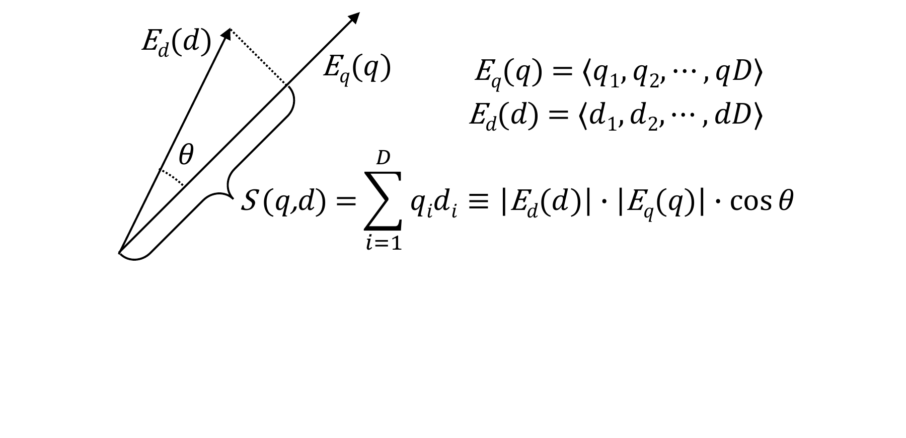

**Figure 1.** Visualization of dot-product similarity.

**General mechanism.** A RAG application combines a generative model, usually an LLM, with a retrieval model. Modern RAG systems rely on *dense retrieval*, a scheme where a pre-trained neural network called a query encoder ($E_q$) and a document encoder ($E_d$) embed queries and documents (any retrievable item) as high-dimensional vectors \[[24](#ref-thakur2021beir), [25](#ref-muennighoff2022mteb)\]. In many cases, document encoders process each document using *bag of words* or related approaches, which broadly map the term-frequency (e.g., TF-IDF or BM25) of words to numeric feature vectors \[[26](#ref-ramos2003tfidf), [27](#ref-sparck1972tfidf), [28](#ref-Salton1988TFIDF), [29](#ref-bm25)\]. Document encoders are trained to predict relevance between a query $q$ and document $d$, as defined by the dot-product $S(q,d) = E_q(q)\cdot E_d(d)$. After training, a document encoder encodes a *corpus* of documents to create a *database* of embedding vectors. Online, a query $q$ is encoded by $E_q$, and the documents are sorted based on their scores $S(q,d)$. This process requires dot products to be computed between $E_q(q)$ and many or all of the vectors contained in the index. [Figure 1](#fig:ip-diagram) illustrates dot-product similarity and its core operations. If all embeddings are normalized to a magnitude of 1, dot-product is identical to cosine similarity.

**Performance and accuracy.** Prior works have demonstrated that both the performance and accuracy of RAG applications are heavily dependent on the performance and accuracy of the dense retrieval phase \[[7](#ref-chen2022rag), [8](#ref-lewis2020rag)\]. In fact, prior work reveals a complex interplay between the retrieval and generation phases in RAG applications \[[14](#ref-quinn-20205-iks), [15](#ref-zhu-2024-accelerating), [17](#ref-yan-2024-corrective)\], where low-quality dense retrieval can significantly increase the LLM generation time by requiring more information to be retrieved and sent to the LLM for generation. We corroborate the prior work and show that including an irrelevant document in a RAG application with a Llama-3.1-70B generative model on an NVIDIA H100 GPU leads to a 29 ms increase in LLM time-to-first-token without contributing to end-to-end accuracy.

### 2.2 Similarity Search

Two primary classes of algorithms are used to perform Nearest-Neighbor Search (NNS) within the database: exact and approximate methods \[[9](#ref-malkov2020hnsw), [11](#ref-indyk1998ann_lsh), [12](#ref-andoni2015ann_lsh), [13](#ref-babenko2012ivfpq), [30](#ref-wang2021annsurvey), [31](#ref-10.1007/s00778-024-00864-x), [32](#ref-aumuller2017ann), [33](#ref-arya1993ann_graph), [34](#ref-wang2012ann_graph), [35](#ref-aoyama2011ann_graph), [36](#ref-malkov2014ann_graph), [37](#ref-jegou2011ann_pq), [38](#ref-kalantidis2014ann_pq), [39](#ref-fu2019nsg)\]. The exact approach, known as *exact nearest neighbor search* (ENNS, a.k.a. KNNS), employs a brute-force method in which the distance between a query vector and each document in the database is calculated, selecting the top $K$ most similar documents. In contrast, approximate methods, collectively referred to as *approximate nearest neighbor search* (ANNS), utilize a variety of structures—such as table-based, tree-based, and graph-based algorithms—to improve search efficiency.

**ANNS limitations.** Approximate Nearest Neighbor Search (ANNS) methods, such as Hierarchical Navigable Small World (HNSW) graphs \[[9](#ref-malkov2020hnsw)\] and Inverted File (IVF) \[[13](#ref-babenko2012ivfpq)\] systems, are the prevalent standards for retrieval tasks in dense vector spaces. Numerous accelerators have been developed to optimize these schemes \[[40](#ref-peng2021hnswaccelerator), [41](#ref-kim2023hnswaccelerator), [42](#ref-wang2024ivfpqaccelerator), [43](#ref-danopoulous2019knnfaissaccelerator)\]. However, they exhibit significant limitations, especially in many RAG applications. These ANNS schemes aim to reduce the search space by indexing the relationships between corpus vectors, enabling queries to be checked only against likely relevant documents. For instance, IVF and its derivatives rely on statically clustering the dataset to identify related vectors. Unfortunately, as the dimensionality of vectors increases, the number of distinct clusters grows exponentially \[[11](#ref-indyk1998ann_lsh), [44](#ref-koppen2000curse), [45](#ref-schuh2014curse)\]. This makes effective clustering challenging, leading to sparser distributions of vectors across clusters and diminished effectiveness of static clusters.

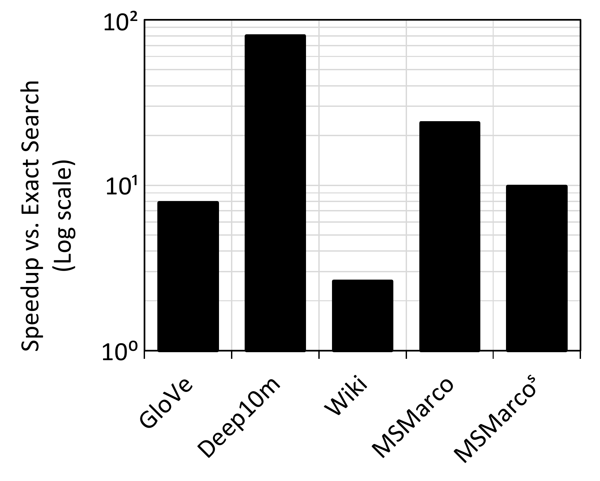

**Figure 2.** Maximum speedup achievable by HNSW for selected datasets in [Table 1](#tab:datasets) over optimized exact search while achieving Recall@32 of 0.95, using Batch size=16, M=64, and efConstruction=256.

Graph-based approximate search schemes like HNSW and CAGRA, optimized for GPU, attempt to mitigate some of these issues by building a navigable graph that connects each document to its nearest neighbors, allowing for more dynamic traversal of the search space. However, achieving high accuracy with these schemes requires a lengthy graph construction process, and the resultant graph introduces substantial memory overhead \[[46](#ref-zhao2023hnswconstruction)\]. In addition, HNSW indices are expensive to construct/rebuild, and such rebuilds may be needed if the underlying documents change. Adding new documents may require fully rebuilding the index, as they may change the nearest-neighbor relationships between the older documents. Although using incremental HNSW index-building methods is possible, they can degrade the quality of the search results.

We conduct an experiment to illustrate the effectiveness of HNSW compared to ENNS. We configure parameters to ensure reasonable index sizes and graph construction times (see experimental setup in [Section 6](#sec:eval:method)), and use a batch size of 16 to model a realistic RAG environment. [Figure 2](#fig:hnsw-comp) shows the maximum speedup achieved by HNSW with a Recall@32 of 0.95 over the ENNS baseline for three different datasets.[^1] The results illustrate how the effectiveness of HNSW compared to ENNS is highly dataset-dependent. In the cases where a Recall@32 of 0.95 is achieved, a speedup of, say, 10$\times$ may appear compelling; however, in the end-to-end execution of a RAG application, it can be overshadowed or even turn into a slowdown compared with a RAG application employing ENNS. This is because ENNS enables the RAG application to achieve the same or better generation accuracy with fewer (but more precise) documents passed onto the LLM, significantly reducing LLM generation time \[[15](#ref-zhu-2024-accelerating), [17](#ref-yan-2024-corrective)\]. Thus, extra time spent on accurate retrieval can yield a net reduction in end-to-end time. Moreover, ANNS mechanisms like HNSW often suffer higher memory consumption due to the indexing required for approximation \[[9](#ref-malkov2020hnsw), [47](#ref-DBLP:journals/corr/abs-2111-08566), [48](#ref-DBLP:journals/corr/abs-1302-1948)\].

The challenge of dataset dependency in ANNS is further compounded by the inefficiency of batching for ANNS. Since the sets of embedding vectors that need to be accessed and searched for each query within a batch are mostly disjoint, there is limited opportunity to reuse embedding vectors fetched from the corpus across queries within the batch. As a result, while ENNS can efficiently reuse data fetched from the corpus across all queries in a batch, ANNS gains minimal benefit from larger batch sizes, which are common in real-world RAG applications.

**ENNS limitations.** ENNS methods can address certain weaknesses inherent in ANNS due to their simpler data layouts. Exact search does not suffer from the overheads associated with graph traversal, and reusing corpus vectors across a batch is natural ENNS’s sequential data access pattern. Additionally, ENNS can easily handle adding and removing corpus vectors, which is highly desirable in dynamic RAG environments.

However, exact search methods have distinct drawbacks in the context of RAG: *1) Inflexibility.* An exact-search-only accelerator cannot trade small amounts of accuracy for performance gains. This limitation is especially troublesome in scenarios with small batch sizes, where the potential speedup from filtering would be significantly higher. *2) Non-opportunism.* While some datasets are challenging for existing approximate search schemes to filter, many datasets are substantially easier to handle. Existing approximate search schemes show sublinear scaling of runtime with corpus size and a fixed accuracy, implying that filtering generally becomes easier as corpora grow larger. For these easy-to-filter datasets, an exact-search-only accelerator cannot opportunistically exploit this to achieve higher performance.

## 3 Algorithmic-Hardware Co-design for Accurate and Scalable Dense Retrieval

In this work, we aim to develop a dense retrieval scheme that embodies the following seemingly conflicting properties: *accurate*, *general*, *flexible*, *scalable*, *fast*, and *resource-efficient*.

We begin with the clean slate of ENNS as our dense retrieval algorithm. ENNS is the most *accurate*, *general* (retrieving exact top-k documents regardless of the dataset), and semi-*resource-efficient* (it can efficiently operate on a vector processor without requiring complex indexing while achieving perfect data reuse across queries within a batch). However, ENNS is extremely memory-bound. From this foundation, we systematically enhance ENNS to make it *flexible*, *scalable*, and *fast*, all while preserving its *accuracy* and *generality*, and significantly improving its *resource efficiency* by alleviating its memory-bound limitations.

Recall that the core idea of ANNS mechanisms is to reduce the search space by relying on offline clustering or index graph generation. However, as discussed in [Section 2.2](#sec:background:simsearch), such offline methods sacrifice generality, slow down retrieval at high accuracy targets, and require large storage capacity and upfront computation for index creation. Modern embedding models used for dense retrieval rely on inner-product or cosine similarity, due to dot-product’s natural compatibility with cross-entropy loss during training \[[49](#ref-dpr), [50](#ref-gillick-2019-dense), [51](#ref-xiong-2020-approximate)\]. Therefore, *maximum inner product search* and *maximum cosine similarity search* have quickly risen to prominence as two of the preferred choices for vector search \[[32](#ref-aumuller2017ann), [49](#ref-dpr)\]. Further still, many of these embedding vectors demonstrate distributions spanning both positive and negative values, centered on or near zero.

**Figure 3.** Illustration of 2D-space cosine similarity. QV and EV stand for query and embedding vector, respectively. The more similar an EV is to QV, the smaller the angular distance between them. Sign concordance along each dimension provides a good first approximation.

Note that the sign bit of each dimension can indicate whether two vectors occupy the same subspace within a given Cartesian space. For instance, in a simple 2-dimensional Cartesian space ([Figure 3](#fig:cosine)), vectors *QV* and *EV* have a good chance of being similar when the sign bits of both dimensions match (e.g., both in the top-right subspace). Conversely, vectors are likely dissimilar when their sign bits are opposite (e.g., in diagonally opposite subspaces). We leverage this intuitive observation to implement an online mechanism capable of reliably and quickly filtering vectors by comparing the sign bits of embedding vectors against those of query vectors. This filtering scheme, which we call Sign Concordance Filtering (SCF), is detailed in [Section 4](#sec:scf).

Although SCF significantly reduces the search space, it requires comparing one bit per dimension of each embedding vector with the corresponding query vector’s bits before initiating the search. As this operation is performed online, it resides on the critical path of dense retrieval. If not executed efficiently, computation risks adding complexity and causing slowdowns instead of accelerating dense retrieval.

Executing SCF-enhanced dense retrieval on a CPU can severely limit its performance potential due to two key challenges: (1) For 16-bit quantized embedding vectors, reading only the sign bits from memory still requires 1/16$^\text{th}$ of the bandwidth needed to read all embedding vectors. Given the billion-scale embedding vector database size and high dimensionality, even this reduced data volume can constitute a bottleneck performance and scalability. (2) Despite filtering a large portion of the embedding vectors, transferring even a fraction of them to the CPU for processing limits scalability \[[52](#ref-ndsearch)\], particularly as corpus sizes continue to grow for future RAG applications.

To overcome these limitations and fully unlock the potential of Sign Concordance Filtering (SCF), we introduce DReX, a system that co-designs the SCF-enhanced ENNS algorithm with in-memory and near-memory processing architectures. [Section 4](#sec:scf) elaborates on the merits of SCF, and [Section 5](#sec:arch) explores the architectural innovations in DReX that leverage SCF to enable an *accurate*, *general*, *flexible*, *scalable*, *fast*, and *resource-efficient* dense retrieval scheme.

## 4 Sign Concordance Filtering

A sign concordance kernel $\textrm{SCF}(QV, EV, \mathit{TH})$ is true if vectors $\mathit{QV}$ and $\mathit{EV}$ with $D$ dimensions meet a minimum threshold $\mathit{TH}$ of matching sign bits: $$\textrm{SCF}(\mathit{QV}, \mathit{EV}, \mathit{TH}) = \left(\mathit{TH} \leq D - \sum_{i=1}^{D} (\mathit{SQV}[i] \oplus \mathit{SEV}[i])\right)$$

where $\mathit{SQV}[i]$ is the sign bit of $i^{th}$ dimension of $\mathit{QV}$, $\mathit{SEV}[i]$ is the sign bit of the $i^{th}$ dimension of $\mathit{EV}$, and $\oplus$ is the XOR operation. This expression is equivalent to counting the number of dimensions that have matching sign bits, and if that number is greater than the threshold, then we keep the vector. Otherwise, we filter it.

The use of a sign concordance filter requires specifying a filter threshold, which enables a trade-off between accuracy and filtering ratio. Specific filter ratios are achieved by experimentally modifying the threshold. Overall, by comparing only the sign bits of vector dimensions and employing the right threshold, we can quickly estimate whether two vectors are similar or not.

A key advantage of the sign concordance filtering is that filtering can be performed online, and the sign concordance kernel requires simple and regular logic, namely a bitwise XOR between the sign bits of each corpus vector, a popcount (Hamming weight) of the result, and a threshold comparison (We describe our hardware implementation later in [Section 5.3](#sec:arch:pimfiltering)). To target a specific accuracy, the threshold can be set by inspecting a sample of true top-k results. For instance, to achieve Recall@32=0.95, we set the threshold to the 95$^{\mathit{th}}$ percentile of sign-bit match counts observed across a sample of true Top-32 neighbors. Additionally, the threshold could be flexibly adjusted online for corner cases and datasets with variable phases. Such simple tuning for trading accuracy for performance contrasts the rigid index creation and offline filtering of existing ANNS.

Although larger batches reduce the overall filtering ratio across all queries within the batch, as we explain in [Section 5](#sec:arch), DReX reuses vectors across all queries within a batch to minimize filtering overhead and improve retrieval accuracy.

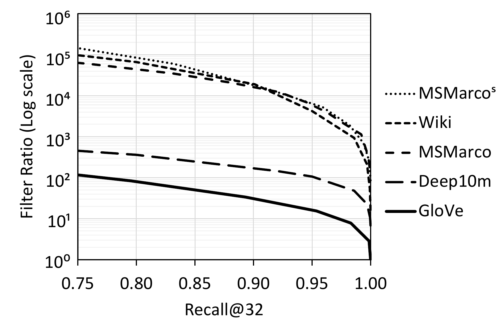 

**Figure 4.** Filter Ratio vs. Recall@32 of Sign Concordance for various datasets at batch size 1.

**Table 1.** Datasets used for dense retrieval.

| Name | $D$ | $N$ | Data Source | Scheme |
|:--:|:--:|:--:|:--:|:--:|
| *Wiki* | 768 | 35,678,076 | Wikipedia | Bi-Encoder \[[49](#ref-dpr)\] |
| *MSMarco* | 768 | 8,841,823 | Web | Bi-Encoder \[[53](#ref-nomic-ai-nomic15)\] |
| *MSMarco*$^\text{s}$ | 768 | 113,419,636 | Web | Bi-Encoder \[[54](#ref-merrick-2024-snowflake)\] |
| *GloVe* | 100 | 1,183,514 | Social Media | GloVe \[[55](#ref-pennington2014glove)\] |
| *Deep10m* | 96 | 9,990,000 | Images | GoogLeNet |

We evaluate the accuracy and filtering ratio of sign concordance filtering on four different datasets summarized in  [Table 1](#tab:datasets).  [Figure 4](#fig:recall) shows the trade-off between recall@32 and filter ratio for all datasets, with various thresholds. As we increase the threshold (from left to right), the accuracy improves while the filtering ratio decreases. As shown, the sign concordance filtering is both effective and flexible, substantially reducing the search space while allowing for a smooth trade-off between recall and filter ratio via the choice of the filtering threshold at runtime. As evident in [Figure 4](#fig:recall), sign concordance filtering is more effective when filtering datasets of higher dimensionality. For the higher-dimensional BiEncoder-embedded datasets such as *Wiki*, sign concordance filtering provides an impressive filtering ratio of 1:4,500 at 0.95 Recall@32. This filtering ratio outperforms HNSW by over 200$\times$. The key benefit of sign concordance filtering is its online filtering capability, which accommodates all datasets without losing accuracy.

## 5 DReX Architecture

### 5.1 Overview

[Figure 5](#fig:overall) provides an overview of the system integration and architecture of DReX. DReX is a compute-enabled CXL type-3 device whose internal memory capacity is part of the host address space. The key benefit of having a flat address space for DReX enabled by CXL is that the CPU can directly use load/store instructions to update the contents of the vector database, eliminating the overhead of setting up DMA for transferring embedding vectors and other metadata between host memory and DReX memory. DReX also leverages CXL.mem to enable the CPU to efficiently communicate with near-memory accelerators through the load/store interface and reduce the overhead of offload.

DReX implements its internal memory capacity using LPDDR5X packages, which strike a balance between DDR and GDDR in terms of capacity and internal memory bandwidth \[[56](#ref-park-2024-cxlpnm)\]. Each LPDDR5X package provides 64 GB of DRAM capacity and eight 16-bit channels, delivering a total of 136 GBps of memory bandwidth. Each LPDDR5X channel consists of 2 ranks, each rank consists of 2 dies, and each die has 32 banks \[[56](#ref-park-2024-cxlpnm)\]. Consequently, with only eight LPDDR5X packages, DReX can achieve 512 GB of internal memory capacity and over 1 TBps of internal bandwidth. In contrast, achieving 512 GB of capacity using high-capacity $\times$<!-- -->4 DDR5 devices would require 32 devices and a large CXL device form factor while yielding only 89.6 GBps of internal memory bandwidth. The high internal memory bandwidth is essential for DReX’s near-memory acceleration of similarity score evaluation ([Section 5.4](#sec:arch:nmasimilarity)).

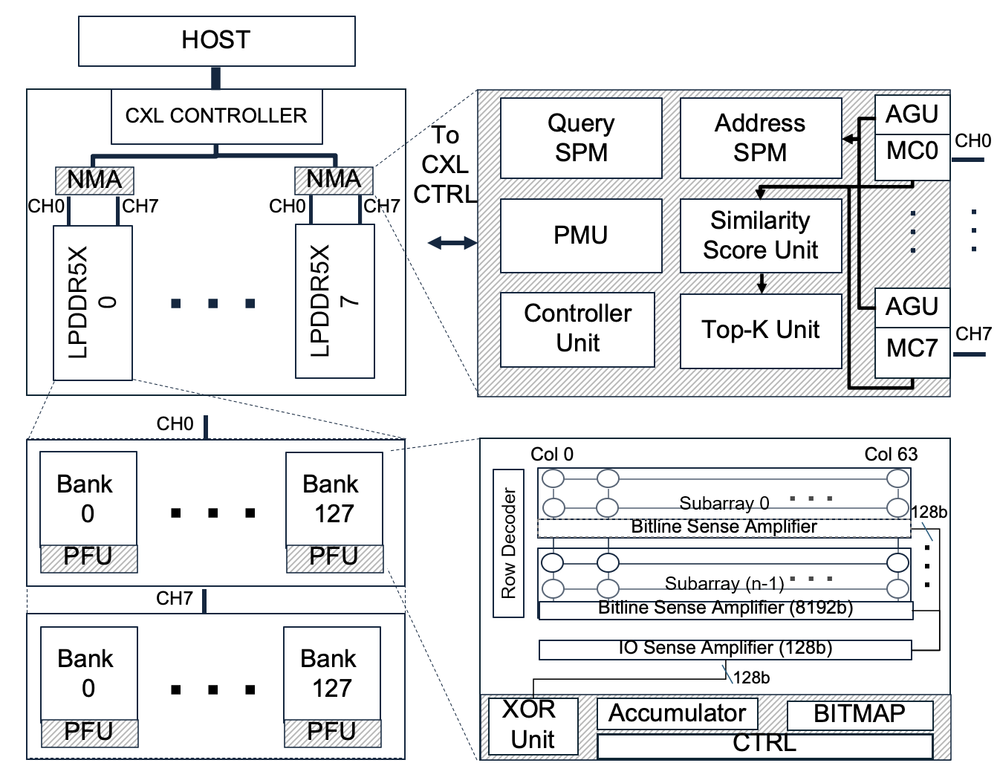

**Figure 5.** System integration and overall architecture of DReX. Shaded areas indicate hardware additions.

**Why not HBM?** HBM3 supports capacities of up to 24 GB and bandwidths of 819 GBps. To implement a 512-GB DReX, we need 22 HBM3 packages. The base die area of an HBM3 chip is approximately 121 mm2. Integrating this many HBM chips on an interposer would require 2662 mm2 of interposer area solely for HBM. For context, the NVIDIA H100 chip (just the compute die) is around 814 mm2.

The LPDDR5X DRAM chips are modified to integrate a PIM Filtering Unit (PFU) in the periphery of each bank, enabling sign concordance filtering on the sign bits of embedding vectors stored in the bank. Each LPDDR5X package connects to a local near-memory accelerator (NMA) chip through eight high-bandwidth LPDDR channels. DReX implements a highly optimized and performant dense retrieval acceleration by leveraging collaborative PIM filtering, NMA similarity scoring, and CPU-based aggregation.

At a high level, performing dense retrieval on DReX involves four phases:

**Prefilling DReX with a specific data layout ([Section 5.2](#sec:arch:datalayout)).** This phase occurs offline and is not part of the critical path for dense retrieval.

**Query vector provision.** The CPU provides DReX with a batch of query vectors by writing them into a memory-mapped I/O (MMIO) register using the CXL-enabled load/store interface in each near-memory accelerator (NMA).

**Independent processing by NMAs.** The NMAs independently execute the processes of filtering ([Section 5.3](#sec:arch:pimfiltering)), similarity score evaluation, and top-k evaluation ([Section 5.4](#sec:arch:nmasimilarity)) on their local corpus (i.e., embedding vectors).

**Aggregation of results.** Once all the NMAs complete their top-k evaluations of their local corpus, the CPU is notified to aggregate the partial top-k lists from each NMA (and multiple DReX units, in the case of multi-DReX dense retrieval) to produce a single top-k list. The list is then used by the CPU to retrieve the actual documents from the host memory or SSD.

### 5.2 DRAM Data Layout

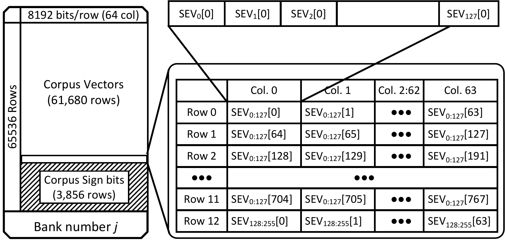

**Figure 6.** Sign bit of Embedding Vectors (SEVs) layout in DRAM Banks.

Before any dense retrieval offload to DReX, the CPU organizes the embedding vectors and their sign bits in a specific manner to ensure efficient and high-performance dense retrieval. The CPU uses mmap to map the entire DReX address space into a contiguous range of the CPU’s virtual address space. It employs explicit cache maintenance instructions, such as CLFLUSH, to ensure that the NMA has access to the up-to-date data during dense retrieval offload. Once laid out, these data remain stable unless the document database changes (relatively infrequent). **Layout of sign bits.** As shown in [Figure 6](#fig:bank-layout), each LPDDR5X bank in DReX contains several rows that store both embedding vectors and the sign bits of all elements within each embedding vector. Without loss of generality, we describe DReX here as using 768-dimension embedding vectors. (The vector dimension is a configurable parameter and DReX can support any vector dimension.) We pack sign bits in memory as follows: First, the sign bits for dimension 0 of 128 vectors are stored contiguously as a block, followed by the sign bits for dimension 1 of those 128 vectors, and so on for the 768 dimensions. The pattern then repeats itself for another 128 vectors, and so forth. This layout aligns 128-bit blocks with the bank transfer rate, enhancing filtering efficiency within tCCD during sequential data access. Moreover, it facilitates an output stationary XOR-accumulate hardware for efficiently evaluating the concordance score of 128 vectors in 768 column accesses concurrently across all DRAM banks. The number of clock cycles required to evaluate the concordance score of 128 vectors in parallel varies with the vector dimension; for dimensions other than 768, a different number of cycles is needed. In [Section 5.3](#sec:arch:pimfiltering), we discuss in more detail how this data layout enables efficient and high-performance PIM implementation of sign concordance filtering.

![Figure 7. Interleaving across eight memory channels assuming 768-dimension vectors. Access to each embedding vector is evenly distributed across all eight channels. EV\_{i}\[k\] denotes the k^\mathit{th} dimension of embedding vector i.](assets/drex/figures-5-architecture-interleaving.png)

**Figure 7.** Interleaving across eight memory channels assuming 768-dimension vectors. Access to each embedding vector is evenly distributed across all eight channels. EV$_{i}$`[k]` denotes the `k`$^\mathit{th}$ dimension of embedding vector $i$.

**Layout of embedding vectors.** After the in-memory sign concordance filtering phase, the surviving embedding vectors need to be sent to the NMA for similarity scoring and top-k evaluation. Note that, since the sign bits of only the local embedding vectors for each LPDDR5X package are stored within that package, it is guaranteed that the NMA accesses to the filtered embedding vectors remain local to the same LPDDR5X package. However, because of the filtering, the candidate embedding vectors will be scattered across different physical addresses within the LPDDR5X package. Therefore, it is impossible to know the physical location of the unfiltered embedding vectors beforehand, and the NMA must access sparse embedding vectors locally stored in its LPDDR5X package. The performance of the NMA directly depends on the efficiency of accessing these sparse embedding vectors; therefore, we aim to minimize the time required to fetch each embedding vector. Because the NMA has global access to all eight LPDDR channels of the package, minimizing the embedding vector access time requires evenly interleaving the access across all eight channels. This is the rationale for the proposed data layout for the embedding vectors presented in [Figure 7](#fig:interleaving).

### 5.3 In-memory Sign Concordance Filtering

We introduce a PIM Filtering Unit (PFU) integrated into each DRAM bank. The PFU is designed to calculate concordance scores for vector embeddings and identify the embedding vectors that should be included in the similarity score evaluation. As discussed in [Section 4](#sec:scf), concordance scores are defined as the sum of the bitwise XOR results between the sign bits of the query vectors and embedding vectors. If the concordance score exceeds a threshold value, then the embedding vector is a candidate for search. Otherwise, it is filtered. By copying the sign bits of the embedding vectors and organizing them in a column-major format within different DRAM banks ([Section 5.2](#sec:arch:datalayout)), these bitwise XOR and aggregation operations can be efficiently performed inside the DRAM banks in parallel, using minimal additional logic integrated into the DRAM bank peripheries.

Filtering is conducted in multiple epochs, with each epoch processing 128 vectors in parallel per bank (128$\times$<!-- -->128 vectors per channel and 128$\times$<!-- -->128$\times$<!-- -->8 per LPDDR5X package). In each epoch, the PFU generates a 128-bit bitmap, marking the embedding vectors to be searched by setting the corresponding bit to 1. The NMA controller maintains bookkeeping to map each bitmap to its corresponding embedding vector space.

The NMA identifies each vector and its corresponding bitmap using an ID address. This ID address establishes a mapping between the bank where the embedding vector is stored, the position of the vector in the bitmap, and a pointer to the epoch number that filters the embedding vector. This mapping requires 32 bits: the seven least significant bits represent the bank number out of the 128 banks in each channel, the next seven bits represent the vector’s index within the 128-bit bitmap, and the 18 most significant bits correspond to the epoch number.

[Figure 8](#fig:PFU) illustrates the datapath of the PFU for a single bank. The PFU logic is designed to pipeline the column access, partial concordance score calculation, and bitmap generation for 128 vectors across N column accesses, where N equals the vector dimension. Our evaluations show that evaluating each bitmap takes approximately 2 μs, which is roughly the same time required to read all the bitmaps (128$\times$<!-- -->128 bits) from 128 banks within a channel to the NMA. This creates a near-perfect pipeline for filtering and bitmap transfers to NMA.

**Figure 8.** Structure of the PIM Filtering Unit (PFU) integrated into each DRAM bank. SQV, SEV, and CSB stand for Sign bit of Query Vectors, Sign bit of Embedding Vectors, and Concordance Score Buffer, respectively. The subscript is the vector ID, and the number in brackets is the dimension number. We consider a vector dimension of 768 in this incarnation of a PFU.

As shown in [Figure 8](#fig:PFU), the PFU supports a batch size of up to 16. Before in-memory filtering begins, the NMA broadcasts the sign bits of up to 16 query vectors to all PFUs. During each DRAM column access, the PFU receives 128 sign bits from the same dimension of 128 different embedding vectors ([Section 5.2](#sec:arch:datalayout)). To process this data, the PFU implements 128 XOR gates and 128 output-stationary accumulators. As depicted in [Figure 8](#fig:PFU), these accumulators consist of a 12-bit Concordance Score Buffer (CSB) and a 12-bit adder.

Over 768 column accesses (corresponding to the vector dimension), which constitute one epoch, the same XOR-accumulator logic compares the sign bits of each embedding vector with a query vector and updates the CSBs if there is a match. At the end of the epoch, a bitmap is generated based on the values in the CSBs. To avoid implementing additional registers and comparators for storing the threshold value and comparing it against CSB values at the end of each epoch, the NMA initializes each CSB at the start of the epoch to $4,096 - \mathit{Threshold}$ (4,096 = $2^{12~\mathrm{bits}}$). At the end of the epoch, the NMA simply checks the sticky overflow bit of each CSB to determine whether the corresponding embedding vector should be filtered. This works because if any of the CSBs count more than $\mathit{Threshold}$, then it would overflow, and the sticky overflow bit flags that CSB.

To further optimize the process, as shown in [Figure 8](#fig:PFU), the design reduces the overflow bits of the 16$\times$<!-- -->128 CSBs into a single 128-bit bitmap by performing a bitwise OR operation across the overflow bits within a batch. This allows the PFU to return a single 128-bit bitmap instead of 16 separate bitmaps. The rationale behind this design decision is that the most expensive operation in performing similarity scores for query vectors in a batch is reading embedding vectors from DRAM. This operation does not affect the performance of batched dense retrieval when the similarity scores for all query vectors in the batch are computed using the same embedding vector already fetched. This approach not only reduces the storage overhead and complexity of the PFU but also enhances overall performance and energy efficiency. The overhead of transferring multiple bitmaps from all banks to the NMA is significantly higher than the additional MAC operations performed during the similarity score evaluation.

### 5.4 Near-memory Acceleration of Similarity Score and Top-K Evaluation

As shown in [Figure 5](#fig:overall), DReX implements a near-memory accelerator (NMA) chip for each LPDDR5X package. Each NMA implements seven key components: Memory Controllers (MC), Address Generation Unit (AGU), Query ScratchPad Memory (SPM), Address SPM (ASPM), Similarity Score Unit, Top-K Unit, and Controller Unit. The primary reason we did not integrate the NMA logic into the CXL controller and instead distributed the logic near each LPDDR5X package is twofold: (1) to reduce the distance that data needs to move off-chip through LPDDR channels and on-chip between the memory controllers and the accelerator units. This reduction in the distance between the memory controllers, NMA PHYs, and the LPDDR5X package allows the NMA to perform high-bandwidth, low-latency, and low-energy data accesses to DRAM. (2) Each LPDDR5X package implements eight memory channels, and connecting eight packages to a single chip would require implementing 64 LPDDR channels along the shoreline of a single chip \[[57](#ref-loh-2015-interposer), [58](#ref-mtia-meta), [59](#ref-cxl-dead), [60](#ref-Orenes-Vera-2024)\]. Such a centralized design would necessitate a large monolithic near-memory accelerator to accommodate the significant number of escape pins at the chip’s shoreline, which would substantially increase the cost of building DReX.

A back-of-the-envelope calculation shows that if each LPDDR5X PHY occupies 2.5 mm of shoreline (based on die shots of the Apple M2 \[[61](#ref-m2-die)\] in 5 nm technology), a single chip would need a minimum perimeter of 160 mm to support 64 PHYs. Assuming a rectangular chip with a golden ratio, the die area would need to be at least 1512 mm2, exceeding the state-of-the-art lithography reticle limit. By limiting each NMA to connect to a single LPDDR5X package with eight channels, each NMA needs only 20 mm of shoreline, which can be satisfied by a rectangular chip with a golden ratio and area of less than 24 mm2.

With the data mapping explained in [Section 5.2](#sec:arch:datalayout) and the distributed NMA organization of DReX, NMAs can independently filter and perform similarity score evaluations for the unfiltered embedding vectors without requiring any inter-NMA communication. This area-efficient NMA architecture is enabled through the co-design of the filtering algorithm, software data placement, and in-memory and near-memory processing principles.

As mentioned in [Section 5.1](#sec:arch:overview), after the query vectors are broadcast from the CPU to the NMAs, the NMAs first initiate the filtering phase and then proceed with similarity score computation and top-k evaluation of the candidate embedding vectors. During the filtering phase, PIM Filtering Units (PFUs) perform sign concordance filtering in multiple epochs, each filtering a group of 128 embedding vectors and generating a bitmap with entries corresponding to each vector in the group. At the end of each epoch, the bitmap is transferred to the NMA, and the next epoch begins immediately, concurrent with the bitmap transfer to the NMA. The memory controllers on the NMAs orchestrate all-bank filtering as well as bitmap transfers from each bank and channel to the NMA chip. Once the bitmap is received by the NMA, the Address Generation Unit (AGU) scans the bitmap, generates the physical addresses of the embedding vectors corresponding to the set bits, and stores them in an Address ScratchPad Memory (Address SPM). These addresses are retained for later use during similarity score computation and top-k evaluation.

Because the Address SPM has limited capacity, the number of continuous filtering epochs depends on the filtering ratio of sign concordance filtering, the size of the Address SPM, and the size of each vector. In general, each LPDDR5X package can store 64 GB / (2 B $\times$ Vector_Dimension) vectors. Considering a vector dimension of 768, this equates to a maximum storage capacity of approximately 45 million embedding vectors per LPDDR5X package. Thus, each vector can be uniquely addressed using a 26-bit address local to each LPDDR5X package. To accommodate datasets with various vector dimensions efficiently, we design the Address SPM to be 4-bit addressable. In the current implementation of DReX, the Address SPM is set to 2 MB, allowing it to store up to 524,288 embedding vector addresses for 768-dimensional vectors.

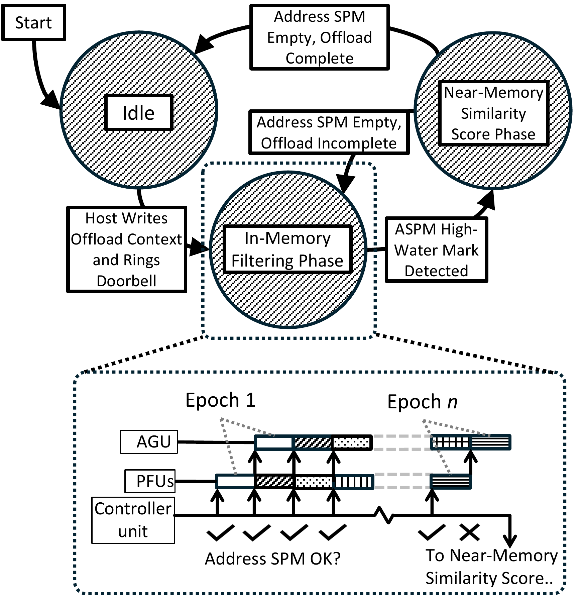

**Figure 9.** Finite state machine implemented by the Controller Unit in each NMA, and breakdown of the filtering phase into $n$ epochs.

Because corpus vectors are laid out to fully utilize bandwidth for similarity score computation, it is not possible to pipeline in-memory filtering operations (which require reading sign bits and sending out bitmaps from all banks) with the reading of vectors that survive the filtering operation. One option would be to perform sign concordance filtering immediately followed by similarity score computation. However, sign concordance filtering involves both the in-memory computation of bitmaps and address generation, which can be pipelined if performed repeatedly. Consequently, we serialize the filtering and similarity score evaluation phases.

[Figure 9](#fig:nma-ctrl) shows the FSM of the NMA Controller Unit and details the multi-epoch near-memory filtering and the alternation between the in-memory filtering and near-memory similarity score evaluation phases until the offload is complete. During the near-memory similarity score evaluation, the NMA reads embedding vector addresses from the Address SPM and fetches the vectors one by one over eight LPDDR5X memory channels. As discussed in [Section 5.2](#sec:arch:datalayout), the embedding vectors are interleaved across all eight channels to saturate the full 136 GB/s memory bandwidth of the package.

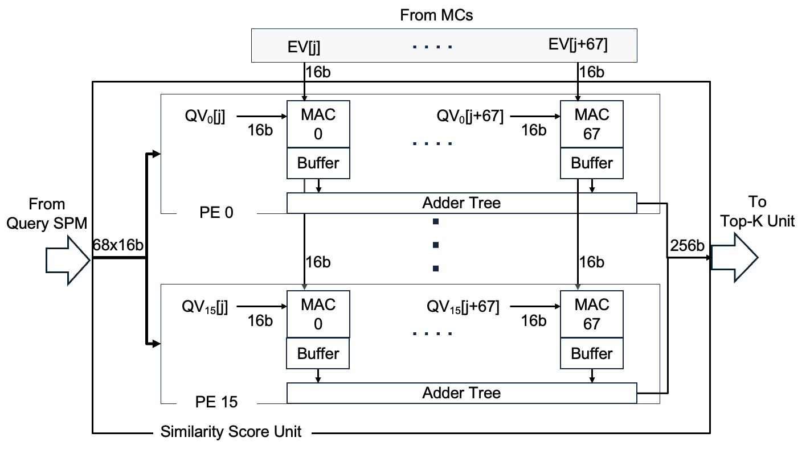

**Figure 10.** Structure of NMA Similarity Score Unit.

[Figure 10](#fig:ssu) illustrates the internal architecture of the Similarity Score Unit. As embedding vectors are received from the DRAM in parallel across eight channels, they are buffered in the input buffer of the Similarity Score Unit and distributed to up to 16 processing engines. Each processing engine consists of 68 MAC units with local output buffers and an adder tree to reduce the 68 outputs to a single similarity score. The MAC and reduction operations are pipelined. Each processing engine computes the similarity score between one query vector and all embedding vectors fetched from DRAM.

The reason for providing 68 16-bit MAC units per processing engine is to sustain the 136 GB/s DRAM bandwidth. The MAC units operate at 1 GHz and must perform 68 MAC operations on 68$\times$<!-- -->16-bit embedding vector dimensions received from memory every 1 ns. For a vector dimension of 768, after 12 clock cycles (768/68), the output register of each MAC unit contains a partial similarity score, which is reduced to a single score using the adder tree. The reduction phase is pipelined and performed concurrently with the MAC operation for the next embedding vector. Once the partial scores are reduced to a single similarity score, it is sent to the Top-K Unit, which maintains an ordered list of the top 32 document IDs.

## 6 Methodology

We build an end-to-end evaluation framework that includes cycle-accurate simulation of DRAM using DRAMSim3 \[[62](#ref-li2020dramsim3)\], timings gathered from RTL synthesis, and real system measurements. We implement RTL designs for the PIM Filtering Unit (PFU), Similarity Score Unit, and Top-K Unit and synthesize them in TSMC’s 16 nm technology node with Synopsis Design Compiler. We then scale PFU results to 7 nm \[[63](#ref-10.1145/3620665.3640422), [64](#ref-STILLMAKER201774)\]. Logic in DRAM technology is approximately ten times less area-efficient \[[65](#ref-Devaux2019UPMEM)\] than regular logic; thus, we scale the area of the PFU correspondingly in our evaluation. For the Query SPM and Address SPM, we adopt the area (0.013 μm2 per bit) and power metrics (50 fJ per bit) from Dally, Turakhia, and Han \[[66](#ref-domain-specific-hw-acc)\].

**Table 2.** System configuration used for measurements.

|           Device | Description                                       |
|-----------------:|:--------------------------------------------------|
|              CPU | 16 $\times$ Intel Xeon Max 9462 3.5 GHz, SMT off  |
|              CPU | 8 $\times$ 128 GB DDR5-4400 DRAM                  |
|              CPU | 3.5 TFLOP/s, 282 GB/s                             |
|              GPU | NVIDIA H100 SXM                                   |
|              GPU | 80GB HBM3                                         |
|              GPU | 989 TFLOP/s, 3.35 TB/s                            |
| DReX (Simulated) | 8 $\times$ NMA , 8,192 $\times$ PFU               |
| DReX (Simulated) | 512 GB LPDDR5X                                    |
| DReX (Simulated) | 26.11 TFLOP/s, 1.1 TB/s (NMAs), 104.9 TB/s (PFUs) |

**Modeling PFUs.** We use LPDDR5 timing reported in Ramulator 2.0 \[[67](#ref-10.1109/LCA.2023.3333759)\], along with RTL synthesis, to derive the time required for the bank-level PFU to compute bitmaps ($1.25d$ ns), for reading bitmaps into the near-memory accelerator (120.4 ns), and for address generation within the memory controller (1024 ns). We use DRAMSim3 to measure the time needed to read traces of embedding vectors into the NMA for similarity score evaluation and use RTL synthesis again to determine the time required to perform the dot products and top-k sorting.

**DReX Simulator.** We augment the cycle-approximate simulator for IKS \[[14](#ref-quinn-20205-iks)\] to incorporate PFU timings and model the more complex pipeline (e.g., filling the ASPM results in a bubble in memory bandwidth utilization). We also modify the analytical model for similarity-score performance, since IKS uses a different NMA Similarity Score Unit architecture and data layout. In particular, we gather traces for each dataset and batch size and collect timing results using DRAMSim3. We do not modify the implementation of the final top-k aggregation since it is identical to IKS’s.

**Comparisons with Other Systems.** [Table 2](#tab:system) compares the system configurations and compute appliances (real or simulated) used for evaluations. We also compare DReX with ANNA \[[68](#ref-anna)\], which is an IVF-PQ accelerator. We construct a first-order model to determine an upper bound for ANNA’s performance. Each ANNA unit is defined based on $N_{\mathit{SCM}}$, $N_{\mathit{cu}}$, and $N_u$ parameters: $N_{\mathit{SCM}}$ defines the number of similarity computation modules, $N_{\mathit{cu}}$ represents the number of computation units responsible for constructing the look-up tables and performing cluster filtering, and $N_u$ defines the number of codebook entries that can be sum-reduced per cycle. ANNA sets $N_{\mathit{SCM}}=16$ and $N_u=64$. ANNA also selects $M=D/4$ (representing an 8:1 compression ratio) and chooses $N=8$ for $2^N=256$ codebook entries. ANNA was evaluated using $|C| = 250$ and $10,000$ for million- and billion-scale corpora, respectively. Similarly, we use $|C|=250$ for the *GloVe*, *Deep10m*, and *MSMarco* datasets, and set $|C|=10,000$ for *MSMarco*$^\text{s}$ and *Wiki*. We validated this performance model on the side by reproducing key results reported in the original ANNA paper \[[68](#ref-anna)\].

**Software configuration.**  We use the Faiss \[[69](#ref-faiss)\] and CUVS \[[70](#ref-cuvs)\] libraries to measure HNSW, IVF-SQ, and CAGRA performance on CPU and GPU. For HNSW on CPU, we use Faiss’s IndexHNSWFlat, and for CAGRA on GPU, we use CUVS. For IVF-SQ and IVF-PQ, we use Faiss’s IndexIVFScalarQuantizer and IndexIVFPQ, and their GPU equivalents. We use 4-bit scalar quantization for IVF-SQ. We also perform a CPU-based top-k refinement phase. For all approximate search schemes, we sweep the design space to find appropriate parameters. For IVF-SQ, HNSW, and CAGRA, respectively, we adjust the n_probe, ef_search, and itopk_size search parameters, which provide a trade-off between accuracy and speed, in order to maximize throughput while achieving an accuracy target.

**Corpora.** Prior works \[[30](#ref-wang2021annsurvey), [32](#ref-aumuller2017ann)\] have shown that leading ANNS schemes show vast differences in search space reduction across different corpora. As a result, it is critical to ensure that we evaluate our filtering scheme and architecture on datasets that are relevant for RAG. In particular, we construct three corpora based on realistic RAG datasets embedded using bi-encoder models. For comparability to prior work, we also use two datasets popular for evaluating existing ANNS accelerators.

***Wiki*.** To examine the case of a model fine-tuned for a specific application, we rely on a corpus designed for evaluating question-answering RAG applications with Wikipedia as the corpus. Meta’s KILT benchmark divides Google’s Natural Questions dataset into train (*nq-train*) and validation (*nq-dev*) sets, containing a query, answer, and relevant documents. Using this approach, we fine-tune a BERT-base (uncased) model to predict relevance between a passage and a given query. Following the technique proposed by Karpukhin et al. \[[49](#ref-dpr)\], we construct the document corpus by dividing Wikipedia into 100-token passages and encoding with the fine-tuned BERT model. We then create query vectors by embedding the queries of the *nq-dev* set, for a total of 2,837 vectors.

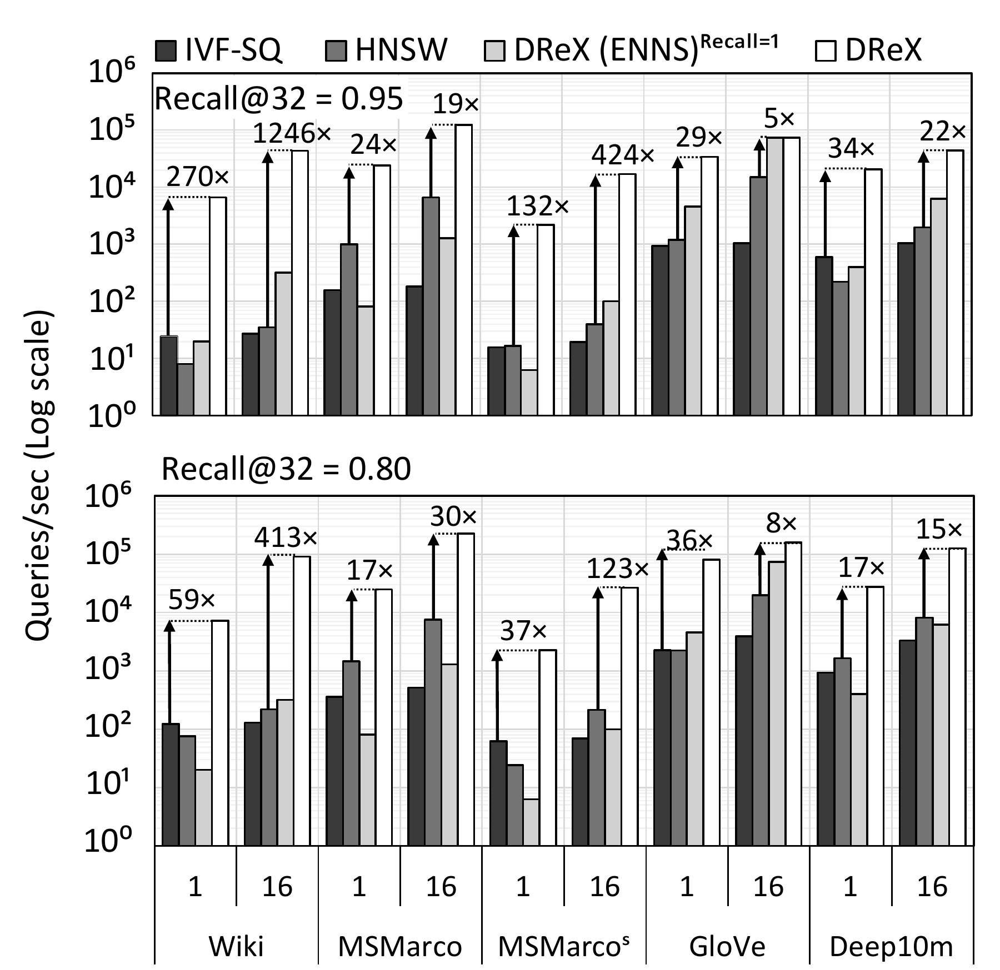

**Figure 11(a).** CPU

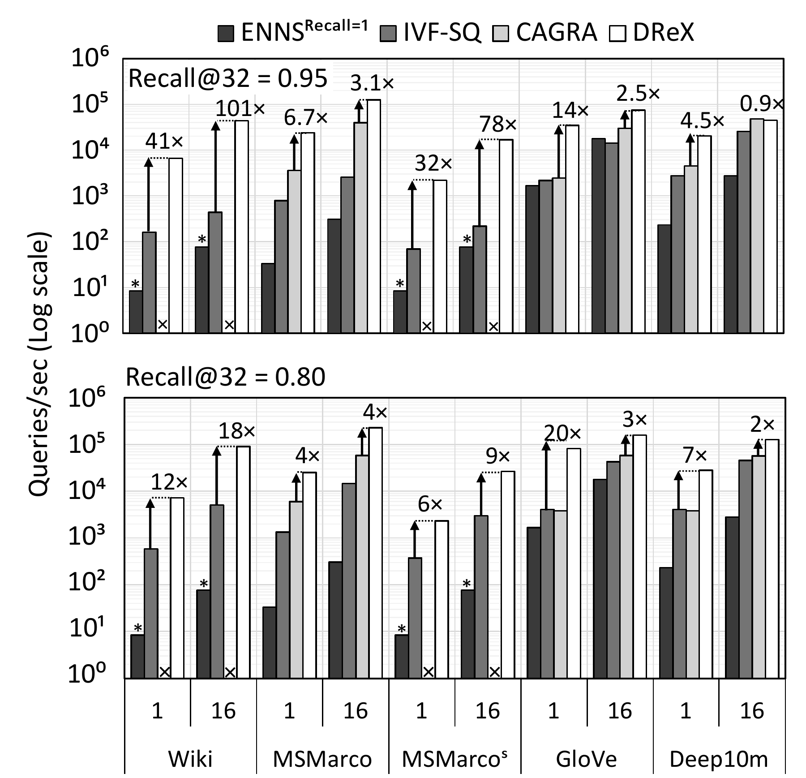

**Figure 11(b).** GPU

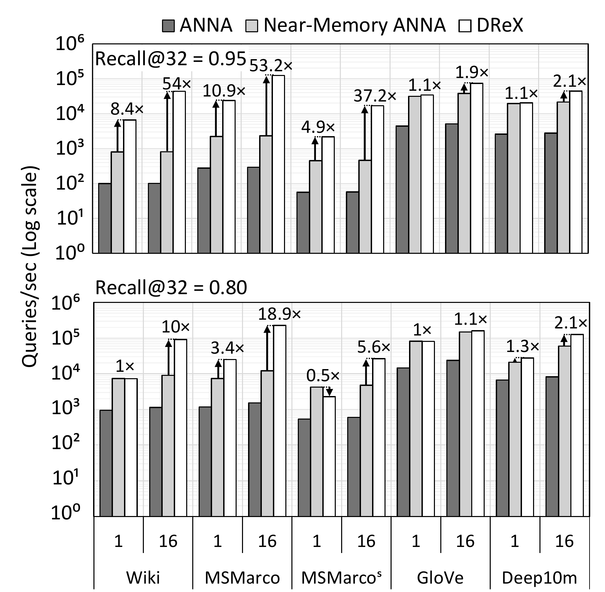

**Figure 11(c).** Prior ANNS accelerators

**Figure 11.** Comparison of DReX and existing options for all datasets. The Y axis is in log scale. ENNS configurations in (b) that are marked by asterisk use 3 GPUs. The value on top of each data point is the speedup of DReX compared to the best-performing competing design. The CAGRA experiments marked by ’X’ in (b) cannot fit in a single GPU and this missing.

***MSMarco*$^\text{s}$ and *MSMarco*.** We adopt open-source corpus and embedding models for this use case, which also facilitates reproducibility. In particular, we use embeddings for segmented and nonsegmented versions of the MSMarco-V2.1 \[[71](#ref-msmarco)\] dataset. Dataset granularity can shift the burden between the retrieval and generation phases of RAG, making it important to study the impacts of segmentation. We denote embedded versions of the segmented and nonsegmented MSMarco-V2.1 dataset as *MSMarco*$^\text{s}$ and *MSMarco*, respectively. For *MSMarco*$^\text{s}$, we use embeddings generated via the Snowflake Arctic Embed M V1.5 embedding model, which is fine-tuned from the BERT-base bi-encoder model for retrieval. This corpus served as the knowledge source for TREC RAG \[[72](#ref-trec_rag_2024_corpus)\], where they implemented segmentation using a sliding-window approach. For the nonsegmented *MSMarco*, dataset documents are much longer, necessitating the use of an embedding model with a longer context length. In particular, we use the Nomic Embed Text V1.5 model, also fine-tuned from BERT-base. To generate query vectors for *MSMarco* and *MSMarco*$^\text{s}$, we follow documentation from Snowflake and Nomic, respectively, to embed MSMarco queries using the retrieval model used to generate the corpus, resulting in a total of 1,010,916 queries.

***GloVe*.** To allow for comparison with prior works, and to evaluate sign concordance filtering on relatively small dimensional vectors, we use the popular GloVe dataset of 1,183,514 100-dimension vectors. Following Aumüller, Bernhardsson, and Faithful’s approach \[[32](#ref-aumuller2017ann)\], we use GloVe’s test (10,000 vectors) as queries.

***Deep10m*.** We use the provided sample set of the Deep1b dataset, which contains 9,990,000 96-dimension vectors. Again, following Aumüller, Bernhardsson, and Faithful’s approach \[[32](#ref-aumuller2017ann)\], we use Deep -1b’s test set (10,000 vectors) as queries. We include *Deep10m* and *GloVe* primarily to provide comparability with other works, and to contextualize the results of *Wiki*, *MSMarco*, and *MSMarco*$^\text{s}$, which are relatively new and have not been widely used in the ANNS literature.

**Representative RAG pipeline.** To contextualize the performance of DReX, we implement a simple RAG pipeline based on *Wiki*, paired with three popular generative models: Llama-3.2-3B, Llama-3.1-8B, and Llama-3.1-70B. Performance-wise, retrieval time primarily impacts latency, rather than other metrics like token rate. In particular, for many user-facing AI applications, time-to-interactive is critical. In this paper, we evaluate DReX primarily based on the time-to-first-token (TTFT) metric \[[73](#ref-greener_llm), [74](#ref-Google-2023-TTFT), [75](#ref-Agarwal-2023-TTFT)\]. A query, taken from the test set for *Wiki*, is presented in a prompt, along with the top-k documents selected during the retrieval phase, and we measure the total delay of retrieval plus production of the first token. For HNSW, we measure delay of retrieval for *Wiki*, using the HNSW indexes described in [Section 6](#sec:method:software), followed by the time to generate the first token (prefill time). For DReX, we use a cycle-approximate simulator to find its retrieval delay. The simulator also produces the IDs of the documents retrieved by DReX, which we then use to construct prompts for the LLM, mirroring the approach used to evaluate HNSW. We measure the prefill time using the same methodology as HNSW, and combine it with the simulated delay to obtain the total latency.

To reach the specified DReX recall target, the sign concordance filtering threshold ([Section 4](#sec:scf)) is chosen per dataset during loading via exploration. This process yields internal results similar to [Figure 4](#fig:recall), where each candidate threshold value offers a trade-off between reduced search latency and increased recall. Our experimental results evaluate DReX and ANNS techniques at Recall@32={0.80,0.95}.

## 7 Experimental Results

### 7.1 Dense Retrieval Performance

We first compare the performance of DReX with existing solutions for dense retrieval. We measure throughput (queries per second) and latency (retrieval time). We compare with the following configurations: IVF-SQ and HNSW on CPU, IVF-SQ and CAGRA on GPU, and ANNA \[[68](#ref-anna)\]. We also include a DReX configuration (denoted by “DReX(ENNS)” in [Figure 11(a)](#fig:drex-comparison:cpu)) where we bypass sign concordance filtering phase and perform ENNS near the memory. This configuration is equivalent to IKS \[[14](#ref-quinn-20205-iks)\]. [Figure 11](#fig:drex-comparison) compares the throughput of DReX with Recall@32 of 0.95 and 0.80 with all these configurations when operating on the five data sets with batch sizes of 1 and 16.

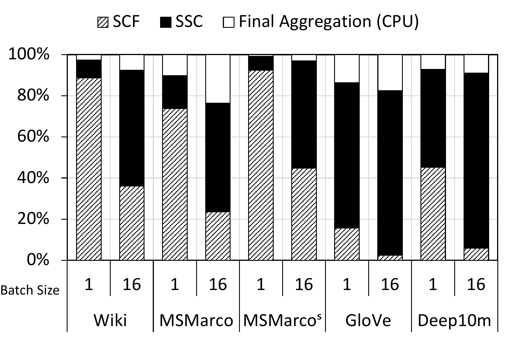

**Figure 12.** Breakdown of DReX latency on various corpora, with batch size 1 and 16, and Recall@32=0.95. Relevant phases are bank-level sign concordance filtering, similarity score computation, and final Top-K Aggregation on the host.

#### 7.1.1 Comparison with CPU-based ANNS

As shown in [Figure 11(a)](#fig:drex-comparison:cpu), DReX significantly outperforms all CPU baselines. Compared to the best performing ANNS baselines, for the high-dimensional Wiki dataset and high recall, DReX provides 270$\times$ (compared to IVF-SQ) and 1,167$\times$ (compared to HNSW) speedup for batch sizes of 1 and 16, respectively. A general trend is that, as the vector dimensions decrease, DReX’s filtering ratio decreases, while the filtering ratio of the baseline ANNS remains the same, causing the performance difference between DReX and ANNS to shrink. Nevertheless, DReX delivers at least 5 and 22 times higher performance compared to the best-performing CPU ANNS for Glove and Deep10M across different batch sizes and recall targets, respectively.

Reducing the recall target generally increases the filtering opportunity for DReX and other ANNS algorithms. At first glance, DReX maintains a strong performance advantage even at lower recall targets. However, for some datasets—specifically Wiki, *MSMarco*, and *MSMarco*$^\text{s}$—at batch size 1, the throughput of DReX remains unchanged when lowering the recall target from 0.95 to 0.80. This is because, in these datasets at batch size 1, the high filtering ratio of sign concordance filtering ensures that similarity score evaluation is not an end-to-end bottleneck even at 0.95 recall. Consequently, further reducing the recall target, which increases the filtering ratio, does not improve end-to-end search time, as predicted by Amdahl’s Law. [Figure 12](#fig:drex-breakdown) illustrates the breakdown of DReX latency at 0.95 recall, showing that, for Wiki, *MSMarco*, and *MSMarco*$^\text{s}$ at batch size 1, the majority of search time is spent on filtering, which does not decrease with a lower recall target.

Interestingly, DReX without filtering (ENNS), which exhaustively searches the entire corpus using near-memory accelerators, is faster than ANNS baselines on the CPU across many of the datasets, especially at a high recall target. These results demonstrate that the speedup achieved by high-quality ANNS can be matched by a purpose-built accelerator designed for ENNS. DReX takes this one step further and implements sign concordance filtering in the memory to deliver very significant speedups.

DReX throughput benefits significantly from batching queries. This improvement occurs for two reasons: First, for corpora that are easy to filter, sign concordance filtering time dominates execution but can be amortized across multiple queries in a batch. As shown in [Figure 12](#fig:drex-breakdown), increasing the batch size shifts some of the execution time from filtering (SCF) to similarity score computation. Second, for corpora that are hard to filter, namely *GloVe* and *Deep10m*(see [Figure 18](#fig:sift)), similarity score computation dominates. In such cases, many corpus vectors meet the sign concordance threshold for multiple queries but are loaded only once, thereby amortizing a portion of the similarity score delay across multiple queries in a batch.

#### 7.1.2 Comparison with GPU-based NNS

As shown in [Figure 11(b)](#fig:drex-comparison:gpu), even when running ENNS or IVF-SQ/CAGRA (both ANNS) on an H100 GPU, DReX outperforms the best-performing of them by 2–101$\times$, except for batch size 16 in the *Deep10m* dataset at a 0.95 recall target. The data points for *Wiki* and *MSMarco*$^\text{s}$ are missing for CAGRA because their indexes cannot fit within the memory of a single H100 GPU. Although CAGRA on GPU achieves a slight speedup over DReX for *Deep10m* at 0.95 recall, DReX demonstrates strong performance across the board and provides 6.4$\times$ more memory capacity than an H100, enabling DReX to accelerate significantly larger corpora.

#### 7.1.3 Comparison with Other Accelerators

[Figure 11(c)](#fig:drex-comparison:accel) compares DReX with the performance upper bound of ANNA (see [Section 6](#sec:eval:method) for how we compute that upper bound). Across the board, DReX fares better. This is consistent with the observation made by Lee et al. that ANNA is bottlenecked by the memory bandwidth between the CPU and DRAM \[[68](#ref-anna)\]. To improve ANNA’s prospects, we compare DReX against a near-memory ANNA configuration, where each ANNA unit is integrated into an NMA. This integration is feasible because the area of each ANNA unit (17 mm2 \[[68](#ref-anna)\]) is approximately the same as that of an NMA in DReX. We assume perfect parallelism across near-memory ANNA units and a top-k aggregation overhead similar to that of DReX.

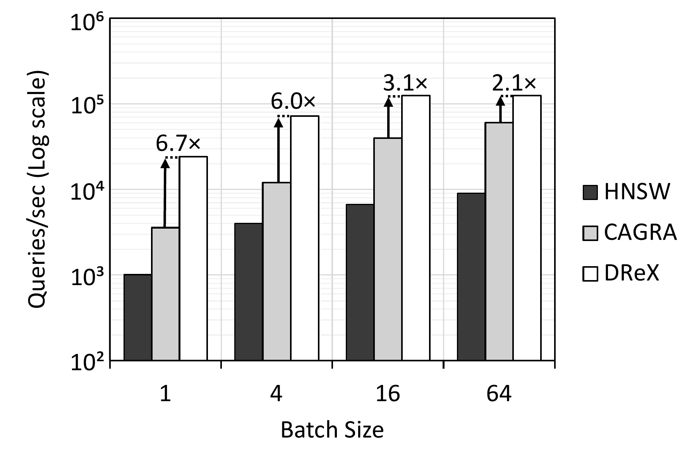

**Figure 13.** Comparison of DReX and CPU/GPU-based ANNS for *MSMarco* for application-level batch sizes up to 64, Recall@32=0.95. The Y axis is in log scale. DReX has a maximum batch size of 16, therefore performance does not improve above batch size 16.

As shown, the near-memory ANNA achieves a significant speedup for all datasets and batch sizes against CPU-attached ANNA. More generally, IVF-PQ performs well at lower recall targets, as it can significantly reduce the search space. For datasets where DReX is already bottlenecked by sign concordance filtering, such as *MSMarco*$^\text{s}$ at batch size 1, or for low-dimension datasets, such as *GloVe*, the near-memory ANNA can match (*GloVe*) or even outperform (*MSMarco*$^\text{s}$) DReX by 2$\times$. This is because ANNA uses IVF to cluster the corpus vectors, which dramatically accelerates filtering for small batch sizes, since only a subset of the clusters must be accessed for filtering. However, as batch size grows, the benefits of this approach dwindle, making DReX faster due to the speed of PIM-based filtering. Nonetheless, the benefits of clustering are largely orthogonal, and there could be an opportunity to extend DReX to support IVF indexing. We leave this for future work. In any case, for most configurations, DReX provides a solid speedup against a futuristic futuristic near-memory ANNA implementation in many cases, and in all cases against CPU-attached ANNA.

NDSearch \[[52](#ref-ndsearch)\] is another recent architecture for in-storage acceleration of HNSW. We cannot construct a reliable performance model due to significant differences in evaluation methodology. However, NDSearch reports a throughput of roughly 11,000 queries per second on *GloVe*, with a batch size of 2,048 and Recall@10=0.95. By contrast, DReX achieves 73,650 queries per second on *GloVe* with the maximum batch size of 16 and Recall@32=0.95. When we set the DReX accuracy target to Recall@10=0.95 to match NDSearch, DReX achieves 90,723 queries per second. DReX has higher throughput for Recall@10=0.95 than for Recall@32=0.95 because true Top-10 results typically have higher sign concordance filtering scores, therefore the filtering threshold can be set higher. Further, we note that *GloVe* is also the dataset for which HNSW on CPU most closely matches DReX performance. Thus, we believe that DReX remains highly competitive for the other datasets.

#### 7.1.4 Impact of Batch Size on DReX

[Figure 13](#fig:batch-size) compares the scalability of DReX performance with existing CPU/GPU-ANNS options for more batch sizes. As shown in [Figure 13](#fig:batch-size), further batching above 16 does not improve performance for DReX, due to the maximum PFU batch size of 16. Therefore, in principle, CPU/GPU-based ANNS can be more competitive at higher batch sizes. However, both CPU and GPU-based ANNS experience diminishing returns due to memory bandwidth limitations, since existing ANNS algorithms cannot achieve strong data re-use across queries. As the figure shows, even at batch size 64, DReX remains superior to the ANNS configurations.

### 7.2 Ablation Study

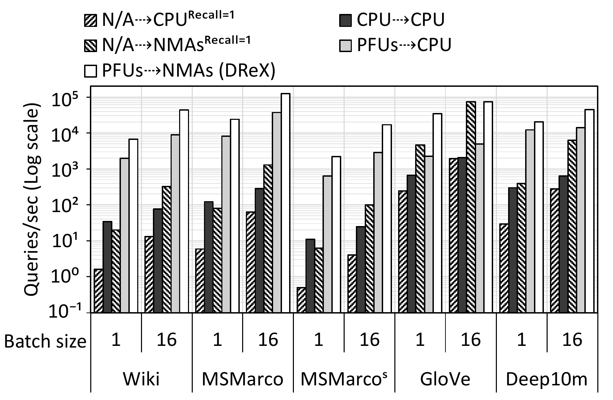

**Figure 14.** Throughput of ablation study configurations. `A`$\dashrightarrow$`B` denotes a pipeline with filtering performed on device `A`, followed by a similarity score computation on device `B`.

We perform an ablation study to evaluate the contribution of each component in DReX, which we logically divide into an optional filtering phase and a necessary similarity score computation phase. We analyze cases where sign concordance filtering is included or excluded, cases where similarity search is performed on the NMAs, and cases where sign concordance filtering is executed using the PFUs. [Figure 14](#fig:ablation) compares the performance of the following configurations: `N/A`$\dashrightarrow$`CPU`, which skips filtering and executes similarity search on the CPU (same configuration as CPU ENNS); `CPU`$\dashrightarrow$`CPU`, which performs both filtering and similarity search on the CPU; `PFUs`$\dashrightarrow$`CPU`, which performs filtering on the PFU and similarity search on the CPU; `N/A`$\dashrightarrow$`NMAs`, which skips filtering and executes ENNS on NMAs; and `PFUs`$\dashrightarrow$`NMAs`, which represents DReX.

Comparing the performance of `N/A`$\dashrightarrow$`NMAs` and `N/A`$\dashrightarrow$`CPU` highlights the benefit of performing similarity score evaluations near memory. Across the board, we observe a throughput improvement of 12.4$\times$ to 38.6$\times$ by simply offloading similarity score evaluations to NMAs. Alternatively, the `CPU`$\dashrightarrow$`CPU` configuration, which performs sign concordance filtering on the CPU, achieves a 1.1$\times$ to 21$\times$ speedup compared to `N/A`$\dashrightarrow$`CPU`. This speedup is solely attributed to sign concordance filtering.

Another interesting comparison is between `CPU`$\dashrightarrow$`CPU` and  
`PFUs`$\dashrightarrow$`CPU`, where we see a significant speedup when offloading filtering to PFUs, except for the *GloVe* dataset. As shown in [Figure 12](#fig:drex-breakdown), sign concordance filtering is not an end-to-end bottleneck in *GloVe*. More importantly, since the total storage required for the sign bits of all embedding vectors in *GloVe* is approximately 15 MB, CPU filtering can match the performance of PFUs without the overhead of fine-grain offloading from the CPU. DReX, which offloads both similarity score evaluation and filtering to NMAs and PFUs, respectively, eliminates the CPU bottleneck in similarity score evaluations. Ultimately, DReX extracts the most potential from PIM by implementing a seamless NMA-PIM fine-grain offload mechanism.

### 7.3 RAG Performance

**Figure 15.** Inference time breakdown of HNSW (CPU) vs. DReX retrieval for Llama-3.2-3B, Llama-3.1-8B, and Llama-3.1-70B. Generative model runs on a single GPU (NVIDIA H100 SXM) for Llama-3.2-3B and Llama-3.1-8B, and 8 GPUs for Llama-3.1-70B. Both retrieval phases have Recall@32=0.95.

[Figure 15](#fig:drex-rag) compares the time-to-first-token breakdown of three different RAG pipelines, all using the *Wiki* corpus for retrieval and employing either Llama-3.2-3B, Llama-3.1-8B, or Llama-3.1-70B as the LLM. We use 1 GPUs for Llama-3.2-3B and 3.1-8B and 8 GPUs for Llama-3.1-70B because the time-to-first-token with a single GPU is several seconds and unacceptable for user-facing RAG applications. As shown, DReX significantly reduces the end-to-end time-to-first-token. For example, DReX outperforms the HNSW CPU baseline in Llama-3.2-3B by 6.2$\times$ and 7$\times$ for $K=1$ and batch sizes of 1 and 16, respectively.

Interestingly, DReX achieves even higher end-to-end speedup for larger batch sizes in this application due to its greater efficiency in batched retrieval compared to HNSW ([Section 2.2](#sec:background:simsearch)). As illustrated, increasing the batch size, the value of K, or the model size disproportionately increases the LLM generation time, thereby reducing the relative end-to-end speedup from retrieval acceleration. However, it is important to note that [Figure 15](#fig:drex-rag) uses the same fixed *Wiki* dataset for all the LLM configurations. In real-world scenarios, it is likely that the corpus size scales proportionally with the LLM size. Therefore, the end-to-end speedup of retrieval acceleration provided by DReX would remain significant, even for RAG applications utilizing large LLMs.

### 7.4 Power and Area Analysis

The area of each PFU is 0.1 mm2; thus, 32 PFUs represent a 6.7% overhead with respect to the 47.64 mm2 area of a 16 Gb LPDDR5X die \[[76](#ref-samsung_1a_lpddr5x)\]. A single PFU consumes 14 mW of power. For LPDDR5X, each 16-bit channel provides up to 136 Gbps \[[56](#ref-park-2024-cxlpnm)\]. DReX can fully utilize this bandwidth across four dies (i.e., 34 Gbps per die). The energy per bit for LPDDR5X is 4 pJ \[[66](#ref-domain-specific-hw-acc)\]. Therefore, the power consumption of a 16 Gb LPDDR5X die with 32 PFUs is 34 Gb/s $\times$ 4 pJ/b plus 32 $\times$ 14 mW = 584 mW. If all banks synchronously perform PIM filtering for a batch size of 16, the power consumption of each PIM-enabled LPDDR5X package (32 dice) would be 18.7 W. For a batch size of 1, the power consumption during all-bank PIM filtering is 5.24 W.

**Figure 16.** End-to-end performance (lines) and energy efficiency (bars) of implementations (Batch size 16, Recall@32=0.95) with per-bank (32), per-bank group (8), and per-die PFU placements. The X axis also shows the area overhead of each configuration vs. plain (16 Gb per die in all cases).

**Power-performance design trade-offs.** We briefly compare our per-bank PFU implementation (32 PFUs per die total) with hypothetical alternative designs with per-bank group (per-BG) and per-die PFUs—eight and one PFUs per die, respectively. While the ACT/PRE power does not depend on the number of PFUs, the RD power varies depending on the PFU placement. With respect to a per-bank PFU placement, the per-BG and per-die placements require each PFU access to travel an additional distance, which we estimate to be the equivalent of going from a bank’s local row buffer to the die’s global buffer. Per Lee et al. \[[77](#ref-9499894)\], that represents about 35% of the power consumed by an end-to-end transmission in HBM memory, and we adopt the same breakdown here. Similarly to LPDDR5 \[[78](#ref-sysverilogtutorial)\], a typical LPDDR5X die in x8 BL16 mode can transmit 128 bits to the global buffer, which is one-eighth the amount of data that eight PFUs would receive simultaneously ($8\times 128\textrm{b}$). Thus, the power consumption attributable to transmitting to the eight per-BG PFUs in parallel would be $8\times 0.35\times 4\,\mathrm{pJ/b} \times 34\,\mathrm{Gbps}$. We assume that the power consumption of this segment for the single per-die PFU placement is 1/8 of that amount. Finally, recall that PFUs transmit 128-bit bitmaps to the near-memory accelerator periodically. To account for the peak power consumption of the off-die transmission (about 47% of the round-trip power consumption by HBM memory per Lee et al. \[[77](#ref-9499894)\], which we adopt here), we assume that the implementation with per-bank PFU placement can saturate the bandwidth, while those with per-BG and per-die placements use 1/4 and 1/32 of the bandwidth, respectively.

**Figure 17.** Impact of power-limiting DReX PFUs to 5 and 10 W via frequency scaling. The data labels for each bar indicate the column access rate used during SCF, in order to ahere to the selected TDP. *MSMarco* and *GloVe* datasets are used, representing workloads more- and less-bounded by SCF, respectively. Recall@32 is 0.95 in all cases.

[Figure 16](#fig:cost_curve) shows the end-to-end performance and energy of those implementations, normalized to the implementation with per-die PFU placement. On the X axis, we also show the total area overhead compared to the LPDDR5X without any PFUs. The plot shows that the per-bank configuration yields a 15.3$\times$ speedup and 3.8$\times$ energy efficiency compared to per-die implementation.

The area of the Near Memory Accelerator (NMA), as shown in [Figure 5](#fig:overall), excluding the Memory Controllers (MC), is 0.88 mm$^2$ per LPDDR5 package in the 16 nm technology node. The physical interfaces (PHYs) and memory controllers are estimated to occupy 14 mm$^2$ of each NMA, based on data from the Apple M2 chip, which uses a 5 nm technology node \[[79](#ref-locuza2022exynos)\]. Given that mixed-signal components exhibit negligible area scaling \[[80](#ref-6757323), [81](#ref-8268306)\], the same value is used for the 16 nm node. Consequently, the total area for each NMA is 14.88 mm$^2$. Since this area is less than the 20 mm shoreline limit, older technology nodes can be employed to meet this requirement. Each NMA operates at 1 GHz to fully utilize the memory bandwidth. The power consumption of an NMA for batch size 16 is 1.072 W. The total power consumption of all NMAs is 8.58 W (8 NMAs per DReX unit).

[Figure 17](#fig:drex-freq) shows the impact of reducing the rate of column accesses during SCF to achieve reduced TDPs of 5 and 10 W. When column access rate is adjusted to hit a reduced power target, the benefits of batching in the SCF phase are diminished since larger batch sizes use more power and thus require slower accesses. For *MSMarco*, which requires a relatively large amount of time for SCF (see [Figure 12](#fig:drex-breakdown)), a 5 W and 10 W power limit reduce performance by up to 33% and 14%, respectively. Conversely, *GloVe* is bounded more by the final similarity score computation, and a 5 W and 10 W power limit reduces performance by 6% and 2%, respectively.

## 8 Discussion and Related Work

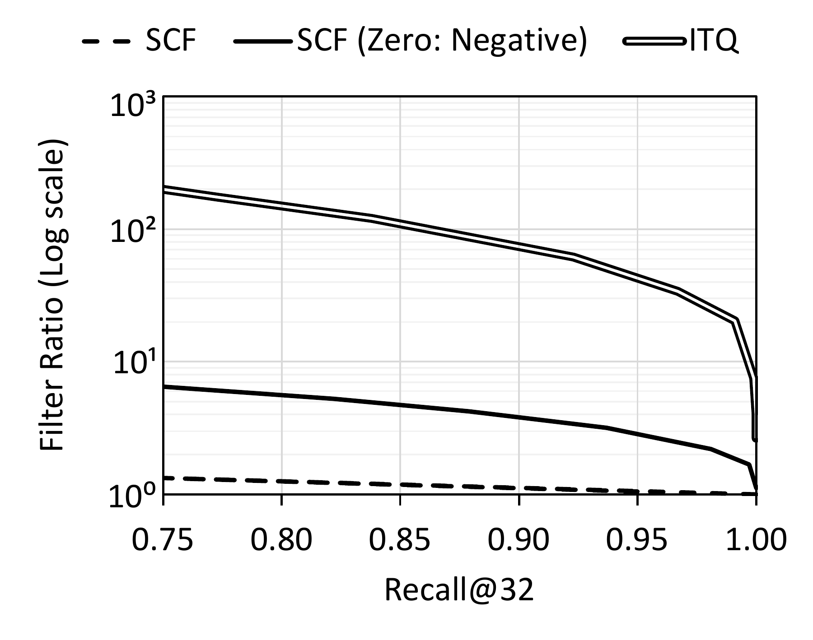

**Figure 18.** Filter Ratio vs. Recall@32 of sign concurrence with various thresholds for a pathologically constructed dataset. A dashed line represents random filtering, as sign concordance filtering cannot discern between non-negative values.

**Generality of sign concordance filtering.** A key drawback of naïve sign-based filtering is that it is dependent on the distribution of embeddings. As a result, SCF is less efficient in cases where embeddings are asymmetric about zero or have a significant correlation between dimensions. Nonetheless, we found that Iterative Quantization (ITQ) \[[82](#ref-Gong-2011-itq)\] is sufficient to dramatically improve performance. ITQ computes a similarity-preserving rotation that optimizes a dataset for binary quantization. We construct a pathological dataset by applying a uniform bias to *Deep10m* then clipping negative dimensions at zero. By clipping, we produce an entirely non-negative dataset. We bias before clipping to reduce the number of dimensions that eventually are clipped to 0.

[Figure 18](#fig:sift) shows that SCF can be highly sensitive to the choice of sign for zero for non-negative vectors with some zero components. SCF assumes a sign bit of 0 for dimensions with a value of zero. In this configuration, SCF cannot discern between any vectors in the dataset; however, if zero is taken as a negative, SCF improves somewhat, as it can distinguish between positive and zero values. However, this is far from a general approach, and sign concordance still performs far worse than on other datasets. By contrast, after applying ITQ, SCF regains much of the performance originally seen on *Deep10m*, and the choice of sign for zero has no impact. For the real datasets that we tested, the impact of ITQ was negligible, and thus we did not apply ITQ.

**Addition/deletion of vectors to/from DReX.** In many cases, updating an ANNS index requires either a partial or total reconstruction of the underlying index structures; for graph-based ANNS, graph edges must be reconstructed, while for cluster-like ANNS (e.g., IVF and LSH), cluster membership must be adjusted. Significantly, even in optimistic cases, repeated modifications to the corpus eventually warrant a total reconstruction \[[30](#ref-wang2021annsurvey), [83](#ref-wang2021milvus), [84](#ref-xu2022nnsupdate)\].

However, the placement or ordering of vectors in the corpus does not impact recall in DReX, as sign concordance filtering removes independent candidate corpus vectors from consideration. Thus, not only are updates to the corpus contained by DReX fairly simple to perform, but also there are no algorithmic concerns from performing repeated updates. Updating a particular corpus vector is a simple overwrite of existing data, without impacting any neighbors. Because the update is simple, deletions and insertions are also similarly simple. To add a new vector to the database, the new vector is appended to the existing storage. To delete a vector, the vector selected for deletion is overwritten by the last vector in the database. Because the updates are not very frequent, they can be performed in batches and optimally performed.

**Alternative NNS accelerators.** Due to the importance of dense retrieval in recommendation systems and generative AI, there is prior work in the computer architecture community on accelerating approximate and exact NNS primitives \[[14](#ref-quinn-20205-iks), [52](#ref-ndsearch), [68](#ref-anna), [85](#ref-ke_near-memory_2022), [86](#ref-Yuan_2025_FANNS), [87](#ref-Liu_2024_JUNO), [88](#ref-Hu_2022_ICE)\]. Nonetheless, these works primarily adopt existing ANNS or ENNS algorithms and design accelerators around them, without fully leveraging the opportunities for algorithm–hardware co-design to exploit the unique capabilities of near- and in-DRAM acceleration.

## 9 Conclusions

DReX is a novel PIM-based mechanism to accelerate RAG pipelines that exploits inherent mathematical properties about how similarity between vectors is computed during nearest-neighbor search, employing a *sign concordance filtering* method that allows pruning corpus vectors that are unlikely to be close to a given query vector. A novel layout in DRAM ensures that vector sign bits are readily available to the in-DRAM hardware. Our in-DRAM filtering hardware makes it possible for disregarded vectors to never even leave the DRAM bank, and our near-DRAM retrieval hardware does the rest. Our results show that DReX outperforms HNSW on CPU by 24 and 19$\times$ at Recall@32=0.95 for a high-dimensional corpus with batch sizes of 1 and 16, respectively. This dense retrieval speedup translates into a 6.2-7$\times$ reduction in time-to-first-token for a representative RAG application. Additionally, DReX incurs reasonable power and area overheads in the memory subsystem.

## Acknowledgments

This work was supported in part by NSF awards CCF-2239020, CCF-2217071, CCF-2312739, CCF-2312740, CCF-2312741, and CCF-2407690, as well as ACE and PRISM, two of the seven centers in JUMP 2.0, a Semiconductor Research Corporation (SRC) program sponsored by DARPA. Any opinions, findings, conclusions, and recommendations expressed in this material are those of the authors and do not necessarily reflect those of the sponsors.

## References

\[1\] G. Team. (2024). Gemini: A family of highly capable multimodal models. *arXiv*. <https://doi.org/10.48550/arXiv.2312.11805>.

\[2\] H. Steen and D. Wahlin. (2023). Retrieval augumented generation overview. *Microsoft Learn*. <https://learn.microsoft.com/en-us/azure/search/retrieval-augmented-generation-overview>.

\[3\] OpenAI. (2023). ChatGPT plugins. *ChinaFlashMarket*. <https://openai.com/blog/chatgpt-plugins>.

\[4\] Y. Ahn, S.-G. Lee, J. Shim, and J. Park. (2022). Retrieval-augmented response generation for knowledge-grounded conversation in the wild. *IEEE Access*. 10, pp. 131374–131385. <https://doi.org/10.1109/ACCESS.2022.3228964>.

\[5\] D. Cai, Y. Wang, W. Bi, Z. Tu, X. Liu, W. Lam, and S. Shi. (2019). Skeleton-to-Response: Dialogue generation guided by retrieval memory. *Proceedings of the 2019 conference of the north American chapter of the association for computational linguistics: Human language technologies, volume 1 (long and short papers)*. pp. 1219–1228. <https://doi.org/10.18653/v1/N19-1124>.

\[6\] G. Bonetta, R. Cancelliere, D. Liu, and P. Vozila. (2021). Retrieval-augmented Transformer-XL for close-domain dialog generation. *The International FLAIRS Conference Proceedings*. 34. <https://doi.org/10.32473/flairs.v34i1.128369>.

\[7\] W. Chen, H. Hu, X. Chen, P. Verga, and W. Cohen. (2022). MuRAG: Multimodal retrieval-augmented generator for open question answering over images and text. *Proceedings of the 2022 conference on empirical methods in natural language processing*. pp. 5558–5570. <https://doi.org/10.18653/v1/2022.emnlp-main.375>.

\[8\] P. Lewis, E. Perez, A. Piktus, F. Petroni, V. Karpukhin, N. Goyal, H. Küttler, M. Lewis, W. Yih, T. Rocktäschel, S. Riedel, and D. Kiela. (2020). Retrieval-augmented generation for knowledge-intensive NLP tasks. *Proceedings of the 34th international conference on neural information processing systems*.

\[9\] Y. A. Malkov and D. A. Yashunin. (2020). Efficient and robust approximate nearest neighbor search using hierarchical navigable small world graphs. *IEEE Transactions on Pattern Analysis and Machine Intelligence*. 42, no. 4, pp. 824–836. <https://doi.org/10.1109/TPAMI.2018.2889473>.

\[10\] H. Ootomo, A. Naruse, C. Nolet, R. Wang, T. Feher, and Y. Wang. (2024). CAGRA: Highly parallel graph construction and approximate nearest neighbor search for GPUs. <https://arxiv.org/abs/2308.15136>.

\[11\] P. Indyk and R. Motwani. (1998). Approximate nearest neighbors: Towards removing the curse of dimensionality. *Proceedings of the thirtieth annual ACM symposium on theory of computing*. pp. 604–613. <https://doi.org/10.1145/276698.276876>.

\[12\] A. Andoni, P. Indyk, T. Laarhoven, I. Razenshteyn, and L. Schmidt. (2015). Practical and optimal LSH for angular distance. *Proceedings of the 28th international conference on neural information processing systems - volume 1*. pp. 1225–1233.

\[13\] A. Babenko and V. Lempitsky. (2012). The inverted multi-index. *2012 IEEE conference on computer vision and pattern recognition*. pp. 3069–3076. <https://doi.org/10.1109/CVPR.2012.6248038>.

\[14\] D. Quinn, M. Nouri, N. Patel, J. Salihu, A. Salemi, S. Lee, H. Zamani, and M. Alian. (2025). Accelerating retrieval-augmented generation. *Proceedings of the 30th ACM international conference on architectural support for programming languages and operating systems, volume 1*. pp. 15–32. <https://doi.org/10.1145/3669940.3707264>.

\[15\] Y. Zhu, J.-C. Gu, C. Sikora, H. Ko, Y. Liu, C.-C. Lin, L. Shu, L. Luo, L. Meng, B. Liu, and J. Chen. (2024). Accelerating inference of retrieval-augmented generation via sparse context selection. *arXiv*. <https://doi.org/10.48550/arXiv.2405.16178>.

\[16\] W. Jiang, S. Zhang, B. Han, J. Wang, B. Wang, and T. Kraska. (2024). PipeRAG: Fast retrieval-augmented generation via algorithm-system co-design. <https://arxiv.org/abs/2403.05676>.

\[17\] S.-Q. Yan, J.-C. Gu, Y. Zhu, and Z.-H. Ling. (2024). Corrective retrieval augmented generation. *arXiv*. <https://doi.org/10.48550/arXiv.2401.15884>.

\[18\] G. Izacard and E. Grave. (2021). Leveraging passage retrieval with generative models for open domain question answering. *Proceedings of the 16th conference of the european chapter of the association for computational linguistics: Main volume*. pp. 874–880. <https://doi.org/10.18653/v1/2021.eacl-main.74>.

\[19\] J. Johnson and M. Douze. (2023). Faiss on the GPU. *GitHub*. <https://github.com/facebookresearch/faiss/wiki/Faiss-on-the-GPU>.

\[20\] A. F. Fabio Petroni Aleksandra Piktus. Introducing KILT, a new unified benchmark for knowledge-intensive NLP tasks — ai.meta.com. *Meta AI Blog*. <https://ai.meta.com/blog/introducing-kilt-a-new-unified-benchmark-for-knowledge-intensive-nlp-tasks/>.

\[21\] L. Gui, B. Wang, Q. Huang, A. Hauptmann, Y. Bisk, and J. Gao. (2022). KAT: A knowledge augmented transformer for vision-and-language. *Proceedings of the 2022 conference of the north american chapter of the association for computational linguistics: Human language technologies*. pp. 956–968. <https://doi.org/10.18653/v1/2022.naacl-main.70>.

\[22\] A. Salemi, J. Altmayer Pizzorno, and H. Zamani. (2023). A symmetric dual encoding dense retrieval framework for knowledge-intensive visual question answering. *Proceedings of the 46th international ACM SIGIR conference on research and development in information retrieval*. pp. 110–120. <https://doi.org/10.1145/3539618.3591629>.

\[23\] A. Salemi, M. Rafiee, and H. Zamani. (2023). Pre-training multi-modal dense retrievers for outside-knowledge visual question answering. *Proceedings of the 2023 ACM SIGIR international conference on theory of information retrieval*. pp. 169–176. <https://doi.org/10.1145/3578337.3605137>.

\[24\] N. Thakur, N. Reimers, A. Rücklé, A. Srivastava, and I. Gurevych. (2021). Beir: A heterogenous benchmark for zero-shot evaluation of information retrieval models. *arXiv preprint arXiv:2104.08663*.

\[25\] N. Muennighoff, N. Tazi, L. Magne, and N. Reimers. (2022). MTEB: Massive text embedding benchmark. *arXiv preprint arXiv:2210.07316*.

\[26\] J. Ramos and others. (2003). Using TF-IDF to determine word relevance in document queries. *Proceedings of the first instructional conference on machine learning*. 242, pp. 29–48.

\[27\] K. Sparck Jones. (1972). A statistical interpretation of term specificity and its application in retrieval. *Journal of documentation*. 28, no. 1, pp. 11–21.

\[28\] G. Salton and C. Buckley. (1988). Term-weighting approaches in automatic text retrieval. *Inf. Process. Manage.* 24, no. 5, pp. 513–523. <https://doi.org/10.1016/0306-4573(88)90021-0>.

\[29\] S. E. Robertson, S. Walker, S. Jones, M. Hancock-Beaulieu, and M. Gatford. (1994). Okapi at TREC-3. *Text retrieval conference*. <https://api.semanticscholar.org/CorpusID:3946054>.

\[30\] M. Wang, X. Xu, Q. Yue, and Y. Wang. (2021). A comprehensive survey and experimental comparison of graph-based approximate nearest neighbor search. *Proc. VLDB Endow.* 14, no. 11, pp. 1964–1978. <https://doi.org/10.14778/3476249.3476255>.

\[31\] J. J. Pan, J. Wang, and G. Li. (2024). Survey of vector database management systems. *The VLDB Journal*. 33, no. 5, pp. 1591–1615. <https://doi.org/10.1007/s00778-024-00864-x>.

\[32\] M. Aumüller, E. Bernhardsson, and A. Faithfull. (2017). ANN-benchmarks: A benchmarking tool for approximate nearest neighbor algorithms. *International conference on similarity search and applications*. pp. 34–49.

\[33\] S. Arya and D. M. Mount. (1993). Approximate nearest neighbor queries in fixed dimensions. *Proceedings of the fourth annual ACM-SIAM symposium on discrete algorithms*. pp. 271–280.

\[34\] J. Wang and S. Li. (2012). Query-driven iterated neighborhood graph search for large scale indexing. *Proceedings of the 20th ACM international conference on multimedia*. pp. 179–188. <https://doi.org/10.1145/2393347.2393378>.

\[35\] K. Aoyama, K. Saito, H. Sawada, and N. Ueda. (2011). Fast approximate similarity search based on degree-reduced neighborhood graphs. *Proceedings of the 17th ACM SIGKDD international conference on knowledge discovery and data mining*. pp. 1055–1063. <https://doi.org/10.1145/2020408.2020576>.

\[36\] Y. Malkov, A. Ponomarenko, A. Logvinov, and V. Krylov. (2014). Approximate nearest neighbor algorithm based on navigable small world graphs. *Information Systems*. 45, pp. 61–68. <https://doi.org/10.1016/j.is.2013.10.006>.

\[37\] H. Jégou, M. Douze, and C. Schmid. (2011). Product quantization for nearest neighbor search. *IEEE Transactions on Pattern Analysis and Machine Intelligence*. 33, no. 1, pp. 117–128. <https://doi.org/10.1109/TPAMI.2010.57>.

\[38\] Y. Kalantidis and Y. Avrithis. (2014). Locally optimized product quantization for approximate nearest neighbor search. *2014 IEEE conference on computer vision and pattern recognition*. pp. 2329–2336. <https://doi.org/10.1109/CVPR.2014.298>.

\[39\] C. Fu, C. Xiang, C. Wang, and D. Cai. (2019). Fast approximate nearest neighbor search with the navigating spreading-out graph. *Proc. VLDB Endow.* 12, no. 5, pp. 461–474. <https://doi.org/10.14778/3303753.3303754>.

\[40\] H. Peng, S. Chen, Z. Wang, J. Yang, S. A. Weitze, T. Geng, A. Li, J. Bi, M. Song, W. Jiang, H. Liu, and C. Ding. (2021). Optimizing FPGA-based accelerator design for large-scale molecular similarity search (special session paper). *Proceedings of the 2021 IEEE/ACM international conference on computer aided design*. pp. 1–7. <https://doi.org/10.1109/ICCAD51958.2021.9643528>.

\[41\] J.-H. Kim, Y.-R. Park, J. Do, S.-Y. Ji, and J.-Y. Kim. (2023). Accelerating large-scale graph-based nearest neighbor search on a computational storage platform. *IEEE Transactions on Computers*. 72, no. 1, pp. 278–290. <https://doi.org/10.1109/TC.2022.3155956>.

\[42\] Y. Wang, H. Liu, J. Yuan, J. Chen, T. Wang, C. Ma, and R. Mao. (2024). Leanor: A learning-based accelerator for efficient approximate nearest neighbor search via reduced memory access. *Proceedings of the 61st ACM/IEEE design automation conference*. <https://doi.org/10.1145/3649329.3657357>.

\[43\] D. Danopoulos, C. Kachris, and D. Soudris. (2019). FPGA acceleration of approximate KNN indexing on high-dimensional vectors. *Proceedings of the 2019 14th international symposium on reconfigurable communication-centric systems-on-chip*. pp. 59–65. <https://doi.org/10.1109/ReCoSoC48741.2019.9034938>.

\[44\] M. Köppen. (2000). The curse of dimensionality. *Proceedings of the 5th online world conference on soft computing in industrial applications*. 1, pp. 4–8.

\[45\] M. A. Schuh, T. Wylie, and R. A. Angryk. (2014). Mitigating the curse of dimensionality for exact kNN retrieval. *The twenty-seventh international flairs conference*.

\[46\] X. Zhao, Y. Tian, K. Huang, B. Zheng, and X. Zhou. (2023). Towards efficient index construction and approximate nearest neighbor search in high-dimensional spaces. *Proc. VLDB Endow.* 16, no. 8, pp. 1979–1991. <https://doi.org/10.14778/3594512.3594527>.

\[47\] Q. Chen, B. Zhao, H. Wang, M. Li, C. Liu, Z. Li, M. Yang, and J. Wang. (2021). SPANN: Highly-efficient billion-scale approximate nearest neighbor search. *CoRR*. abs/2111.08566. <https://arxiv.org/abs/2111.08566>.

\[48\] S. Dasgupta and K. Sinha. (2013). Randomized partition trees for exact nearest neighbor search. *CoRR*. abs/1302.1948. <http://arxiv.org/abs/1302.1948>.

\[49\] V. Karpukhin, B. Oguz, S. Min, P. Lewis, L. Wu, S. Edunov, D. Chen, and W. Yih. (2020). Dense passage retrieval for open-domain question answering. *Proceedings of the 2020 conference on empirical methods in natural language processing*. pp. 6769–6781. <https://doi.org/10.18653/v1/2020.emnlp-main.550>.

\[50\] D. Gillick, S. Kulkarni, L. Lansing, A. Presta, J. Baldridge, E. Ie, and D. Garcia-Olano. (2019). Learning dense representations for entity retrieval. *arXiv*. <https://doi.org/10.48550/arXiv.1909.10506>.

\[51\] L. Xiong, C. Xiong, Y. Li, K.-F. Tang, J. Liu, P. Bennett, J. Ahmed, and A. Overwijk. (2020). Approximate nearest neighbor negative contrastive learning for dense text retrieval. *arXiv*. <https://doi.org/10.48550/arXiv.2007.00808>.

\[52\] Y. Wang, S. Li, Q. Zheng, L. Song, Z. Li, A. Chang, H. "Helen" Li, and Y. Chen. (2024). NDSEARCH: Accelerating graph-traversal-based approximate nearest neighbor search through near data processing. *Proceedings of the 39th annual international symposium on computer architecture*. <https://doi.org/10.48550/arXiv.2312.03141>.

\[53\] N. AI. Nomic-embed-text-v1.5. <https://huggingface.co/nomic-ai/nomic-embed-text-v1.5>.

\[54\] L. Merrick. (2024). Embedding and clustering your data can improve contrastive pretraining. *arxiv*. <https://arxiv.org/abs/2407.18887>.

\[55\] J. Pennington, R. Socher, and C. D. Manning. (2014). GloVe: Global vectors for word representation. *Proceedings of the 2014 conference on empirical methods in natural language processing*. pp. 1532–1543. <http://www.aclweb.org/anthology/D14-1162>.

\[56\] S.-S. Park, K. Kim, J. So, J. Jung, J. Lee, K. Woo, N. Kim, Y. Lee, H. Kim, Y. Kwon, J. Kim, J. Lee, Y. Cho, Y. Tai, J. Cho, H. Song, J. H. Ahn, and N. S. Kim. (2024). An LPDDR-based CXL-PNM platform for TCO-efficient inference of transformer-based large language models. *Proceedings of the 2024 IEEE international symposium on high-performance computer architecture*. pp. 970–982. <https://doi.org/10.1109/HPCA57654.2024.00078>.

\[57\] G. H. Loh, N. E. Jerger, A. Kannan, and Y. Eckert. (2015). Interconnect-memory challenges for multi-chip, silicon interposer systems. *Proceedings of the 2015 international symposium on memory systems*. pp. 3–10. <https://doi.org/10.1145/2818950.2818951>.

\[58\] A. Firoozshahian, J. Coburn, R. Levenstein, R. Nattoji, A. Kamath, O. Wu, G. Grewal, H. Aepala, B. Jakka, B. Dreyer, A. Hutchin, U. Diril, K. Nair, E. K. Aredestani, M. Schatz, Y. Hao, R. Komuravelli, K. Ho, S. Abu Asal, J. Shajrawi, K. Quinn, N. Sreedhara, P. Kansal, W. Wei, D. Jayaraman, L. Cheng, P. Chopda, E. Wang, A. Bikumandla, A. Karthik Sengottuvel, K. Thottempudi, A. Narasimha, B. Dodds, C. Gao, J. Zhang, M. Al-Sanabani, A. Zehtabioskuie, J. Fix, H. Yu, R. Li, K. Gondkar, J. Montgomery, M. Tsai, S. Dwarakapuram, S. Desai, N. Avidan, P. Ramani, K. Narayanan, A. Mathews, S. Gopal, M. Naumov, V. Rao, K. Noru, H. Reddy, P. Venkatapuram, and A. Bjorlin. (2023). MTIA: First generation silicon targeting Meta’s recommendation systems. *Proceedings of the 50th annual international symposium on computer architecture*. <https://doi.org/10.1145/3579371.3589348>.

\[59\] (2024). CXL is dead in the AI era. *Semianalysis*. <https://www.semianalysis.com/p/cxl-is-dead-in-the-ai-era>.

\[60\] M. Orenes-Vera, E. Tureci, M. Martonosi, and D. Wentzlaff. (2024). MuchiSim: A simulation framework for design exploration of multi-chip manycore systems. *Proceedings of the 2024 IEEE international symposium on performance analysis of systems and software*. pp. 48–60. <https://doi.org/10.1109/ISPASS61541.2024.00015>.

\[61\] D. Patel. (2022). Apple M2 Die Shot and Architecture Analysis – Big Cost Increase And A15 Based IP. *SemiAnalysis*. <https://www.semianalysis.com/p/apple-m2-die-shot-and-architecture>.

\[62\] S. Li, Z. Yang, D. Reddy, A. Srivastava, and B. Jacob. (2020). DRAMsim3: A cycle-accurate, thermal-capable DRAM simulator. *IEEE Computer Architecture Letters*. 19, no. 2, pp. 106–109. <https://doi.org/10.1109/LCA.2020.2973991>.

\[63\] J. Park, J. Choi, K. Kyung, M. J. Kim, Y. Kwon, N. S. Kim, and J. H. Ahn. (2024). AttAcc! Unleashing the power of PIM for batched transformer-based generative model inference. *Proceedings of the 29th ACM international conference on architectural support for programming languages and operating systems, volume 2*. pp. 103–119. <https://doi.org/10.1145/3620665.3640422>.

\[64\] A. Stillmaker and B. Baas. (2017). Scaling equations for the accurate prediction of CMOS device performance from 180nm to 7nm. *Integration*. 58, pp. 74–81. <https://doi.org/10.1016/j.vlsi.2017.02.002>.

\[65\] F. Devaux. (2019). UPMEM processing in memory: DRAM is becoming a true processing unit. *Proceedings of the 31st hot chips symposium (HC31)*. <https://old.hotchips.org/hc31/HC31_1.4_UPMEM.FabriceDevaux.v2_1.pdf>.

\[66\] W. J. Dally, Y. Turakhia, and S. Han. (2020). Domain-specific hardware accelerators. *Communications of the ACM*. 63, no. 7, pp. 48–57. <https://doi.org/10.1145/3361682>.

\[67\] H. Luo, Y. C. Tuğrul, F. N. Bostancı, A. Olgun, A. G. Yağlıkçı, and O. Mutlu. (2024). Ramulator 2.0: A modern, modular, and extensible DRAM simulator. *IEEE Comput. Archit. Lett.* 23, no. 1, pp. 112–116. <https://doi.org/10.1109/LCA.2023.3333759>.

\[68\] Y. Lee, H. Choi, S. Min, H. Lee, S. Beak, D. Jeong, J. W. Lee, and T. J. Ham. (2022). ANNA: Specialized architecture for approximate nearest neighbor search. *2022 IEEE international symposium on high-performance computer architecture (HPCA)*. pp. 169–183. <https://doi.org/10.1109/HPCA53966.2022.00021>.

\[69\] H. Jegou, M. Douze, and J. Johnson. Faiss: A library for efficient similarity search — engineering.fb.com. *Meta Engineering Blog*. <https://engineering.fb.com/2017/03/29/data-infrastructure/faiss-a-library-for-efficient-similarity-search/>.

\[70\] RAPIDS AI. (2025). cuVS: GPU-accelerated vector search and clustering. <https://github.com/rapidsai/cuvs>.

\[71\] P. Bajaj, D. Campos, N. Craswell, L. Deng, J. Gao, X. Liu, R. Majumder, A. McNamara, B. Mitra, T. Nguyen, M. Rosenberg, X. Song, A. Stoica, S. Tiwary, and T. Wang. (2018). MS MARCO: A human generated MAchine reading COmprehension dataset. <https://arxiv.org/abs/1611.09268>.

\[72\] T. RAG. (2024). TREC RAG 2024 corpus finalization. <https://trec-rag.github.io/annoucements/2024-corpus-finalization/>.

\[73\] J. Stojkovic, E. Choukse, C. Zhang, I. Goiri, and J. Torrellas. (2024). Towards greener LLMs: Bringing energy-efficiency to the forefront of LLM inference. *arXiv preprint arXiv:2403.20306*. <https://doi.org/10.48550/arXiv.2403.20306>.

\[74\] G. Cloud. (2023). Best practices with large language models (LLMs). <https://cloud.google.com/vertex-ai/generative-ai/docs/learn/prompt-best-practices>.

\[75\] M. Agarwal, A. Qureshi, N. Sardana, L. Li, J. Quevedo, and D. Khudia. (2023). LLM inference performance engineering: Best practices. <https://www.databricks.com/blog/llm-inference-performance-engineering-best-practices>.

\[76\] TechInsights. (2025). Samsung 1a 16Gb LPDDR5X DRAM transistor. <https://www.techinsights.com/blog/samsung-1a-16gb-lpddr5x-dram-transistor>.

\[77\] S. Lee, S. Kang, J. Lee, H. Kim, E. Lee, S. Seo, H. Yoon, S. Lee, K. Lim, H. Shin, J. Kim, O. Seongil, A. Iyer, D. Wang, K. Sohn, and N. S. Kim. (2021). Hardware architecture and software stack for PIM based on commercial DRAM technology : Industrial product. *2021 ACM/IEEE 48th annual international symposium on computer architecture (ISCA)*. pp. 43–56. <https://doi.org/10.1109/ISCA52012.2021.00013>.

\[78\] LPDDR5 tutorial: Deep dive into its physical structure. <https://www.systemverilog.io/design/lpddr5-tutorial-physical-structure/>.

\[79\] Locuza. (2022). Die analysis: Samsung exynos 2200 with RDNA2 graphics. <https://locuza.substack.com/p/die-analysis-samsung-exynos-2200>.

\[80\] M. Horowitz. (2014). 1.1 computing’s energy problem (and what we can do about it). *2014 IEEE international solid-state circuits conference digest of technical papers (ISSCC)*. pp. 10–14. <https://doi.org/10.1109/ISSCC.2014.6757323>.

\[81\] L. T. Su, S. Naffziger, and M. Papermaster. (2017). Multi-chip technologies to unleash computing performance gains over the next decade. *2017 IEEE international electron devices meeting (IEDM)*. pp. 1.1.1–1.1.8. <https://doi.org/10.1109/IEDM.2017.8268306>.

\[82\] Y. Gong and S. Lazebnik. (2011). Iterative quantization: A procrustean approach to learning binary codes. *CVPR 2011*. pp. 817–824. <https://doi.org/10.1109/CVPR.2011.5995432>.

\[83\] J. Wang, X. Yi, R. Guo, H. Jin, P. Xu, S. Li, X. Wang, X. Guo, C. Li, X. Xu, K. Yu, Y. Yuan, Y. Zou, J. Long, Y. Cai, Z. Li, Z. Zhang, Y. Mo, J. Gu, R. Jiang, Y. Wei, and C. Xie. (2021). Milvus: A purpose-built vector data management system. *Proceedings of the 2021 international conference on management of data*. pp. 2614–2627. <https://doi.org/10.1145/3448016.3457550>.

\[84\] Z. Xu, W. Zhao, S. Tan, Z. Zhou, and P. Li. (2022). Proximity graph maintenance for fast online nearest neighbor search. *arXiv preprint arXiv:2206.10839*.

\[85\] L. Ke, X. Zhang, J. So, J.-G. Lee, S.-H. Kang, S. Lee, S. Han, Y. Cho, J. H. Kim, Y. Kwon, K. Kim, J. Jung, I. Yun, S. J. Park, H. Park, J. Song, J. Cho, K. Sohn, N. S. Kim, and H.-H. S. Lee. (2022). Near-Memory Processing in Action: Accelerating Personalized Recommendation With AxDIMM. *IEEE Micro*. 42, no. 1, pp. 116–127. <https://doi.org/10.1109/MM.2021.3097700>.

\[86\] W. Yuan and X. Jin. (2025). FANNS: An FPGA-based approximate nearest-neighbor search accelerator. *IEEE Transactions on Very Large Scale Integration (VLSI) Systems*. 33, no. 4, pp. 1197–1201. <https://doi.org/10.1109/TVLSI.2024.3496589>.

\[87\] Z. Liu, W. Ni, J. Leng, Y. Feng, C. Guo, Q. Chen, C. Li, M. Guo, and Y. Zhu. (2024). JUNO: Optimizing high-dimensional approximate nearest neighbour search with sparsity-aware algorithm and ray-tracing core mapping. *Proceedings of the 29th ACM international conference on architectural support for programming languages and operating systems, volume 2*. pp. 549–565. <https://doi.org/10.1145/3620665.3640360>.

\[88\] H.-W. Hu, W.-C. Wang, Y.-H. Chang, Y.-C. Lee, B.-R. Lin, H.-M. Wang, Y.-P. Lin, Y.-M. Huang, C.-Y. Lee, T.-H. Su, C.-C. Hsieh, C.-M. Hu, Y.-T. Lai, C.-K. Chen, H.-S. Chen, H.-P. Li, T.-W. Kuo, M.-F. Chang, K.-C. Wang, C.-H. Hung, and C.-Y. Lu. (2022). ICE: An intelligent cognition engine with 3D NAND-based in-memory computing for vector similarity search acceleration. *2022 55th IEEE/ACM international symposium on microarchitecture*. pp. 763–783. <https://doi.org/10.1109/MICRO56248.2022.00058>.

[^1]: *Recall@K* of *R* means that, on average across multiple queries, $(100\times R)$% of the top-*K* documents retrieved by the ANNS algorithm overlap with the top-*K* retrieved by the ENNS algorithm. Prior work has suggested that retrieving more than 25–50 documents yields diminishing returns in terms of accuracy \[[18](#ref-izacard2021leveraging)\]; therefore, in this paper, we use Recall@32 as a metric to quantify the accuracy of the dense retrieval.
