# LongSight: Compute-Enabled Memory to Accelerate Large-Context LLMs via Sparse Attention

Derrick Quinn, E. Ezgi Yücel, Jinkwon Kim, José F. Martínez, Mohammad Alian

Jinkwon Kim: Work done while at SK hynix.

MICRO 2025

[Published paper](https://doi.org/10.1145/3725843.3756062) · [PDF](https://derrickquinn.github.io/LongSight.pdf)

Full-text Markdown converted from the author-provided LaTeX source. Figures are linked images; equations use LaTeX math notation.

## Abstract

Large input context windows in transformer-based LLMs help minimize hallucinations and improve output accuracy and personalization. However, as the context window grows, the attention phase increasingly dominates execution time. Key–Value (KV) caching alleviates part of this cost by avoiding redundant computation, but the KV cache itself can quickly exceed the capacity of today’s GPU high-bandwidth memory (HBM). In this work, we present LongSight, an algorithm–hardware co-design framework for accelerating attention in large-context scenarios. LongSight leverages a compute-enabled CXL memory device, originally designed for dense retrieval acceleration, to offload KV cache storage and retrieval. Therefore, LongSight effectively elevates the value of relatively low-cost LPDDR DRAM to that of high-end HBM. We demonstrate that, with just a single GPU and a single compute-enabled CXL memory expander, LongSight can efficiently support context lengths of up to 1 million tokens for state-of-the-art Llama models.

## 1 INTRODUCTION

Pretrained large language models (LLMs) require access to up-to-date and relevant information to minimize hallucinations and generate accurate, personalized outputs. This information is typically provided as part of the model’s input context. Indeed, LLMs are increasingly being applied in settings that require extended context windows, driven by test-time techniques (e.g., chain-of-thought, few-shot, scratchpad prompting, ReACT, etc.) \[[1](#ref-brown2020languagemodelsfewshotlearners), [2](#ref-nye2021workscratchpadsintermediatecomputation), [3](#ref-yao2023reactsynergizingreasoningacting), [4](#ref-wei2023chainofthoughtpromptingelicitsreasoning)\], retrieval-augmented generation \[[5](#ref-lewis2021retrievalaugmentedgenerationknowledgeintensivenlp)\], and the growing complexity of input data, such as long-form documents, code, or multi-turn interactions.

As context lengths grow, so too do the computational and memory demands of inference. In particular, the attention phase in transformer-based LLMs tends to dominate execution time as the context window increases. Key-Value (KV) caching helps mitigate this by avoiding redundant computation in exchange for increased memory pressure. Unfortunately, with larger context windows, the size of the KV cache can quickly exceed the capacity of high-bandwidth memory (HBM) available on current neural processing units (NPUs), such as GPUs or TPUs.

DReX \[[6](#ref-quinn-2025-drex)\] is a recent compute-enabled CXL memory expander for accelerating dense retrieval. Dense retrieval is increasingly adopted for implementing retrieval-augmented generation (RAG), where retrievable items are stored as high-dimensional embedding vectors in a vector database, and semantically relevant items are identified by evaluating cosine similarity between a query vector and the embeddings. DReX integrates lightweight accelerators in and near the LPDDR DRAM chips of a high-capacity CXL memory expander. It further introduces a sign-bit filtering mechanism that rapidly prunes the search space without fetching full embedding vectors from DRAM, thereby significantly increasing the performance of dense retrieval.

In this work, we introduce LongSight, an algorithm–hardware co-design framework for accelerating attention in large-context inference. Building on DReX’s foundation, LongSight extends its functionality beyond RAG, repurposing the same compute-enabled CXL memory expander to accelerate the attention mechanism in transformer-based LLMs. As a result, LongSight delivers high performance for very large attention contexts.

More specifically, LongSight enables the NPU to store the KV cache through the load/store interface provided by CXL in DReX. LongSight implements a hybrid dense–sparse attention algorithm: the NPU retains a sliding window of the most recent KV pairs in its local HBM and performs dense attention over this window, while sparse attention is offloaded to DReX. For the sparse component, the NPU submits an attention request containing the query vector(s) to DReX through the CXL interface. DReX then efficiently retrieves a top-k list of keys with the highest dot-product similarity to the query vector(s). Finally, the NPU completes the attention operation by applying a softmax over the combined set of dense and sparse keys.

We demonstrate that LongSight, equipped with a single GPU and a single DReX unit, can efficiently support context lengths of up to 1 million tokens for state-of-the-art Llama-3 1B and 8B models. Such context length is only possible to support with 2 H100 GPUs in current systems. At the maximum context length supported by a single GPU, LongSight achieves up to $8.1$–$9.6\times$ higher throughput and $3.6$–$11.9\times$ higher tokens per second per user for the Llama-3 models.

Our key contributions are:

- We corroborate prior findings that attention in transformers is predominantly influenced by a small subset of past tokens whose Key vectors exhibit high dot-product similarity with the current Query vectors. Building on this insight, we enabled large-context attention by leveraging recent advances in dense-retrieval acceleration.

- We propose a hybrid dense-sparse attention algorithm that keeps the short-term attention window inside NPU’s HBM and implements long-term attention as a vector database of Keys and Values, accessed via top-k dot-product similarity.

- We repurpose DReX, a recently proposed compute-enabled CXL memory expander originally designed for dense retrieval, to accelerate our hybrid attention mechanism.

## 2 BACKGROUND

### 2.1 Transformer-Based LLM

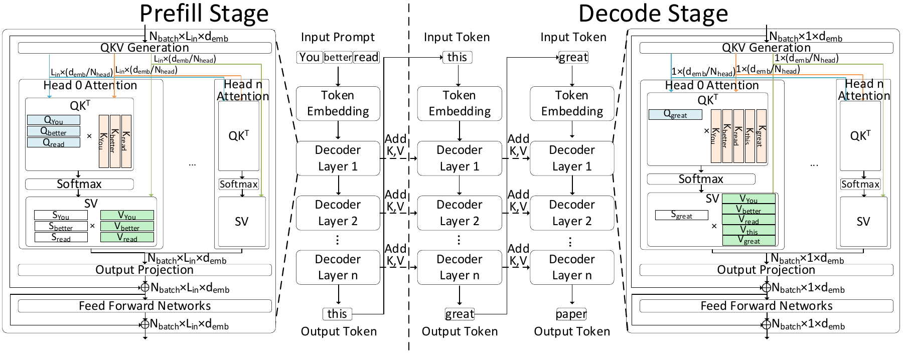

**Figure 1.** Inference pipeline of transformer-based LLMs.

[Figure 1](#fig:background:llm) illustrates a state-of-the-art LLM architecture. LLM inference consists of prefill and decode stages. The prefill stage constructs a KV cache for a user input prompt, while the decode stage uses the KV cache to generate new tokens in an autoregressive manner. Both stages share the same weight matrices and model architecture, comprising token embedding and multiple decoder layers. Each decoder layer sequentially performs QKV generation, multi-head attention, output projection, and feed-forward networks. QKV generation creates Query (Q), Key (K), and Value (V) tensors in parallel for each input token using the layer’s weight matrices. After that, Q, K, and V tensors are divided into multiple heads and passed through multi-head attention. In multi-head attention, each head computes attention scores for each Q tensor over all preceding K tensors in the input sequence. The attention scores are passed through a softmax function and then multiplied by the corresponding V tensors. Using multiple heads allows the model to attend to information from different representation subspaces at different positions. Multi-head attention enables transformers to capture diverse contextual relationships \[[7](#ref-NIPS2017_3f5ee243)\]; for example, one head may determine part of speech, while another determines sentiment. The resulting vectors are projected through an output projection layer and added to the input embeddings via a residual connection, followed by a feed-forward networks.

The left and right parts of [Figure 1](#fig:background:llm) illustrate the decoder layer in the prefill and decode stages, respectively. Regardless of the stage, QKV generation, output projection, and feed-forward networks can benefit from batching by sharing weight matrices across multiple users, enabling matrix-matrix multiplications. In contrast, since attention utilizes Q, K, and V tensors that encode information for each input token, KV data cannot be re-used across a batch due to differences in user prompts. The input length varies depending on the prompt: in the prefill stage, it corresponds to the full user prompt length, whereas the decode stage receives only a single input token. Consequently, attention in the prefill stage involves matrix-matrix multiplications, while the decode stage requires vector-matrix multiplications.

In summary, except for attention in the decode stage, most LLM operations are matrix-matrix multiplications, allowing GPUs to efficiently utilize compute resources. However, attention in the decode stage involves vector-matrix multiplication, leading to high memory bandwidth demands and underutilization of GPU compute resources. Moreover, as the input context length increases, more K and V tensors are required for attention. Prior work shows that, for these reasons, the attention for the decoder stage can become a primary performance bottleneck, significantly impacting token generation throughput  \[[8](#ref-neupims2023), [9](#ref-cent2023)\].

### 2.2 Tiered GPU Memory and CXL

Recent advancements in GPU-centric architectures and systems have led to the development of *tiered GPU memory*, which expands the byte-addressable memory space of GPUs from local HBM to include host DDR memory and even NVMe SSDs \[[10](#ref-qureshi-2023-bam), [11](#ref-park-2024-vldb-gpudirect)\]. These GPU-centric approaches allow GPUs to initiate on-demand access to data—whether in memory or storage—without relying on the CPU to initiate or trigger such accesses.

The simplest implementation of tiered GPU memory maps host memory into the GPU’s address space, enabling the GPU to either access host memory through load/store instructions executed by GPU threads or initiate DMA transfers. NVIDIA’s recently introduced *SCaled Accelerated Data Access (SCADA)* API enables GPU threads to perform multi-granular and random accesses to datasets of unbounded size across the tiered memory hierarchy \[[12](#ref-newburn2024gpus)\].

Compute Express Link (CXL) is an industry standard designed to provide low-latency, byte-granular access to disaggregated memory while supporting cache coherence between devices—traditionally connected via PCIe interconnects without coherency. CXL has already been adopted by hyperscalers \[[13](#ref-cxl-meta)\] and is being used to build rack-scale shared memory systems \[[14](#ref-hpeSuperdome), [15](#ref-hpeSuperdomeXR), [16](#ref-nextplatform2021bigiron)\]. In this work, we focus on CXL’s capability to attach DDR-based memory (“Type-3” devices) over PCIe to the processor, making it directly accessible via standard load/store instructions.

## 3 State-of-the-Art in Long-Context Generation

Prior work has shown that the cost of full attention grows to dominate runtime as sequence length increases \[[17](#ref-qserve)\]. The total sequence length includes both the size of the input context and the number of output tokens generated during inference. Both dimensions are becoming increasingly important in modern LLM applications. Longer input contexts are needed to provide grounding and give the LLM access to fresh, relevant information for accurate and up-to-date generation. Meanwhile, generating longer output sequences is crucial in tasks requiring reasoning and multi-step planning, particularly in agentic AI systems such as OpenAI DeepResearch \[[18](#ref-openai-2025-deepresearch)\], which use reinforcement learning to guide multi-round generation and reasoning based on previously generated tokens. These systems demand support for LLMs capable of attending to both a large number of input tokens and a growing number of generated output tokens.

As the total context length increases, the attention mechanism becomes a significant bottleneck—both in terms of FLOPs and memory capacity. Furthermore, unlike the feedforward network or other components that benefit from batching, attention costs cannot be amortized across users. This limitation becomes increasingly problematic as batch sizes grow to improve computational efficiency. As a result, these challenges have driven the development of non-quadratic partial attention mechanisms (i.e., sparse attention) and accelerated attention execution using in-memory and near-memory computing architectures.

### 3.1 Software-Based Sparse Attention

We begin by discussing software-based approaches to sparse attention, which have gained popularity as a means to reduce the computational cost of attention. *Reformer* \[[19](#ref-kitaev2020reformerefficienttransformer)\] implements sparse attention in software by using *locality-sensitive hashing* (LSH) to filter out context tokens that are unlikely to be relevant. Only the surviving tokens are then passed to the attention mechanism. This probabilistic filtering reduces the computational complexity of the remaining attention phase.

However, Reformer’s LSH-based filtering introduces per-token overhead with linear time complexity. Moreover, Reformer performs multiple rounds of filtering, each requiring either additional storage or recomputation of hash buckets. As a result, the benefits of sparsity can be offset by these overheads when executed on modern hardware, which is highly optimized for dense dot-product computation.

Additionally, Reformer assumes that the queries and keys are identical, which prevents the use of configurations with fewer KV heads than query heads—a common state-of-the-art technique used to reduce memory footprint and improve attention efficiency.

*Longformer* \[[20](#ref-beltagy2020longformerlongdocumenttransformer)\] takes a different approach to sparse attention by implementing non-exact attention using *sliding windows* combined with limited global attention. A key advantage of the sliding window mechanism is its computational simplicity and its compatibility with current hardware, enabling efficient execution.

However, sliding-window attention alone is inherently limited in its ability to capture long-range dependencies. To address this, Longformer augments the local sliding-window attention with a small set of *global attention tokens* that can attend broadly across the sequence. The sparse attention mask in Longformer is *pre-defined* and *static*, allowing models to be fine-tuned for specific tasks with customizable attention patterns. This approach enables increased sparsity relative to baseline models by tailoring the mask to the structure of each task.

Despite these benefits, a key limitation of Longformer’s design is that attention masks must be manually configured on a per-task basis, which has been cited as a significant usability and generalization challenge \[[20](#ref-beltagy2020longformerlongdocumenttransformer)\].

*DeepSeek AI* \[[21](#ref-yuan2025native)\] reports that “blockwise selection is crucial to achieve efficient computation on modern GPUs.” Building on this insight, they propose *NSA* (Natively trainable Sparse Attention), which combines block-level sparsity with compressed dense attention and sliding-window attention. While block-level sparsity enables efficient implementation on GPU hardware, it imposes a limitation on the achievable overall sparsity due to its coarse granularity. Furthermore, NSA requires long-context fine-tuning to perform effectively, which introduces additional computational and financial cost.

In summary, existing software-based sparse attention implementations struggle to achieve both high sparsity and low filtering overhead without requiring significant model- or task-specific modifications.

### 3.2 Hardware-Based Attention Acceleration

NeuPIMs \[[8](#ref-neupims2023)\] and AttAcc \[[22](#ref-attacc)\] explore hybrid architectures that combine traditional neural processing units (NPUs), such as GPUs, with processing-in-memory (PIM) hardware for large-scale LLM inference. Batched LLM inference workloads exhibit significant heterogeneity; therefore, NeuPIMs/AttAcc perform compute-bound pipeline stages (e.g., Prefill and FFN) on the NPU while offloading the memory-bound attention computation during the decode phase to PIM units. However, a key limitation of these works is their use of full *dense* attention, which remains expensive even when executed on PIM hardware. Furthermore, NeuPIMs relies on a dual row buffer mechanism, which poses major implementation challenges, requiring substantial modifications to the DRAM circuit design.

CENT \[[9](#ref-cent2023)\] adopts a system-level, memory-centric approach by offloading all transformer operations to near- and in-memory devices. A key benefit of CENT is that it utilizes high-bandwidth PIM units to accelerate memory-bound computations. However, CENT implements BFloat16 multiply-accumulate (MAC) units for attention *within memory*, which incurs substantial area and energy overhead. Additionally, CENT’s system-wide design replaces highly optimized GPUs or NPUs with custom hardware to handle compute-bound transformer components, increasing overall system cost. Like NeuPIMs, CENT also implements *dense* attention, making it difficult to extend the architecture to support efficient sparse attention.

DynaX \[[23](#ref-Xiong-2025-DynaX)\] takes a different approach by leveraging sparsity within query vectors and employing 4- or 6-bit quantization for queries and keys to reduce the cost of computing approximate attention scores. These approximate scores are then used to construct a block-based sparse attention mask. DynaX further exploits structured sparsity within filtered blocks using custom hardware. However, its performance is ultimately limited by the cost of loading Keys during filtering. Even with quantization, at least $\frac{1}{4} \cdot \frac{6}{16} \approx 9.4\%$ of the Keys’ memory footprint must be loaded to evaluate attention scores—placing a bound on achievable speedups.

## 4 LongSight: Algorithm-System Codesign for Large-Context Attention

To overcome the limitations of existing software- and hardware-based approaches to large-context attention, we propose LongSight. LongSight co-designs the attention algorithm in transformer-based LLMs alongside the system and hardware architecture to enable arbitrarily large-context attention—without compromising the composability or programmability of existing GPU-based ML frameworks. LongSight introduces a sparse attention algorithm based on the observation that transformers primarily attend to prior tokens whose corresponding Key vectors exhibit high dot-product similarity with the current Query vector \[[24](#ref-hooper2024squeezedattentionacceleratinglong)\]. At a high level, LongSight treats the KV cache as a *vector database*, accessed via top-$k$ dot-product similarity queries to retrieve only the most semantically relevant Keys—instead of attending to the full KV cache history.

This vector database, however, differs significantly from conventional vector databases in several key aspects:

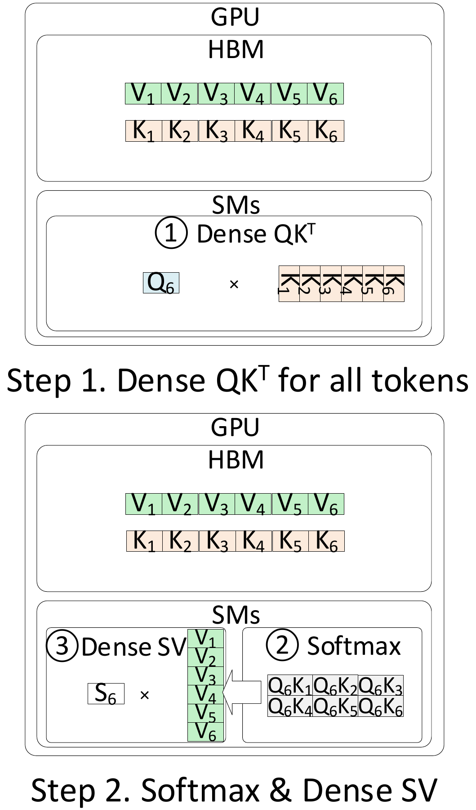

**Figure 2(a).** Conventional GPU-only serving

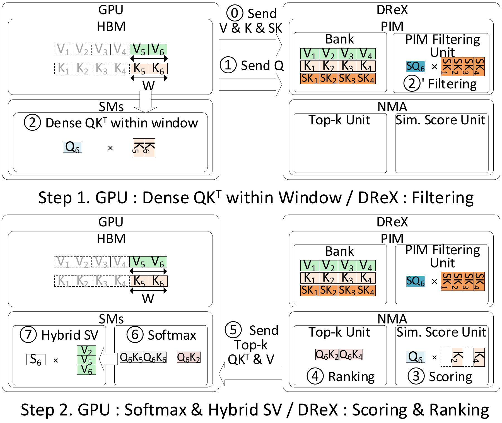

**Figure 2(b).** GPU + DReX collaborative hybrid attention

**Figure 2.** Overview of LongSight.

**1. Granularity and scale:** It maintains independent databases for each KV head, layer, and user. For example, in Llama-3-8B(which has 8 KV heads and 32 decoder layers), this results in 256 independent databases per user. With more users, this number scales linearly.

**2. Access rate:** The database is accessed at a rate of $\mathit{TPS} \times L \times H \times U$, where $\mathit{TPS}$ is the token generation rate, $L$ is the number of decoder layers, $H$ is the number of attention heads, and $U$ is the number of users in the batch. For Llama-3-8B running on optimized systems, $\mathit{TPS}$ can reach several hundred tokens per second even for moderate batch sizes—translating to *hundreds of thousands of vector database queries per second*.

**3. Latency sensitivity:** These vector database accesses lie on the critical path of token generation due to the autoregressive and sequential nature of transformer-based models. For a generation rate of 100 tokens per second with a single-user batch and 32 layers, the latency budget for attention in each layer is on the order of *a few hundred microseconds*. We refer to this latency budget as the *Service Level Objective (SLO)* of attention requests.

**4. Dynamic updates:** Unlike conventional vector databases, which are often static or slow-changing, this vector database is *frequently updated*. During the Prefill stage, the entire database is initialized. In the decode stage, a new Key-Value pair is added for each token generated per user—resulting in high update rates.

**Current approaches fail to meet the above requirements.** Traditional vector databases typically use either exhaustive nearest neighbor search (ENNS) or approximate nearest neighbor search (ANNS) to retrieve the top-$k$ most similar vectors. ENNS is prohibitively slow and violates the SLO of attention requests. In fact, dense attention is equivalent to performing ENNS over the entire KV cache, making ENNS-based LongSight operation regressive.

Clustering-based and Graph-based ANNS, while fast, incur significant overhead for index construction and maintenance. Every time a new vector is added, the index must be updated—a process that is costly and time-consuming. This is why prior work can only support a fixed long context that is reused with ANNS \[[24](#ref-hooper2024squeezedattentionacceleratinglong)\].

To enable accurate and high-performance sparse attention at large context scales, LongSight enables an NPU (e.g., GPU) to store the KV cache of the users on a separate *compute-enabled memory* device and offload the bulk of attention computation to the compute-enabled memory device. LongSight builds on three key ideas:

#### Idea 1: Multi-stage, in- and near-memory filtering and retrieval

The first idea is to move away from traditional ANNS methods that rely on pre-processed indices and instead adopt a *hierarchical filtering mechanism* pioneered by DReX \[[6](#ref-quinn-2025-drex)\], which provides the accuracy of ENNS with the speed of ANNS in multiple stages:

Stage 1 involves in-memory filtering. All quantized Key vectors are laid out in DRAM to allow efficient access by Processing-In-Memory (PIM) units ([Figure 2(b)](#fig:longsight:cem) (2)’). PIM units rapidly compute the similarity between the quantized query and keys. We use one-bit quantization of key vector dimensions based on the sign bit of their full-precision data representations (§[5](#sec:alg)). A relaxed threshold is used to filter out distant keys while ensuring that no semantically relevant key is filtered out. This dramatically simplifies storage and eliminates the need for complex indexing. This enables low-overhead, on-the-fly filtering and high update rates. Moreover, unlike other processing-in-memory approaches that support only a limited set of data types, in-memory filtering is compatible with any signed data type.

Stage 2 involves near-memory top-k retrieval. Vectors that pass the Stage-1 filter are forwarded to near-memory accelerators, which perform an exhaustive full-precision dot-product similarity search to identify the most relevant Keys and Values ([Figure 2(b)](#fig:longsight:cem) (3), (4)). The resulting top-k set is then returned to the GPU for final attention computation ([Figure 2(b)](#fig:longsight:cem) (5)).

#### Idea 2: Leveraging CXL for fine-grain GPU access

This multi-stage in- and near-memory filtering inside DReX satisfies high-bandwidth, low-latency, and high-accuracy requirements. To support fine-grain access, DReX uses CXL to expose both its internal memory and Memory-Mapped I/O (MMIO) registers directly into the GPU address space. Modern GPU APIs support this via mechanisms such as SCADA \[[12](#ref-newburn2024gpus)\], allowing the GPU to access remote memory using standard load/store instructions.

#### Idea 3: Hybrid dense and sparse attention

Because LongSight requires frequent updates to per-head, per-layer, and per-user KV databases during generation, we implement a hybrid dense-sparse attention strategy. The GPU retains a sliding window of the $W$ most recent KV pairs in its HBM and performs dense attention over this window in parallel with sparse attention offloaded to DReX ([Figure 2(b)](#fig:longsight:cem) (2), (2)’, (3), (4)). Once DReX returns its top-k results, GPU performs softmax over the combined set of dense and sparse $QK^{T}$ ([Figure 2(b)](#fig:longsight:cem) (5), (6)). Subsequently, the recent V vectors are loaded from HBM and combined with the received top-k V vectors retrieved from DReX. Then, a hybrid dense-sparse SV attention is applied ([Figure 2(b)](#fig:longsight:cem) (7)).

This hybrid design offers two benefits: (1) Tokens that are temporally close are often the most relevant, so dense attention over recent tokens improves accuracy; (2) The window serves as a *staging buffer* to batch KV updates to DReX, removing them from the inference-time critical path.

In the following sections, we present the three subparts of LongSight: algorithm design (§[5](#sec:alg)), system integration (§[6](#sec:sys)), and hardware architecture (§[7](#sec:arch)).

## 5 LongSight Algorithm Design

In this section, we present the algorithmic design of LongSight, which enables hybrid dense-sparse attention by offloading to a separate device. We explain Sign-Concordance Filtering \[[6](#ref-quinn-2025-drex)\], a one-bit quantized filtering scheme tailored to the capabilities of PIM, and discuss how SCF enables high-performance filtering as part of a multi-stage Key-Value (KV) retrieval pipeline. LongSight’s sparse attention algorithm operates in three stages: (1) **filtering**, which excludes prior tokens’ keys based on the number of signs that match a new query (2) **scoring**, which computes attention scores via dot-product for included keys; and (3) **ranking**, which selects the top-$k$ attention scores—a process mirroring retrieval from a vector database.

### 5.1 Overview

LongSight computes up to $k$[^1] attention scores per KV head, where $k$ is a tunable parameter. Each KV head is handled independently. First, we apply per-token filtering based on quantized approximations of similarity between queries and keys, producing a sparse mask. Next, full-precision attention is computed over the surviving tokens, and the Top-$k$ results are retained for each head.

**Filtering:** LongSight leverages Sign Concordance Filtering (SCF) \[[6](#ref-quinn-2025-drex)\], which is a threshold-based filtering with quantized queries and keys. Specifically, SCF evaluate whether a query vector $Q$ and a key vector $K$, each of dimension $D$, share enough matching sign bits to exceed a similarity threshold $\mathit{TH}$:

$\textrm{SCF}(Q, K, \mathit{TH}) = \left( \mathit{TH} \leq D - \sum_{i=1}^{D} (\mathit{SQ}[i] \oplus \mathit{SK}[i]) \right)$

where $\mathit{SQ}[i]$ and $\mathit{SK}[i]$ are the sign bits of the $i^{\text{th}}$ dimensions of $Q$ and $K$ respectively, and $\oplus$ denotes XOR. This expression counts the number of dimensions where the sign bits match; keys are retained only if this count exceeds the threshold. Within LongSight, it is feasible to set each threshold value at many different granularities (e.g., setting a single threshold value for all Q heads, KV heads, or layers). Since each attention head has a distinct distribution of scores, fine-grained thresholding (i.e., setting a threshold for each Q head) has the potential to be more expressive than coarser-grained thresholding. Nonetheless, we found that assigning a threshold to each Query head introduced instability in our threshold tuning algorithm (§[8.1.3](#sec:method:tuning)). Instead, we assign a threshold to each KV head, which provides effective and stable filtering performance.

SCF is applied independently per query token, rather than in blocks. This per-token filtering improves quality and is a good fit for processing in memory acceleration (§[7](#sec:arch)). **Attention Scores:** After filtering, attention scores are computed via full-precision dot-products between queries and the remaining keys.

**Top-$k$ Retrieval:** LongSight applies a Top-$k$ reduction over the attention scores to select the most relevant Value vectors. This step reduces the number of Value vectors loaded back to the GPU, enabling the GPU to implement very large-context lengths with a limited memory space. **Remaining Operations:** Offloading the remainder of attention (i.e., softmax over dot-products, accumulation of value vectors) to a standalone accelerator limits our ability to incorporate dense attention masks on the GPU. Therefore, the remaining operations (softmax, weighted sum, and linear layers) are executed on the GPU using conventional methods and are not core to our algorithm.

### 5.2 Baseline Algorithm Results

To evaluate the effectiveness of LongSight’s algorithm, we implement a software prototype on a CPU-GPU system. As a baseline, we use the raw sign bits from unmodified Key and Query vectors for SCF.

[Figure 3(a)](#fig:hybrid-fr:1b) shows the KV cache filter ratio (the ratio of the total number of KV entries accessed during the dense attention baseline to the number of Keys accessed after filtering and k Keys and Values retrieved after Top-$k$ selection). We evaluate the algorithm using $k = 128$ and $k = 1,024$, and match the model quality to be similar to dense attention, as determined by perplexity, which measures how well a model predicts the next token.

As shown in [Figure 3(a)](#fig:hybrid-fr:1b), the baseline sparse algorithm struggles to match the perplexity of dense attention for long-context sequences when $k = 128$. This is because limiting the number of attended tokens to $k$ restricts access to useful context, regardless of filtering effectiveness.

### 5.3 Hybrid Short/Long-Range Attention

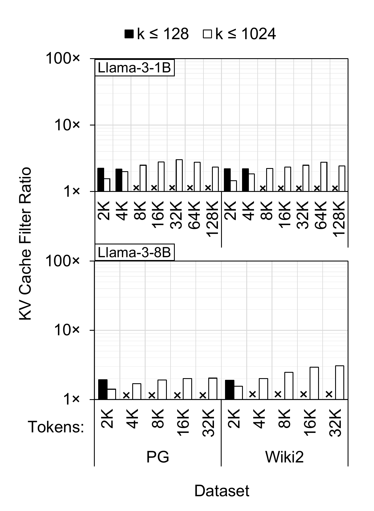

**Figure 3(a).** Sparse only, no ITQ

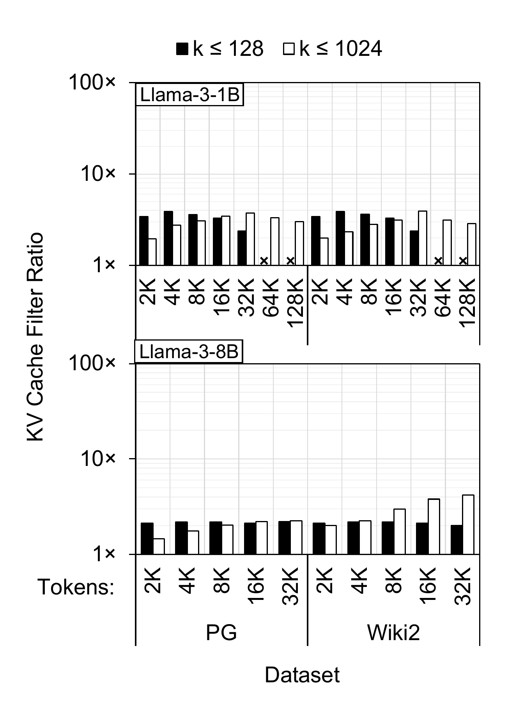

**Figure 3(b).** Hybrid, no ITQ

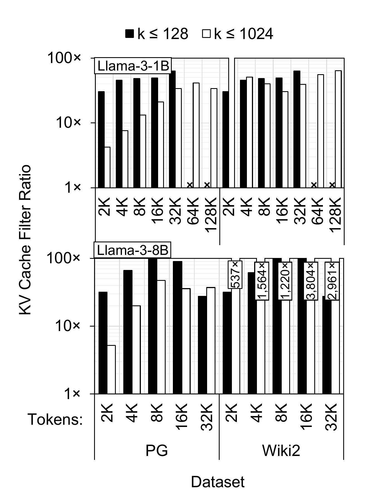

**Figure 3(c).** Hybrid, ITQ

**Figure 3.** Non-window KV Cache filter ratios for LongSight. Sparse attention includes a sign-based filtering phase for keys, then $k$ values are selected based on scores. “Hybrid" configurations combine sparse attention with dense sliding-window attention (1024 tokens). Perplexity is within 5% of full dense attention. Some configurations with small $k$ could not reach the perplexity target and are marked with ‘X.’

**Figure 4.** Accuracy vs. KV Cache filter ratio pareto frontiers for LongSight’s Hybrid, ITQ-enhanced sparse attention algorithm at 32K context length. On the X axis, 10x (100x) means a 10:1 (100:1) raw:filtered ratio. Three example configurations are shown, as well as “All Configs" which represents the pareto frontier across all configurations tested.

We next enhance our baseline sparse attention algorithm with short-range sliding-window attention, forming a *hybrid attention* strategy. Hybrid attention performs dense attention on the $W$ most recent tokens (we set $W=1{,}024$) and sparse attention on the remainder of the context.

As shown in [Figure 3(b)](#fig:hybrid-fr:1b-h), this hybrid approach improves robustness at long context lengths even with smaller $k$. Additionally, hybrid attention improves the KV cache filter ratio by up to 39% and 7% for Llama-3-1B and Llama-3-8B, respectively. This is because the use of a dense sliding window in hybrid attention reduces the burden on the sparse attention phase to capture relevant tokens. As a result, the threshold for SCF can be set to a higher value, leading to a higher filter ratio.

### 5.4 ITQ-Enhanced Sparse Attention

The effectiveness of SCF assumes that vectors are uniformly distributed around the origin. In practice, KV representations in LLaMA models exhibit strong clustering, which reduces filter efficiency.

To address this, we apply *Iterative Quantization (ITQ)* \[[25](#ref-Gong-2011-itq)\]—a technique that learns a rotation matrix to minimize quantization error. ITQ is applied to both Keys and Queries, improving the balance of sign-bit distributions and thereby increasing filtering efficacy.

We train an ITQ rotation matrix for each KV head using a 1K-token sequence of post-embedding Key and Query vectors. Since positional embeddings break distance invariance, ITQ cannot be fused into the linear projection layers and must be applied at runtime. Nevertheless, the improvements provided by ITQ far outweigh this minor runtime overhead. Moreover, the one-time ITQ tuning is fast, taking under a minute for Llama-3-8B and requires no task-specific data. At inference time, after the queries & keys are projected and positional embeddings are applied, each query and key is multiplied by the ITQ-tuned $[D_h\times D_h]$ matrix, where $D_h$ is the Query/Key head dimension.

As shown in [Figure 3(c)](#fig:hybrid-fr:1b-h-i), ITQ significantly improves filtering: the KV cache filter ratio improves by up to $6.4\times$ for Llama-3-1B and $46\times$ for Llama-3-8B, compared to hybrid attention alone. The runtime computational overhead of ITQ is less than 3% of the cost of computing query vectors (and less than 0.5% of the average cost of an inference request for Llama-3-1B), which is negligible compared to the significant improvements it provides for effective sign-concordance filtering.

**Sensitivity Analysis.** To illuminate trade-offs, [Figure 4](#fig:algo-frontier) shows the relationship between overall filter ratio and accuracy (in terms of inverse perplexity), relative to dense attention at a specific context length. As shown, large window sizes of greater than $1{,}024$ tokens tend to be useful only at the highest accuracy targets (see [Section 8.1.3](#sec:method:tuning) for more details). Conversely, $k$ significantly smaller than $1{,}024$ only provides an advantage for the lowest accuracy targets, and not in all configurations. In general, we found that window size and $k$ both set to $1{,}024$ reliably achieved a wide range of accuracy targets while maintaining reasonably effective filtering.

DynaX \[[23](#ref-Xiong-2025-DynaX)\] reports an average sparsity of 91.77% with a 1% perplexity increase when emulating long-context datasets, including concatenated *Wiki2* docs, using Llama-3-8B. In our testing of this exact setup, we achieve up to 91.92% sparsity (a KV Cache filter ratio of 12.4$\times$) with the same perplexity increase. Thus, LongSight’s sparse attention is algorithmically competitive with state-of-the-art methods.

## 6 System Integration

[Figure 2](#fig:longsight) compares the high-level execution model of conventional GPU-only attention with that of LongSight. LongSight enables the GPU to collaborate with DReX over a low-latency CXL interface, offloading the memory-intensive phase of sparse attention to DReX. As illustrated in [Figure 5](#fig:arch), DReX is a Type-3 CXL device, with its entire internal DRAM capacity mapped into the host address space. As a result, LongSight allows the GPU to directly access DReX’s internal memory, executing load/store instructions to interact with DReX’s memory space \[[12](#ref-newburn2024gpus)\]. This design enables the GPU—without CPU involvement—to populate DReX with Keys and Values and submit sparse attention requests at the granularity of attention heads, layers, and users.

A key design decision in LongSight is the implementation of hybrid dense and sparse attention. Specifically, the GPU retains a window of the most recent Keys and Values in GPU HBM and resorts to sparse attention via DReX only when the KV size exceeds a certain threshold. This threshold can either reflect the available HBM capacity or be user-defined. This design offers three main benefits: **(1)** As prior work suggests, dense attention over the most recent KVs can significantly improve the accuracy of sparse attention \[[20](#ref-beltagy2020longformerlongdocumenttransformer)\]. **(2)** Utilizing available HBM avoids underutilization, improving overall memory efficiency. **(3)** Updating DReX in bulk—by accumulating a group of KV vectors before transfer—reduces communication overhead compared to sending one KV vector per generated token. Therefore, by retaining a window of newly generated KV vectors on the GPU and performing dense attention locally while updating DReX off the critical path, LongSight improves both accuracy and throughput.

[Figure 2(b)](#fig:longsight:cem) illustrates the operation of LongSight’s hybrid attention mechanism operation. It operates as follows: During the Prefill stage, the GPU accumulates KV tensors in HBM. Once the user-defined threshold is reached, the GPU prepares Key Sign Objects, Key Objects, and Value Objects for groups of 128 Keys and Values, and writes them to DReX. Object preparation and transfer are handled by separate GPU kernels that execute off the critical path of the Prefill stage.(Details of the object formats and their physical layout in DReX DRAM are discussed in [Section 7.3](#sec:arch:datalayout).)

After the first token is generated (i.e., at the end of the Prefill stage), LongSight establishes a dense attention window in GPU HBM using the most recent Keys and Values, and a sparse attention window in DReX (assuming a sufficiently large input context). In the autoregressive decode stage, at the beginning of each attention layer, LongSight constructs a Request Descriptor (§[7.3](#sec:arch:datalayout)) on the GPU for each user in the batch and writes it into an MMIO Request Queue on DReX. After submitting the offload request to DReX, the GPU performs dense attention using the local window in HBM. Once the dense phase is complete, the GPU enters a polling phase, periodically checking for the completion of the sparse attention on DReX. Upon receiving the top-k $QK^{T}$ and Values from DReX, the GPU performs the Softmax and projection steps and proceeds to the feed-forward network and subsequent decoder layer.

## 7 Architecture

### 7.1 Overview

LongSight repurposes DReX \[[6](#ref-quinn-2025-drex)\], which is a compute-enabled CXL memory expander originally designed for accelerating dense retrieval, to accelerate attention. In this section, we discuss the overall architecture of DReX and the extensions that enable it to accelerate LongSight’s sparse attention algorithm.

[Figure 5](#fig:arch) illustrates the overall architecture of DReX. DReX integrates PIM Filtering Units (PFUs) near each LPDDR bank and places a Near-Memory Accelerator (NMA) chip adjacent to each LPDDR package. The system comprises eight LPDDR5X packages, each with eight channels, and each channel includes 128 banks, implemented as four dies with 32 banks per die \[[26](#ref-10476443)\]. As a result, DReX includes $8 \times 8 \times 128 = 1{,}024$ PFUs and eight NMAs and implements 512GB of LPDDR capacity. For efficient sparse attention offloads, LongSight extends DReX’s CXL Controller (DCC) to orchestrate sparse attention offload to the NMAs (§[7.2](#sec:arch:cxlctrl)).

LongSight offload model is as follows. At a high level, the GPU submits attention request descriptors to DCC, which maintains a request queue. DCC pulls descriptors from the head of the queue and, based on the address mapping (§[7.3](#sec:arch:datalayout)), assigns partial sparse attention workloads to NMAs. Each NMA handles sparse attention for a single user, a single layer, and a single attention head at a time. Depending on the size of the KV cache, multiple or all NMAs can work in parallel on a single attention request. This is because batching across users or heads does not yield reuse benefits due to the lack of shared KV cache data.

During the execution of a sparse attention request on an NMA, the NMA offloads the *filtering* stage to in-DRAM PFUs and performs the *scoring* and *ranking* on the near-DRAM, NMA chip. Each PFU operates on 128-bit inputs per cycle, aligned with the 128-bit-wide on-chip interconnect between Local and Global Row Buffers in LPDDR5X banks. The PFU filters distant Keys relative to Queries, reducing the need for full dot-product evaluation. However, PFUs are only effective if their local DRAM bank contains a sufficiently large population of Keys; otherwise, the filtering ratio becomes too small to be beneficial. To ensure high utility, each PFU processes blocks of 128 Keys and supports attention groups of up to 16 Queries. That is, in each offload, a PFU filters 128 Keys for a batch of 16 Queries.

The PFU’s block-based design implies a specific data layout and offload scheduling strategy, which we elaborate on in [Section 7.3](#sec:arch:datalayout).

### 7.2 DReX CXL Controller (DCC) Extensions

For efficient orchestration of sparse attention offloads to NMAs, LongSight makes some extensions to the DReX CXL Controller (DCC). The baseline DCC implements a lightweight, low-latency interface enabling any programmable NPU (e.g., GPU) to interact with DReX. LongSight extends DCC with several MMIO registers: a single *Polling Register* (512 bits), a hardware-managed *Request Queue*, and 512 individual *Response Buffers*, each sized to accommodate the maximum *Response Descriptor* ([Section 7.3](#sec:arch:datalayout)).

Request Descriptors written by the GPU are pushed into the Request Queue MMIO register, similar in spirit to Intel’s Accelerator Interfacing Architecture (AiA) \[[27](#ref-10609705)\]. The descriptors are processed in FIFO order. Since generation is sequential and a user’s sparse attention must complete before their next request, DCC maintains a queue depth equal to the maximum supported batch size. DCC supports a queue depth of 512, corresponding to a batch size of 512 users.

LongSight, as detailed in [Section 5](#sec:alg), implements a hierarchical offload mechanism. DCC is responsible for interfacing with the GPU, preparing offload workloads, and distributing them to one or more NMAs for computation. Each NMA includes control logic that interprets physical addresses local to its package to initiate filtering, read filtering metadata from PFUs, and iteratively evaluate a partial top-k (maximum supported k in hardware is 1,024) list of Keys and Values. We describe the NMA controller in more detail in [Section 7.4](#sec:arch:nmactrl).

DCC polls for the completion of NMA workloads and aggregates the resulting partial top-k lists. Once an offload completes, DCC populates a corresponding *Response Buffer* indexed to the user. To manage these buffers, DCC maintains a mapping table—implemented as a content-addressable memory (CAM)—that associates each User ID with a specific Response Buffer and *Polling Register* entry. The GPU reads this mapping once and uses it throughout the generation phase across all layers and autoregressive iterations.

![Figure 5. Overall architecture of DReX, reproduced from \[6\]. LongSight extends DReX’s "CXL Controller" to efficiently accelerate sparse attention.](assets/longsight/figures-architecture-drex-modified.png)

**Figure 5.** Overall architecture of DReX, reproduced from \[[6](#ref-quinn-2025-drex)\]. LongSight extends DReX’s "CXL Controller" to efficiently accelerate sparse attention.

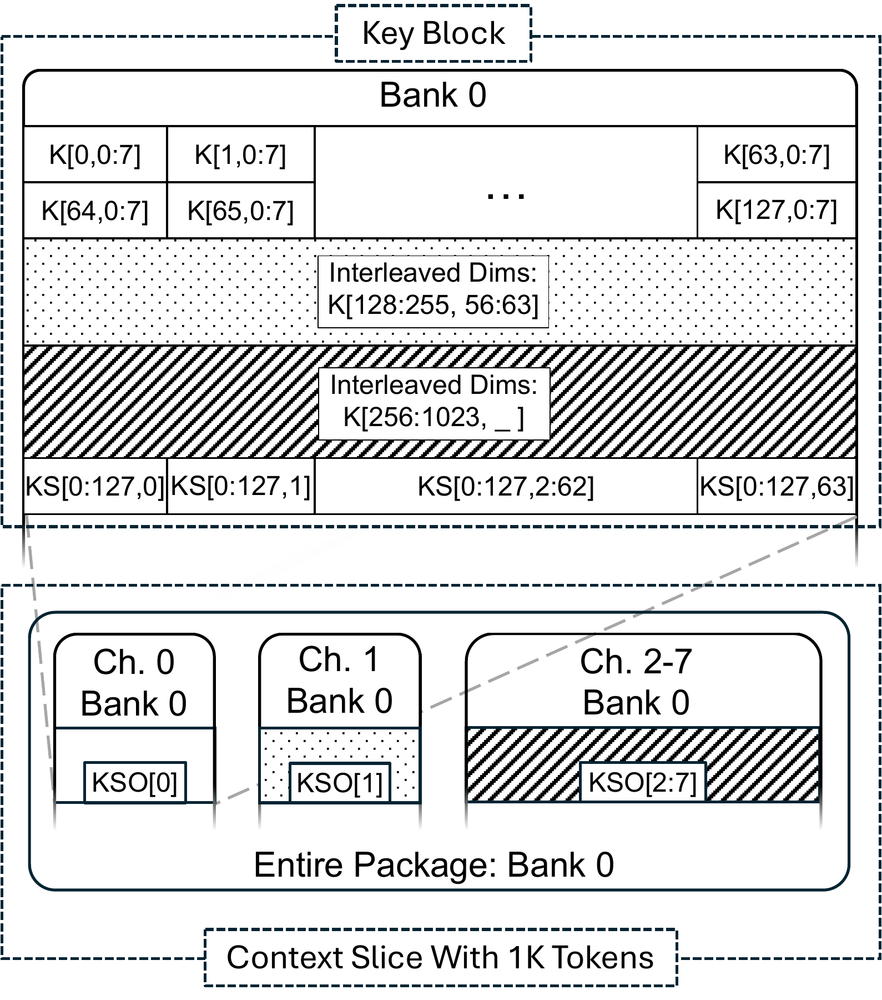

**Figure 6(a).**

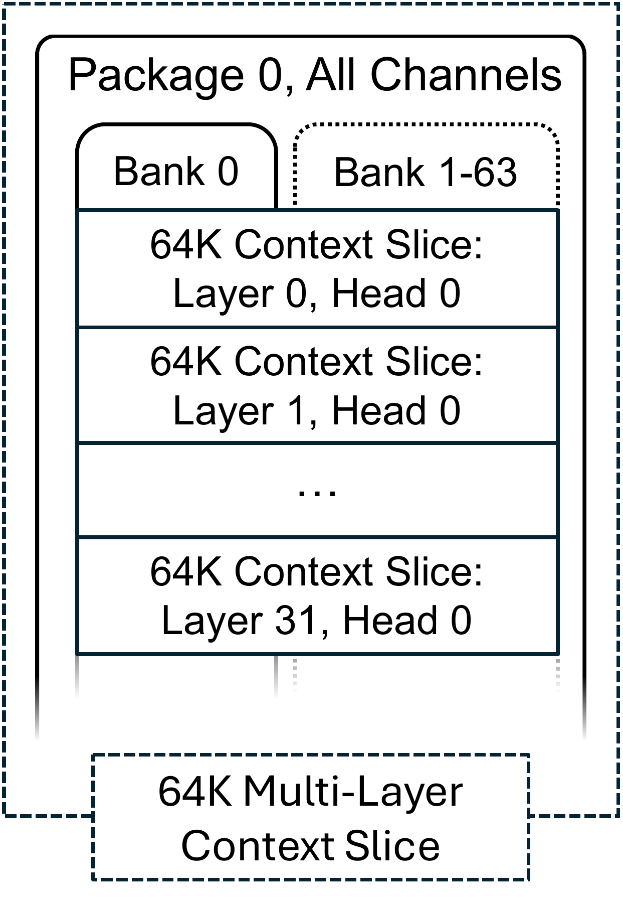

**Figure 6(b).**

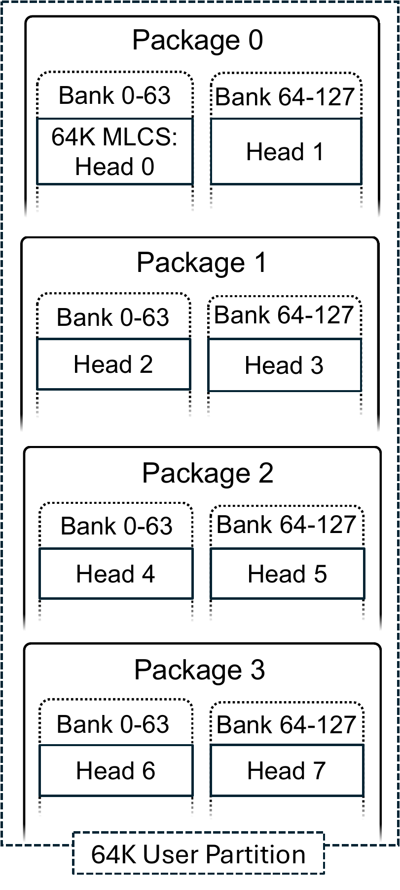

**Figure 6(c).**

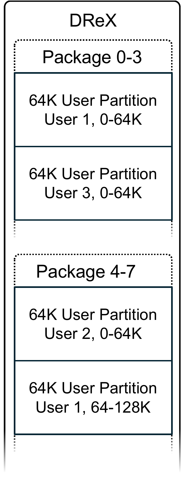

**Figure 6(d).**

**Figure 6.** LongSight logical hierarchy of data mapping in DReX.

### 7.3 Data Layout

#### 7.3.1 Memory Allocation

LongSight allocates DReX memory at the granularity of the following objects:

- Key Sign Object: Contains one-bit, sign-quantized Key vectors per user, layer, and attention head.

- Key Object: Contains Key vectors in full-precision formats.

- Value Object: Contains Value vectors for each layer and head.

- Request Descriptor: Contains the User ID (UID), layer number (L), and Query vectors.

- Response Descriptor: Contains a list of $1{,}024 \times H$ top Keys and Values, where H is the number of heads.

#### 7.3.2 Address Translation

While the GPU can write directly to DReX memory, the placement of Key vectors must adhere to DReX’s strict physical layout constraints. These constraints are governed by a deterministic hashing function that maps data to specific packages, channels, banks, and rows. DReX employs a simple physical address mapping scheme in which contiguous physical addresses are first mapped to columns, then rows, followed by banks, channels, and finally packages. This mapping simplifies the translation from GPU addresses to the physical locations in DReX DRAM. To maximize memory bandwidth utilization during the near-memory top-k retrieval stage, LongSight explicitly distributes Key vectors across multiple memory channels. Rather than allocating Key Objects as contiguous blocks in physical memory, LongSight scatters them across strided physical addresses. This strided placement ensures that when Key vectors are accessed during near-memory computation, the bandwidth of all LPDDR5X channels is effectively utilized.

#### 7.3.3 Object Data Layout

The logical mapping of users, layers, and attention heads into DReX plays a critical role in performance. During attention, parallelism can be exploited across tokens within a single head, across KV heads, and across users. But this parallelism cannot be achieved by batching, as each of the attention requests operates on disjoint Keys. [Figure 6](#fig:layout) illustrates the logical hierarchy used to map multi-user context data to DReX, which enables multiple forms of parallelism: within a head (via DRAM banks and channels), across heads (via packages), and across users (via multi-tenancy).

**Key Blocks:** A *Key Block* comprises several rows within a DRAM bank and contains both the *Key Objects* (full-precision Key vectors) and the *Key Sign Objects* (one-bit quantized sign bits of each dimension for 128 Keys). Each Key Sign Object must be fully contained within a single DRAM bank. Because PFUs operate on 128 Keys per cycle, each DRAM column access must retrieve one bit from the same dimension across 128 Keys. Therefore, sign bits are stored such that each 128-bit column represents a single dimension across all 128 Key vectors.

The full-precision Key vectors are used by the NMA for dot-product similarity calculations during Top-$k$ selection. Since NMAs have access to all banks within a package, these Keys do not need to be bank-local. LongSight interleaves each Key vector across all eight memory channels within a package to ensure balanced channel utilization. This interleaving is essential: if surviving Keys after filtering are accessed from only one memory channel, the result would be bandwidth imbalance and NMA stalls. Distributing the Keys across channels enables the NMAs to fully exploit the LPDDR5X bandwidth during sparse dot-product and Top-$k$ operations.

[Figure 6(a)](#fig:layout:slice) shows the mapping of Key Objects and Key Sign Objects into Key Blocks for Bank 0 across all channels in a package. Since each Key Block contains 128 Keys per bank and each package includes 8 channels, the minimum size of a group of Key Blocks is $128 \times 8 = 1{,}024$ Keys.

**Context Slices:** A *Context Slice* is composed of one or more sets of Key Blocks, each allocated to a distinct bank in all channels within a package. Context Slices serve as the natural storage unit for the Keys corresponding to one head within one layer for a single user. Given that each channel includes 128 banks, a Context Slice can store up to $1{,}024 \times 128 = 131{,}072$ Keys when fully utilizing every bank.

While NMAs cannot process multiple Context Slices in parallel, filtering across banks can still proceed in parallel within a single Context Slice. However, if a Context Slice occupies fewer than 128 banks, this reduces bank-level filtering parallelism. As shown in [Section 9](#sec:results), filtering is typically not the bottleneck, so this limitation has minimal performance impact. Context Slices also simplify address generation: since their location is deterministic, the NMA can launch PFUs in parallel across all banks that the Context Slice spans.

**Multi-Layer Context Slices:** [Figure 6(b)](#fig:layout:mlslice) illustrates a *Multi-Layer Context Slice*, which concatenates multiple Context Slices sequentially. Since transformer layers must be processed sequentially, Multi-Layer Context Slices are ideal for storing the Keys associated with the same head across multiple layers.

**User Partitions:** [Figure 6(c)](#fig:layout:partition) shows a *User Partition*, which is formed by aggregating multiple Multi-Layer Context Slices—one per KV head—for a given user. User Partitions exploit head-level parallelism by storing each Multi-Layer Context Slice in a different package. The number of packages required for a User Partition is:

$\text{Packages} = h_{\mathit{kv}} \cdot \frac{L}{131{,}072}$

where $h_{\mathit{kv}}$ is the number of KV heads, $L$ is the total context length (in tokens), and $131{,}072$ is the maximum capacity of a full Context Slice.

**Partition Mapping:** [Figure 6(d)](#fig:layout:all) shows several User Partitions mapped across the DReX memory. These partitions support both *spatial multi-tenancy* (across users) and *temporal expansion* (across a single user’s long context). In the latter case, a user’s context may span multiple User Partitions, each of which receives the same queries but attends to a different segment of the context. Therefore, LongSight does not statically allocate equal context lengths to all users.

### 7.4 NMA Controller

LongSight leverages each NMA in DReX to process, at any given time, attention for a single attention head, a single layer, and a single user. This design choice stems from the insight that batching filtering or top-k retrieval across multiple attention heads or users offers no benefit in terms of data reuse. While parallel execution of multiple heads or users on a single NMA is theoretically possible, we chose not to pursue this direction due to its complexity and limited performance gain.

DCC submits attention requests to NMAs sequentially, based on the physical location of the Key vectors involved in each request (§[7.3](#sec:arch:datalayout)). Upon receiving a request, the NMA enters a state machine that alternates between in-memory filtering and near-memory similarity score evaluation until all relevant Key vectors are processed.

Filtering is executed in multiple *epochs*, with each epoch processing 128 Key vectors in parallel per bank—amounting to up to $1{,}024 \times 128$ Key vectors per LPDDR5X package in each epoch. During each epoch, the PFU generates a 128-bit bitmap that is read by NMA, where each bit corresponds to one of the 128 vectors. PFUs are synchronously controlled by the memory controllers on each NMA, an architecture similar to HBM-PIM \[[28](#ref-9499894)\]. A bit is set to 1 if the corresponding Key vector passes the sign-concurrence filtering threshold. The NMA controller maintains metadata to map each bitmap back to its corresponding Key vector.

Each Key vector is identified by a 32-bit *ID address* that encodes three components: the 7 least significant bits represent the bank index (out of 128 banks per channel); the next 7 bits represent the vector’s index within the 128-bit bitmap; and the 18 most significant bits encode the epoch number during which the Key was filtered.

During the near-memory similarity score evaluation phase, the NMA fetches the filtered Key vectors one by one from memory. It uses addresses stored in the Address Scratchpad Memory (SPM) and reads data across all eight LPDDR5X memory channels. As described in [Section 7.3](#sec:arch:datalayout), the full-precision Key vectors are interleaved across the channels to maximize parallel access and fully saturate the memory bandwidth of the LPDDR5X package.

**Table 1.** Model parameters.

|     Model      |       Llama-3-1B       | Llama-3-8B \[[29](#ref-llama3)\] |
|:--------------:|:----------------------:|:--------------------------------:|
|   Attention    | GQA \[[30](#ref-gqa)\] |      GQA \[[30](#ref-gqa)\]      |
| Query/KV heads |          32/8          |               32/8               |
|   Head Dim.    |           64           |               128                |
|     Layers     |           16           |                32                |
|  Quantization  |          BF16          |               BF16               |

**Table 2.** System configuration used for measurements.

|           Device | Description                                       |
|-----------------:|:--------------------------------------------------|
|              CPU | 16 $\times$ Intel Xeon Max 9462@3.5 GHz, SMT off  |
|              CPU | 8 $\times$ 128 GB DDR5-4400 DRAM                  |
|              CPU | 3.5 TFlop/s, 282 GB/s                             |
|              GPU | NVIDIA H100 SXM (2,958 TF/s)                      |
|              GPU | 80 GB HBM3 (3.35 TB/s)                            |
|              GPU | 989 TFlop/s, 3.35 TB/s                            |
| DReX (Simulated) | 8 $\times$ NMA , 8,192 $\times$ PFU               |
| DReX (Simulated) | 512 GB LPDDR5X                                    |
| DReX (Simulated) | 26.11 TFlop/s, 1.1 TB/s (NMAs), 104.9 TB/s (PFUs) |

## 8 Methodology

### 8.1 Evaluating the Hybrid Attention Algorithm

#### 8.1.1 Datasets and Perplexity

While downstream tasks such as summarization or long-document question answering provide insight into application-level accuracy, these benchmarks often operate on datasets with fixed or limited context lengths. This makes it difficult to systematically evaluate the effect of increasing context length on model capabilities. Furthermore, success on these tasks does not necessarily imply that the model effectively utilizes the entire context.

To directly evaluate long-range modeling as context length increases, we use *perplexity* as our primary metric. As an intrinsic measure, perplexity quantifies the model’s ability to predict the next token given prior context. Perplexity can be computed over arbitrarily long contiguous sequences, making it suitable for studying how well models utilize extended context windows.

Many common benchmarks lack the long, contiguous text sequences necessary for this analysis. To address this, we use the Project Gutenberg (denoted *PG*) corpus \[[31](#ref-projectgutenberg)\], selecting complete books that significantly exceed the maximum context lengths of the models under evaluation. We segment these texts into token sequences of the target context length, yielding natural, long-form input for evaluation. For comparability to prior work, we also use the Wikitext2 dataset (denoted *Wiki2*), though its passages are far shorter than that of Project Gutenberg. Thus, for long context experiments, we follow prior works and concatenate *Wiki2* passages as needed \[[32](#ref-Huang-2023-LongRange), [33](#ref-Park-2024-AnyPrecision)\].

#### 8.1.2 Setup

We initialize the Llama-3-1B and Llama-3-8B models using the HuggingFace `transformers` library. Our hybrid attention mechanism is implemented as a PyTorch module named LongSightAttn, which replaces the default attention layers. LongSightAttn is parameterized by `ITQ` tensors containing the learned rotation matrices and accepts as input: (1) a threshold tensor (one value per KV head), (2) a top-k value $k$, and (3) a dense window size $W$ for hybrid attention. LLM inference can be broken down in terms of prefill and decoding. Prior works \[[34](#ref-nvidia-2025-performance)\] have shown that prefill has hundreds of times higher throughput than decoding; as a result, the decode phase tends to dominate end-to-end runtime. Prefill can have a noticeable impact if input sequences are much longer than output sequences, e.g., if a long-context KV cache must be reconstructed; however, such cases are highly application-specific. In our evaluation, we only consider the throughput and latency of the decoding phase, as LongSight does not impact the performance of the prefill phase.

#### 8.1.3 Hyperparameter Tuning

In this subsection, we discuss our methodology for tuning the hyperparameters in LongSight.

**Attention sink tokens:** We use a small number of early tokens to serve as an “attention sink", after observing that the Llama-3 models attended heavily to early tokens. This observation corroborates prior work \[[35](#ref-Xiao-2023-streamingLLM)\], and is model-specific technique; indeed, newer models that incorporate trained biases in the softmax denominator \[[36](#ref-openai-2025-gptoss)\] may not need to include any attention sink tokens. These tokens are meant to provide stability rather than relevant context, so the number of attention sink tokens can be small. In fact, we found that even a single attention sink token can dramatically improve stability. Since attention sink tokens are largely unrelated LongSight’s sparse attention, we configured the number of sink tokens using sliding-window attention alone. Similarly to StreamingLLM \[[35](#ref-Xiao-2023-streamingLLM)\], we found small stability improvements when using more than one token as the attention sink. To eliminate any risk of instability, we used 16 tokens.

**Sliding window size:** Sliding-window attention captures highly relevant recent tokens and can even improve robustness at long contexts as shown in [Figure 3(b)](#fig:hybrid-fr:1b-h). Moreover, Sliding-window attention is dense and can be computed directly on the GPU, overlapping with a DReX offload. As discussed in [Section 9.2](#sec:results:breakdown), the system-level bottleneck shifts from the GPU to DReX as the number of users increases. Therefore, the optimal strategy for sliding window size differs depending on the overall system load for LongSight. When there are many users, DReX becomes the bottleneck, so a useful heuristic is to simply use the largest possible window size based on the GPU capacity and a target batch size. However, with few users, it is likely that the GPU will be the end-to-end bottleneck, in which case it is useful to set sliding window size based on a per-token latency target. For simplicity and consistency, we use a sliding window with 1,024 tokens unless stated otherwise.

**Top-k**: The Top-k stage sets the upper bound for quality in the long-context quality-speed trade-off space, eliminating nearly half of long-context KV accesses even without SCF. Therefore, a simple strategy is to set $k$ to be the maximum possible, 1,024. However, CXL transfers of the $k$ values can readily bottleneck end-to-end LongSight inference if both $k$ and filter ratio are high. Therefore, to find reasonable values for $k$, we set the thresholds to zero, and adjust $k$ to increase perplexity by 0.5-1% compared to the base model. This represents a meaningful perplexity increase, but is still small enough that SCF thresholds can be configured to achieve a high filter ratio without violating quality targets.

**Thresholds:** We initialize all thresholds such that no Keys are filtered (i.e., filter ratio = 1). We iteratively increase the thresholds for KV heads with the lowest filtering ratios. This process continues until the perplexity exceeds a predefined threshold (5%), at which point we record the filter ratio from the prior iteration. We tune thresholds using 128K context for Llama-3-1B and 32K context for Llama-3-8B, which were longest context sizes that could fit in GPU memory when running the sparse attention implementation.

### 8.2 Modeling Performance

![Figure 7. Decode-phase throughput (across all users) and per-token latency for 1-GPU systems, 2-GPU systems, AttAcc, and LongSight and 32K context length. LongSight throughput and latency are averaged across both datasets. Missing entries indicate that the GPU memory capacity could not fit the context. Entries marked with \* indicate deviations from power-of-two scaling, since DReX has additional overhead for storing sign bits. Context lengths above 128K are marked with ^\text{P}, indicating that sparse attention performance is projected based on performance at 128K context.](assets/longsight/figures-results-comp.png)

**Figure 7.** Decode-phase throughput (across all users) and per-token latency for 1-GPU systems, 2-GPU systems, AttAcc, and LongSight and 32K context length. LongSight throughput and latency are averaged across both datasets. Missing entries indicate that the GPU memory capacity could not fit the context. Entries marked with ‘\*’ indicate deviations from power-of-two scaling, since DReX has additional overhead for storing sign bits. Context lengths above 128K are marked with $^\text{P}$, indicating that sparse attention performance is projected based on performance at 128K context.

To evaluate performance, we build an end-to-end simulation framework combining cycle-accurate DRAM modeling with DRAMSim3 \[[37](#ref-li2020dramsim3)\], RTL synthesis results (for PFUs and NMAs), and real-system measurements for GPU execution, PCIe/CXL transfers, and polling latency.

We develop RTL models for both PFU and NMA and synthesize them to extract latency and power consumption figures at the 16 nm technology node. We then scale PFU results to 7 nm \[[22](#ref-attacc), [38](#ref-STILLMAKER201774)\]. Since logic within DRAM dies is known to be approximately $10\times$ less area-efficient \[[39](#ref-Devaux2019UPMEM)\], we apply the scaling factor to our area results. For on-chip buffers such as Query SPM and Address SPM, we use area and power projections from \[[40](#ref-domain-specific-hw-acc)\].

We combine RTL timing with LPDDR5 specifications from Ramulator \[[41](#ref-kim2016ramulator)\] to compute latency values, including: Bitmap generation time in PFU: $d \times 1.25$ ns; Bitmap read latency into NMA: 120.4 ns; Address generation overhead in memory controller: 1,024 ns. Using DRAMSim3, we simulate memory traces for loading Keys into the NMA for similarity score evaluation. RTL synthesis is again used to estimate time for dot-product computation and Top-$k$ sorting.

We fix the threshold values for the PFU in our models to meet a perplexity requirement of less than 5% for both *PG* and *Wiki2*. This leads to an average 20$\times$ filtering ratio measured form long-context inference with Llama-3-1B and Llama-3-8B.

Following prior work \[[42](#ref-10.1145/3575693.3578835)\], we emulate the CXL interface using a dual-socket Intel Xeon (5th Gen) platform to measure overheads from memory copies and polling. These are incorporated into our overall system performance model.

**GPU Performance:**  For dense attention, we use HuggingFace transformers implementations of Llama-3-1B and Llama-3-8B. For the 2-GPU configuration, we map our algorithm to the GPUs using data parallelism. Compared to tensor or pipeline parallelism, data parallelism duplicates model weights but does not introduce communication overheads \[[43](#ref-nvidia-2025-demystifying)\]. In the worst case, with Llama-3-8B, this means that each GPU must load an additional $16/2=8$ GB of weights (relative to tensor/pipeline-parallel) which is approximately 10% of HBM capacity. To model integration of DReX with the GPU pipeline, we replace the native attention layers with a PyTorch module that performs ITQ transformation, attention over a sliding window (dense), and integration with top-k results returned from DReX. Because sliding-window attention can overlap with DReX offload execution, we measure GPU execution time both with and without the sliding window. Similarly, softmax can start as soon as DReX offload for that head is complete, so we measure GPU execution time with and without softmax to isolate its cost. These measurements are used to compute pipeline overlap and total inference latency. The final decoding time combines GPU-side execution with the offload latency obtained from our DReX model.

**AttAcc \[[22](#ref-attacc)\]:** We integrate Llama-3-1B and Llama-3-8B configurations into AttAcc’s simulator. Since AttAcc is designed for dense attention, its perplexity is zero. We use a single H100 GPU alongside bank-level PIM units, with the context length $L_{\mathit{in}}$ applied consistently across experiments.

**Sparse Attention:** We compare LongSight against sliding window attention, commonly used to reduce attention cost \[[44](#ref-GemmaTeam-2025-Gemma3), [45](#ref-MistralAI-2023-mistral7b)\]. Our models were not fine-tuned for sliding-window attention; thus, we follow the approach used in StreamingLLM \[[35](#ref-Xiao-2023-streamingLLM)\] and include 16 tokens from the beginning of context to serve as an attention sink.

## 9 Experimental Results

### 9.1 Inference Acceleration

We compare LLM inference performance for LongSight against 1-GPU, 2-GPU, and AttAcc \[[22](#ref-attacc)\] setups using Llama-3-1B and Llama-3-8B, across various context lengths and user counts. [Figure 7](#fig:comp) shows LongSight improves total decode-phase throughput and reduces per-token latency vs. 1-GPU, especially as context length increases. 2-GPU and AttAcc can achieve higher throughput than LongSight for shorter context lengths, since LongSight has additional overheads resulting from moving $k$ value vectors over CXL. Nonetheless, LongSight achieves superior peak throughput for context lengths above 128K tokens due to its sparse attention.

The large memory capacity of DReX allows LongSight to support more concurrent users, expanding the overall utility of the LLM-serving infrastructure. For both setups, increasing the number of users leads to higher per-token latency, which can degrade quality of service. However, the latency increase is substantially more modest with LongSight, due to its ability to accelerate sparse attention. As a result, LongSight can maintain latency Service Level Objectives (SLOs) while increasing system throughput by serving more users concurrently.

Although LongSight throughput eventually plateaus as the number of users increases beyond a certain point, the ability to fit user contexts entirely within DReX memory allows the system to pre-stage Key/Value data, reducing per-user inference cost and improving GPU utilization.

The benefits of LongSight are especially pronounced at longer context lengths. At shorter lengths, Value loading dominates latency and represents a fixed overhead per user. However, DReX offload time scales sub-linearly with context length, making it more efficient as context grows. At the maximum context length supported by one GPU, LongSight achieves up to $8.1$–$9.6\times$ higher throughput and $3.6$–$11.9\times$ lower per-token latency.

### 9.2 DReX and LongSight Latency Breakdowns

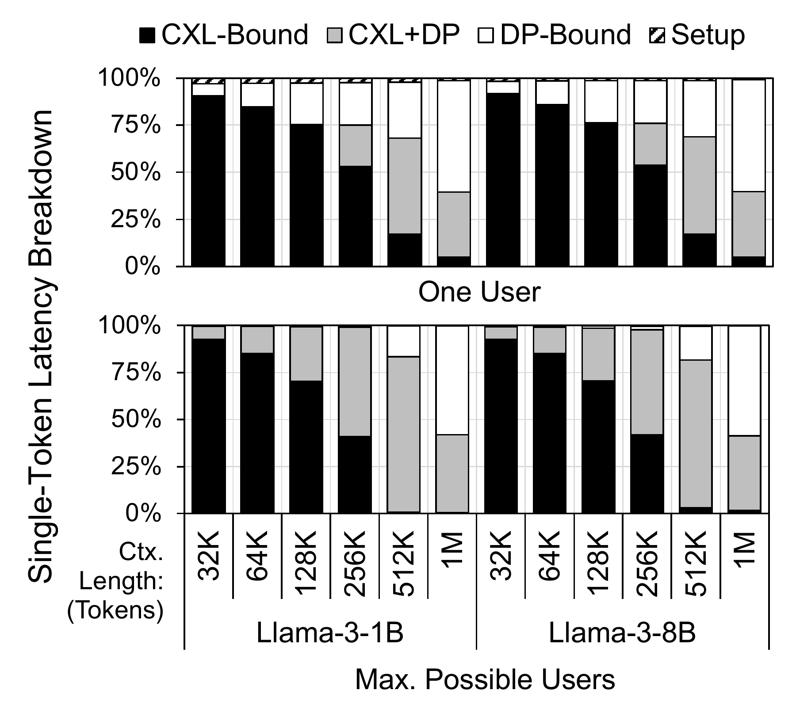

**Figure 8.** Per-token latency breakdown for DReX.

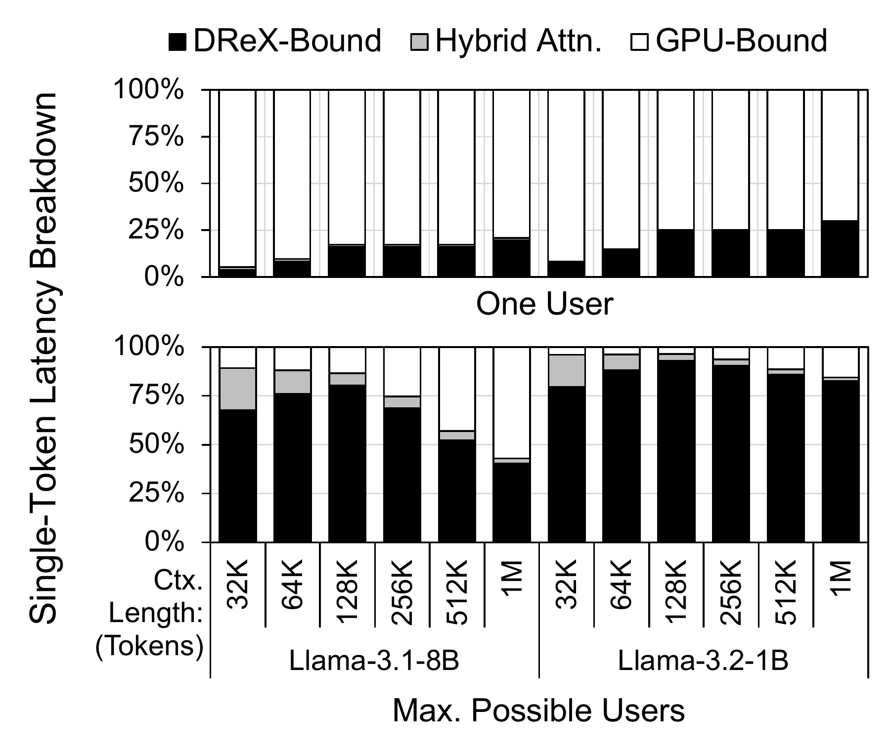

**Figure 9.** Per-token latency breakdown for LongSight.

[Figure 8](#fig:cem-breakdown) presents a breakdown of latency within a single DReX offload. The top subfigure shows results for a single-user scenario, while the bottom subfigure illustrates the breakdown when DReX is fully utilized by multiple users. The maximum number of users that can be accommodated in DReX per model and context length is reported in [Figure 7](#fig:comp).

As shown, for both single-user and multi-user cases, short-context workloads are primarily bottlenecked by the time required to read Value vectors over CXL. However, as context length increases, the relative cost of the dot-product phase grows, while Value loading remains a fixed per-user overhead. Notably, the CXL-bound Value loading stage can be effectively overlapped with the dot-product stage, particularly in high-utilization scenarios. In such cases, where multiple User Partitions are mapped to each package, Value reads for early partitions can be issued in parallel with dot-product computation for later partitions, enabling efficient pipelining of data movement and compute.

[Figure 9](#fig:sys-breakdown) shows a system-level breakdown of LongSight performance across varying workloads. When there are few users, LongSight is bottlenecked by the GPU, regardless of context length. As DReX becomes fully utilized, short-context workloads become bottlenecked by DReX due to the high per-user overhead of Value loading. However, for longer contexts, fewer users can be served concurrently, and more DReX resources (PFUs and NMAs) are assigned per user. As a result, the DReX offload time does not increase proportionally with context length. At these longer contexts, the reduced number of users leads to lower GPU utilization, making the GPU the primary end-to-end bottleneck in the system.

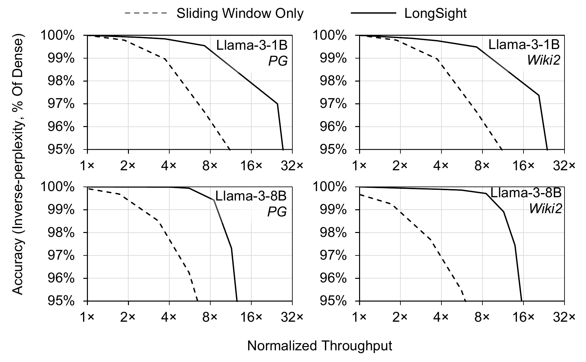

**Figure 10.** Accuracy (rel. to dense attention) vs. normalized throughput pareto frontier for LongSight and Sliding Window attention at 32K token context length. Window size, K, and thresholds for each dataset and model tuned separately via parameter sweep.

### 9.3 Comparison with Sliding Window Attention

[Figure 10](#fig:acc-performance) shows accuracy-throughput Pareto frontiers for LongSight and a sliding window configuration, both tuned to 32k token context length. These are optimistic, since all parameters are tuned for a specific context length; the configuration in [Figure 7](#fig:comp) balances performance across all context lengths and datasets. In particular, we use $k$=256, 512, and 1024 for 32K, 64K, and 128K context, respectively. For longer contexts, we use $k$=1024. All configurations use a 1024-token sliding window and 16 attention sink tokens. While performance is similar for both datasets, [Figure 7](#fig:comp) shows average performance across the two datasets. A drawback of LongSight vs. sliding window is that optimal parameters (i.e., window size, $k$, and SCF thresholds) are heavily context-dependent and impact end-to-end performance. Nonetheless, LongSight achieves a substantial Pareto expansion with parameter tuning.

### 9.4 Power and Area Analysis

Because LongSight does not modify the PFU and only slightly increase the SPM size of the NMAs, the area and power profile of DReX used in this work is similar to what reported in prior work \[[6](#ref-quinn-2025-drex)\]. Each LPDDR5X package in DReX consumes up to 18.7 W at peak power, and the PFUs incur an area overhead of 6.7% relative to the total DRAM die area. Each NMA, implemented in 16 nm technology, occupies 15.1 mm$^2$ of area and has a peak power consumption of 1.072 W. Consequently, the total peak power of a DReX unit (comprising eight PIM-enabled LPDDR5X packages and eight NMAs) is estimated at 158.2 W. The additional lightweight logic integrated into the DReX CXL controller introduces negligible area and power overhead.

## 10 Conclusion

In this work, we presented LongSight, a system that co-designs algorithm and hardware to enable arbitrarily large context lengths for transformer-based LLMs. LongSight repurposes DReX, a recently proposed compute-enabled CXL memory expander for dense retrieval acceleration, to also accelerate attention mechanis in transformer based LLMs. LongSight leverages DReX to implement a highly efficient sparse attention mechanism, made possible by a the sign-concordance filtering algorithm, specifically designed to match the capabilities of processing-in-memory hardware. We demonstrate that LongSight, equipped with a single GPU and a single DReX device, can efficiently support context lengths of up to 1 million tokens for state-of-the-art LLaMA models.

## Acknowledgments

This work was supported in part by NSF awards CCF-2530337 and CCF-2312741, as well as ACE, one of the seven centers in JUMP 2.0, a Semiconductor Research Corporation (SRC) program sponsored by DARPA. Any opinions, findings, conclusions, and recommendations expressed in this material are those of the authors and do not necessarily reflect those of the sponsors.

## A Artifact Appendix

### A.1 Abstract

*We provide a software implementation of LongSight’s sparse attention algorithm. LongSight’s sparse attention is implemented as a pytorch module and directly replaces the Llama 3 attention module in the HuggingFace implementation of Llama 3. We also provide example code which tests a sparse attention configuration against dense attention and shows the computation of perplexity as well as filter ratio.*

### A.2 Artifact check-list (meta-information)

- **Algorithm: Sparse Attention**

- **Run-time environment: Linux**

- **Hardware: NVIDIA GPU**

- **How much disk space required (approximately)?: 20 GB**

- **How much time is needed to prepare workflow (approximately)?: 30 minutes**

- **How much time is needed to complete experiments (approximately)?: 5 minutes**

- **Publicly available: Yes**

- **Archived: https://doi.org/10.5281/zenodo.16937763**

### A.3 Description

#### A.3.1 How to access

Access the source code for LongSight’s sparse attention software implementation:

- https://doi.org/10.5281/zenodo.16937763

### A.4 Installation

Please follow the setup & installation instructions provided in the README.md file provided at the DOI.

### A.5 Evaluation and expected results

After completing setup, the `src/example.py` script can be used to benchmark an example configuration of LongSight’s sparse attention. This script prints baseline perplexity, sparse perplexity, and filter ratio on an example passage.

## References

\[1\] T. B. Brown, B. Mann, N. Ryder, M. Subbiah, J. Kaplan, P. Dhariwal, A. Neelakantan, P. Shyam, G. Sastry, A. Askell, S. Agarwal, A. Herbert-Voss, G. Krueger, T. Henighan, R. Child, A. Ramesh, D. M. Ziegler, J. Wu, C. Winter, C. Hesse, M. Chen, E. Sigler, M. Litwin, S. Gray, B. Chess, J. Clark, C. Berner, S. McCandlish, A. Radford, I. Sutskever, and D. Amodei. (2020). Language models are few-shot learners. <https://arxiv.org/abs/2005.14165>.

\[2\] M. Nye, A. J. Andreassen, G. Gur-Ari, H. Michalewski, J. Austin, D. Bieber, D. Dohan, A. Lewkowycz, M. Bosma, D. Luan, C. Sutton, and A. Odena. (2021). Show your work: Scratchpads for intermediate computation with language models. <https://arxiv.org/abs/2112.00114>.

\[3\] S. Yao, J. Zhao, D. Yu, N. Du, I. Shafran, K. Narasimhan, and Y. Cao. (2023). ReAct: Synergizing reasoning and acting in language models. <https://arxiv.org/abs/2210.03629>.

\[4\] J. Wei, X. Wang, D. Schuurmans, M. Bosma, B. Ichter, F. Xia, E. Chi, Q. Le, and D. Zhou. (2023). Chain-of-thought prompting elicits reasoning in large language models. <https://arxiv.org/abs/2201.11903>.

\[5\] P. Lewis, E. Perez, A. Piktus, F. Petroni, V. Karpukhin, N. Goyal, H. Küttler, M. Lewis, W. Yih, T. Rocktäschel, S. Riedel, and D. Kiela. (2021). Retrieval-augmented generation for knowledge-intensive NLP tasks. <https://arxiv.org/abs/2005.11401>.

\[6\] D. Quinn, E. E. Yücel, M. Prammer, Z. Fan, K. Skadron, J. M. Patel, J. F. Martínez, and M. Alian. (2025). DReX: Accurate and scalable dense retrieval acceleration via algorithmic-hardware codesign. *Proceedings of the 52nd annual international symposium on computer architecture*. pp. 1108–1124. <https://doi.org/10.1145/3695053.3731079>.

\[7\] A. Vaswani, N. Shazeer, N. Parmar, J. Uszkoreit, L. Jones, A. N. Gomez, Ł. Kaiser, and I. Polosukhin. (2017). Attention is all you need. *Advances in neural information processing systems*. 30. <https://proceedings.neurips.cc/paper_files/paper/2017/file/3f5ee243547dee91fbd053c1c4a845aa-Paper.pdf>.

\[8\] G. Heo, S. Lee, J. Cho, H. Choi, S. Lee, H. Ham, G. Kim, D. Mahajan, and J. Park. (2024). Neupims: Npu-pim heterogeneous acceleration for batched llm inferencing. *Proceedings of the 29th ACM international conference on architectural support for programming languages and operating systems, volume 3*. pp. 722–737.

\[9\] Y. Gu, A. Khadem, S. Umesh, N. Liang, X. Servot, O. Mutlu, R. Iyer, and R. Das. (2025). PIM is all you need: A CXL-enabled GPU-free system for large language model inference. *arXiv preprint arXiv:2502.07578*.

\[10\] Z. Qureshi, V. S. Mailthody, I. Gelado, S. Min, A. Masood, J. Park, J. Xiong, C. J. Newburn, D. Vainbrand, I.-H. Chung, M. Garland, W. Dally, and W. Hwu. (2023). GPU-initiated on-demand high-throughput storage access in the BaM system architecture. *Proceedings of the 28th ACM international conference on architectural support for programming languages and operating systems, volume 2*. pp. 325–339. <https://doi.org/10.1145/3575693.3575748>.

\[11\] J. B. Park, V. S. Mailthody, Z. Qureshi, and W. Hwu. (2024). Accelerating sampling and aggregation operations in GNN frameworks with GPU initiated direct storage accesses. *Proc. VLDB Endow.* 17, no. 6, pp. 1227–1240. <https://doi.org/10.14778/3648160.3648166>.

\[12\] C. Newburn. (2024). GPUs as data access engines. <https://files.futurememorystorage.com/proceedings/2024/20240808_NETC-301-1_Newburn.pdf>.

\[13\] H. A. Maruf, H. Wang, A. Dhanotia, J. Weiner, N. Agarwal, P. Bhattacharya, C. Petersen, M. Chowdhury, S. Kanaujia, and P. Chauhan. (2023). TPP: Transparent page placement for CXL-enabled tiered-memory. *Proceedings of the 28th ACM international conference on architectural support for programming languages and operating systems, volume 3*. pp. 742–755. <https://doi.org/10.1145/3582016.3582063>.

\[14\] Hewlett Packard Enterprise. (2025). HPE superdome: Mission-critical servers. <https://www.hpe.com/us/en/servers/superdome.html>.

\[15\] Hewlett Packard Enterprise. (2025). HPE superdome flex 280 interactive demo. <https://apps.kaonadn.net/5185710160084992/product.html#1/199;C187>.

\[16\] T. P. Morgan. (2021). Big iron will always drive big spending. *The Next Platform*. <https://www.nextplatform.com/2021/09/21/big-iron-will-always-drive-big-spending/>.

\[17\] Y. Lin, H. Tang, S. Yang, Z. Zhang, G. Xiao, C. Gan, and S. Han. (2024). QServe: W4A8KV4 quantization and system co-design for efficient LLM serving. <https://arxiv.org/abs/2405.04532>.

\[18\] OpenAI. (2025). Introducing deep research. <https://openai.com/index/introducing-deep-research/>.

\[19\] N. Kitaev, Ł. Kaiser, and A. Levskaya. (2020). Reformer: The efficient transformer. <https://arxiv.org/abs/2001.04451>.

\[20\] I. Beltagy, M. E. Peters, and A. Cohan. (2020). Longformer: The long-document transformer. <https://arxiv.org/abs/2004.05150>.

\[21\] J. Yuan, H. Gao, D. Dai, J. Luo, L. Zhao, Z. Zhang, Z. Xie, Y. Wei, L. Wang, Z. Xiao, and others. (2025). Native sparse attention: Hardware-aligned and natively trainable sparse attention. *arXiv preprint arXiv:2502.11089*.

\[22\] J. Park, J. Choi, K. Kyung, M. J. Kim, Y. Kwon, N. S. Kim, and J. H. Ahn. (2024). AttAcc! Unleashing the power of PIM for batched transformer-based generative model inference. *Proceedings of the 29th ACM international conference on architectural support for programming languages and operating systems, volume 2*. pp. 103–119. <https://doi.org/10.1145/3620665.3640422>.

\[23\] X. Xiong, Z. Chen, Y. Liang, M. Tian, J. Shang, J. Zhong, and D. Liu. (2025). DynaX: Sparse attention acceleration with dynamic x:m fine‑grained structured pruning. *Proceedings of the 30th ACM International Conference on Architectural Support for Programming Languages and Operating Systems (ASPLOS)*. 2, pp. 260–274. <https://doi.org/10.1145/3676641.3715991>.

\[24\] C. Hooper, S. Kim, H. Mohammadzadeh, M. Maheswaran, J. Paik, M. W. Mahoney, K. Keutzer, and A. Gholami. (2024). Squeezed attention: Accelerating long context length LLM inference. <https://arxiv.org/abs/2411.09688>.

\[25\] Y. Gong and S. Lazebnik. (2011). Iterative quantization: A procrustean approach to learning binary codes. *CVPR 2011*. pp. 817–824. <https://doi.org/10.1109/CVPR.2011.5995432>.

\[26\] S.-S. Park, K. Kim, J. So, J. Jung, J. Lee, K. Woo, N. Kim, Y. Lee, H. Kim, Y. Kwon, J. Kim, J. Lee, Y. Cho, Y. Tai, J. Cho, H. Song, J. H. Ahn, and N. S. Kim. (2024). An LPDDR-based CXL-PNM platform for TCO-efficient inference of transformer-based large language models. *2024 IEEE international symposium on high-performance computer architecture (HPCA)*. pp. 970–982. <https://doi.org/10.1109/HPCA57654.2024.00078>.

\[27\] Y. Yuan, R. Wang, N. Ranganathan, N. Rao, S. Kumar, P. Lantz, V. Sanjeepan, J. Cabrera, A. Kwatra, R. Sankaran, I. Jeong, and N. S. Kim. (2024). Intel accelerators ecosystem: An SoC-oriented perspective : Industry product. *2024 ACM/IEEE 51st annual international symposium on computer architecture (ISCA)*. pp. 848–862. <https://doi.org/10.1109/ISCA59077.2024.00066>.

\[28\] S. Lee, S. Kang, J. Lee, H. Kim, E. Lee, S. Seo, H. Yoon, S. Lee, K. Lim, H. Shin, J. Kim, O. Seongil, A. Iyer, D. Wang, K. Sohn, and N. S. Kim. (2021). Hardware architecture and software stack for PIM based on commercial DRAM technology : Industrial product. *2021 ACM/IEEE 48th annual international symposium on computer architecture (ISCA)*. pp. 43–56. <https://doi.org/10.1109/ISCA52012.2021.00013>.

\[29\] L. team. (2024). The llama 3 herd of models. <https://ai.meta.com/research/publications/the-llama-3-herd-of-models/>.

\[30\] J. Ainslie, J. Lee-Thorp, M. de Jong, Y. Zemlyanskiy, F. Lebrón, and S. Sanghai. (2023). GQA: Training generalized multi-query transformer models from multi-head checkpoints. <https://arxiv.org/abs/2305.13245>.

\[31\] Project Gutenberg. (1971). Project gutenberg. <https://www.gutenberg.org>.

\[32\] X. Huang and N. Hollenstein. (2023). Long-range language modeling with selective cache. *Findings of the Association for Computational Linguistics: EMNLP 2023*. pp. 4838–4858. <https://doi.org/10.18653/v1/2023.findings-emnlp.321>.

\[33\] Y. Park, J. Hyun, S. Cho, B. Sim, and J. W. Lee. (2024). Any-precision LLM: Low-cost deployment of multiple, different-sized LLMs. *arXiv*. <https://doi.org/10.48550/arXiv.2402.10517>.

\[34\] NVIDIA. (2025). NIM LLMs benchmarking: performance.

\[35\] G. Xiao, Y. Tian, B. Chen, S. Han, and M. Lewis. (2023). Efficient streaming language models with attention sinks. *arXiv*. arXiv:2309.17453. <https://doi.org/10.48550/arXiv.2309.17453>.

\[36\] OpenAI. (2025). Gpt‑oss‑120b & gpt‑oss‑20b model card. *arXiv*. arXiv:2508.10925. <https://doi.org/10.48550/arXiv.2508.10925>.

\[37\] S. Li, Z. Yang, D. Reddy, A. Srivastava, and B. Jacob. (2020). DRAMsim3: A cycle-accurate, thermal-capable DRAM simulator. *IEEE Computer Architecture Letters*. 19, no. 2, pp. 106–109. <https://doi.org/10.1109/LCA.2020.2973991>.

\[38\] A. Stillmaker and B. Baas. (2017). Scaling equations for the accurate prediction of CMOS device performance from 180nm to 7nm. *Integration*. 58, pp. 74–81. <https://doi.org/10.1016/j.vlsi.2017.02.002>.

\[39\] F. Devaux. (2019). UPMEM processing in memory: DRAM is becoming a true processing unit. *Proceedings of the 31st hot chips symposium (HC31)*. <https://old.hotchips.org/hc31/HC31_1.4_UPMEM.FabriceDevaux.v2_1.pdf>.

\[40\] W. J. Dally, Y. Turakhia, and S. Han. (2020). Domain-specific hardware accelerators. *Communications of the ACM*. 63, no. 7, pp. 48–57. <https://doi.org/10.1145/3361682>.

\[41\] Y. Kim, W. Yang, and O. Mutlu. (2016). Ramulator: A fast and extensible DRAM simulator. *IEEE Computer Architecture Letters*. 15, no. 1, pp. 45–49. <https://doi.org/10.1109/LCA.2015.2414456>.

\[42\] H. Li, D. S. Berger, L. Hsu, D. Ernst, P. Zardoshti, S. Novakovic, M. Shah, S. Rajadnya, S. Lee, I. Agarwal, M. D. Hill, M. Fontoura, and R. Bianchini. (2023). Pond: CXL-based memory pooling systems for cloud platforms. *Proceedings of the 28th ACM international conference on architectural support for programming languages and operating systems, volume 2*. pp. 574–587. <https://doi.org/10.1145/3575693.3578835>.

\[43\] N. D. Blog. (2025). Demystifying AI inference deployments for trillion‑parameter large language models. <https://developer.nvidia.com/blog/demystifying-ai-inference-deployments-for-trillion-parameter-large-language-models/>.

\[44\] G. Team and G. DeepMind. (2025). Gemma 3 technical report. *arXiv*. <https://doi.org/10.48550/arXiv.2503.19786>.

\[45\] Mistral AI team. (2023). Announcing Mistral 7B. <https://mistral.ai/news/announcing-mistral-7b>.

[^1]: In this paper, we use lowercase $k$ to refer to the number of top Key/Value vectors, and uppercase $K$ to refer to Key vectors.
